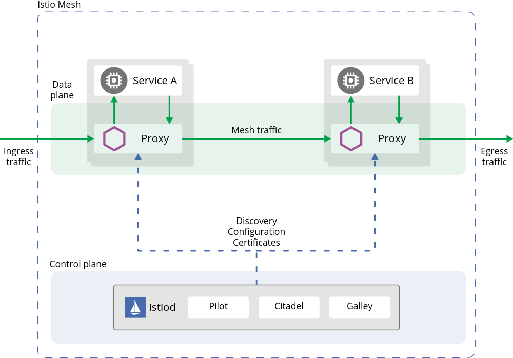
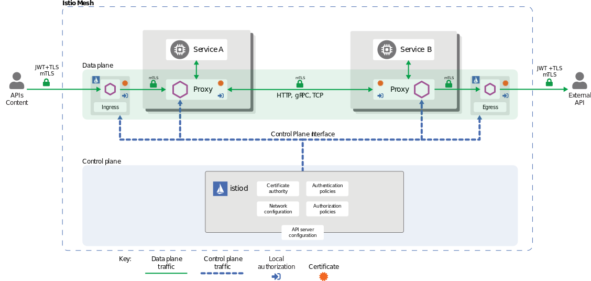
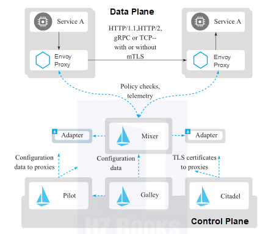

# Istio Getting Start

Follow these steps to get started with Istio:

- 1. Download and install Istio
- 2. Deploy the sample application
- 3. Open the application to outside traffic
- 4. View the dashboard
## Architecture


- Or another one:


## Download Istio
- 다운로드 페이지: Go to the [Istio release](https://github.com/istio/istio/releases) page to download the installation file for your OS
- 다운로드 명령어 사용 (Linux or macOS)
  ```sh
  ## latest release 다운로드
  curl -L https://istio.io/downloadIstio | sh -

  ## 특정 버전 다운로드
  curl -L https://istio.io/downloadIstio | ISTIO_VERSION=1.6.8 TARGET_ARCH=x86_64 sh -
  ```
- Istio package directory로 이동 한다.
  ```sh
  cd istio-1.10.0
  ```
- client binary **istioctl** 사용 하기
  ```sh
  # 패스 등록
  export PATH=$PWD/bin:$PATH

  # 또는 bin/sbin 패스로 copy
  copy /usr/sbin
  ```

## Install Istio with istioctl
- Istio installations with istioctl 
  - IstioOperator 사용
    - --watchedNamespaces<string> : 운영자 컨트롤러가 감시하는 네임 스페이스는 예를 들어 쉼표로 구분 된 네임 스페이스 목록 일 수 있습니다. 'ns1, ns2'(기본값 'istio-system')
    - --operatorNamespace <string> : 운영자 컨트롤러가 설치된 네임 스페이스입니다. (기본값 'istio-operator')
```sh
# IstioOperator Init
istioctl operator init \
--watchedNamespaces=monitoring \
--operatorNamespace=monitoring

# IstioOperator Install
istioctl install -f istio-op.yaml
```

- vi istio-op.yaml
```yaml
cat <<EOF | kubectl apply -f -
apiVersion: install.istio.io/v1alpha1
kind: IstioOperator
metadata:
  name: istiocontrolplane
  namespace: monitoring
spec:
  profile: default
  values:
    global:
      # namespqce 변경 - default: istio-system
      istioNamespace: monitoring
  meshConfig:
    accessLogFile: /dev/stdout
    enableTracing: true
    defaultConfig:
      tracing:
        sampling: 100.0
        max_path_tag_length: 256
        zipkin:
          address: 'jaeger-operator-jaeger-collector.monitoring.svc:9411'
EOF
```

## Istio IngressGateway 설정
- Service Type을 NodePort로 변경 한다.
```sh
## LoadBalancer -> NodePort
kubectl -n monitoring edit svc istio-ingressgateway
```

## Istio 검증
```sh
## istio proxy 상태 정보
istioctl proxy-status -i monitoring
```

## Disable Istio sidecar injection to the job pod
- The annotation is in wrong place. You have to put it on the pod template.
```yaml
apiVersion: batch/v1beta1
kind: CronJob
metadata:
spec:
  jobTemplate:
    spec:
      template:
        metadata:
          annotations:
            sidecar.istio.io/inject: "false"
```


## Uninstall Istio
- 클러스터에서 Istio를 완전히 제거 하기
```sh
istioctl x uninstall --purge
```

# 참조
> [Installation Configuration Profiles](https://istio.io/latest/docs/setup/additional-setup/config-profiles/)  
> [IstioOperator Options](https://istio.io/latest/docs/reference/config/istio.operator.v1alpha1/)  
> [istioctl commands]([참조링크](https://istio.io/latest/docs/reference/commands/istioctl/))