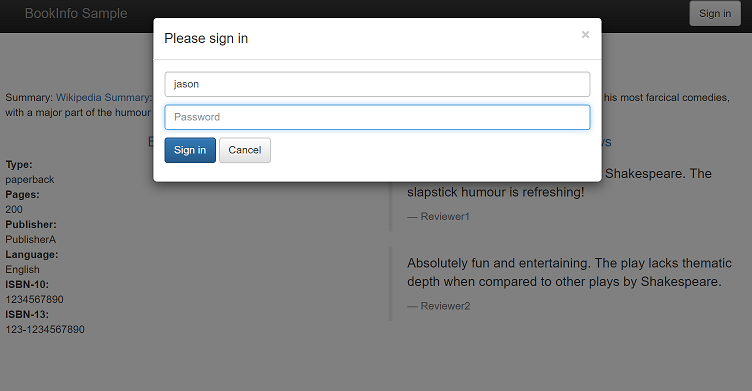
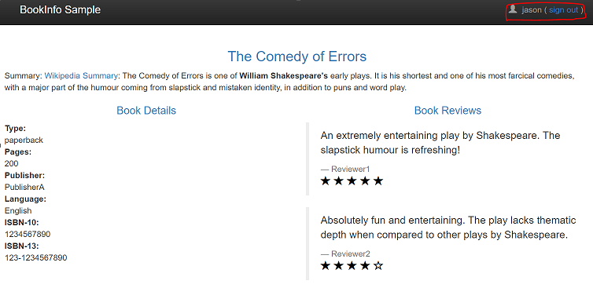

# Istio Traffic Management

Istio의 트래픽 라우팅 규칙을 사용하면 서비스 간의 트래픽 흐름과 API 호출을 쉽게 제어 할 수 있다

Istio는 회로 차단기(circuit breakers), 시간 초과 및 재시도와 같은 서비스 수준 속성의 구성을 단순화하고 백분율 기반 트래픽 분할을 사용하여 **A / B 테스트, 카나리아 롤아웃 및 단계적 롤아웃**과 같은 중요한 작업을 쉽게 설정할 수 있도록합니다

또한 종속 서비스 또는 네트워크의 장애에 대해 애플리케이션을 더욱 강력하게 만드는 데 도움이되는 기본 제공 장애 복구 기능을 제공합니다.


## 구조
- Virtual services
  - 가상 서비스는 트래픽을 해당 워크로드로 전송하기위한 다양한 트래픽 라우팅 규칙을 지정하는 다양한 방법을 제공한다
- Destination rules
  - 대상 규칙을 사용 하여 해당 대상의 트래픽 에 발생하는 작업을 구성 할 수 있다.
- Gateways
  - Istio 게이트웨이를 사용하면 Istio 트래픽 라우팅의 모든 기능과 유연성을 사용할 수 있습니다
- Service entries
  - [서비스 항목](https://istio.io/latest/docs/reference/config/networking/service-entry/#ServiceEntry) 을 사용하여 Istio가 내부적으로 유지 관리하는 서비스 레지스트리에 항목 을 추가한다
- Sidecars
  - 기본적으로 Istio는 연결된 워크로드의 모든 포트에서 트래픽을 허용하고 트래픽을 전달할 때 메시의 모든 워크로드에 도달하도록 모든 Envoy 프록시를 구성한다.

## 트래픽 분할 - A/B test, Canary Deployment
트래픽 분할은 서로 다른 버전의 서비스를 배포해놓고, 버전별로 트래픽의 양을 조절할 수 있는 기능이다. 예를 들어 새 버전의 서비스를 배포할때, 기존 버전으로 90%의 트래픽을 보내고, 새 버전으로 10%의 트래픽만 보내서 테스트하는 것이 가능하다. (카날리 테스트)
```sh
## reviews의  Destination rules 정의 - 버전 v1, v2, v3에 대한 트래픽 규칙(RANDOM) 정의
kubectl -n bookinfo apply -f samples/bookinfo/networking/destination-rule-reviews.yaml 

## 라우팅 규칙 정의 - 커넥션 트래픽의 양을 조절
kubectl -n bookinfo apply -f samples/bookinfo/networking/virtual-service-reviews-90-10.yaml
```

## 컨텐츠 기반의 트래픽 분할
단순하게 커넥션 기반으로 트래픽을 분할하는 것이 아니라, 조금 더 발전된 기능으로 네트워크 패킷의 내용을 기반으로 라우팅이 가능하다. 

예를 들어 아래 우측 그림과 같이 HTTP 헤더의 end-user 필드에 따라서, 필드 값이 json 이면 revice-v2 서비스로 라우팅을 하고, 아닐 경우에는 v1 서비스로 라우팅을 할 수 있다.

```sh
## reviews의  Destination rules 정의 - 버전 v1, v2, v3에 대한 트래픽 규칙(RANDOM) 정의
kubectl -n bookinfo apply -f samples/bookinfo/networking/destination-rule-reviews.yaml 

## 라우팅 규칙 정의 - HTTP 헤더의 User-agent 필드의 값
kubectl -n bookinfo apply -f samples/bookinfo/networking/virtual-service-reviews-jason-v2.yaml
```



## HTTP 지연 구성 테스트
- 복원력을 위해 Bookinfo 애플리케이션 마이크로 서비스를 테스트하려면 사용자에 대한 마이크로 서비스 reviews:v2와 ratings마이크로 서비스 사이에 7 초 지연을 삽입합니다 jason. 이 테스트는 Bookinfo 앱에 의도적으로 도입 된 버그를 발견한다.


```sh
## ratings 서비스의  Destination rules 정의
kubectl -n bookinfo apply -f samples/bookinfo/networking/destination-rule-all.yaml

## 라우팅 규칙 정의 - HTTP 헤더의 User-agent 필드의 값
kubectl apply -f samples/bookinfo/networking/virtual-service-ratings-test-delay.yaml
```


# 참조
> [Istio Gateway](https://istio.io/latest/docs/reference/config/networking/gateway/)
> [Istio Traffic Management](https://istio.io/latest/docs/concepts/traffic-management/)
> [Istio Service Entry](https://istio.io/latest/docs/reference/config/networking/service-entry/)
> [Istio Destination Rule](https://istio.io/latest/docs/reference/config/networking/destination-rule/)
> [Istio Fault Injection](https://istio.io/latest/docs/tasks/traffic-management/fault-injection/)