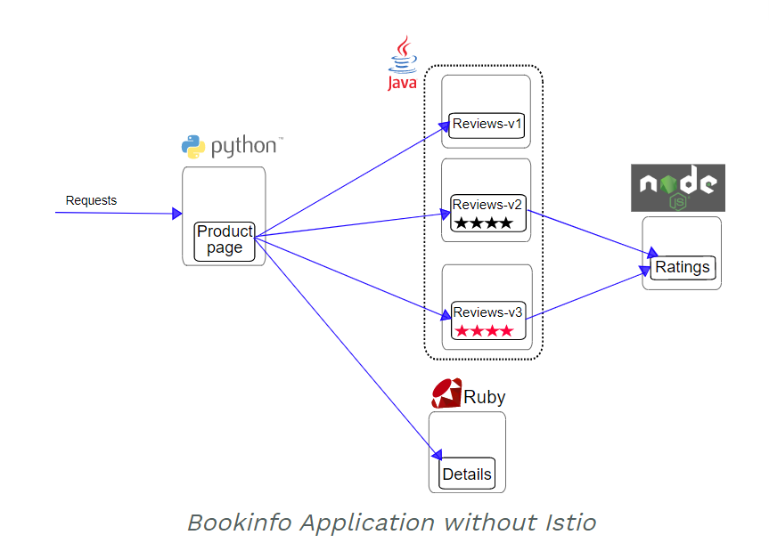
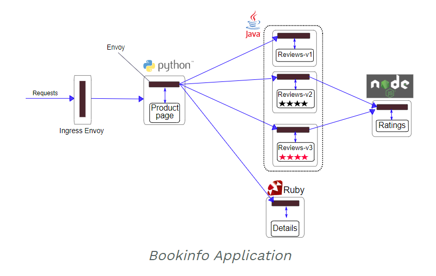

# Bookinfo Getting Start

4개의 microservice로 이루어진 간단한 application

## Architecture
- Istio를 사용하지 않고 서비스를 배치한다면 다음과 같은 구조일 것이다.



- Istio를 사용한 구조는 다음과 같다.
  - **application을** 수정하지 않고 envoy proxy만 sidecar로 각 서비스에 삽입된 것을 확인할 수 있다.




## 기능
- 책의 정보를 보여주는 페이지.
  - 책의 설명, 상세정보, 책의 리뷰정보를 확인할 수 있습니다.

## 구조 
- **productpage** : details와 reviews 서비스를 호출
- **details** : 책의 상세정보
- **reviews** : 책의 리뷰가 담겨있고 ratings서비스를 호출
  - 추가로 reviews 서비스는 세가지 버전이 존재 한다.
  - v1 : ratings 서비스를 호출하지 않음 (only 리뷰)
  - v2 : ratings 서비스를 호출
  - v3 : ratings 서비스를 호출 + 별의 색깔이 빨간색
- **ratings** : 책의 별점정보

## Sidecar injection 기능 활성화
Istio는 Pod에 envoy proxy를 sidecar 패턴으로 삽입하여, 트래픽을 컨트롤 하는 구조.

Istio는 sidecar를 Pod 생성시 자동으로 주입 (inject)하는 기능이 있는데, 이 기능을 활성화 하기 위해서는 쿠버네티스의 해당 네임스페이스에 istio-injection=enabled 라는 라벨을 추가해야 한다.

sample application 서비스들은 **bookinfo namespace로** 올릴 예정이니 해당 namespace에 라벨을 추가해줍니다.

- command-line
```sh
## namespace injection 라벨 추가
kubectl label namespace bookinfo istio-injection=enabled

## 라벨 확인
kubectl get ns --show-labels
```

## Application 배포
```sh
## 배포
kubectl apply -f samples/bookinfo/platform/kube/bookinfo.yaml

## 확인
kubectl get pod
kubectl get svc
```

## Application 외부에 노출 - Ingress 설정
- tls secret을 생성후 적용 한다.
```sh
cat <<EOF | kubectl -n bookinfo apply -f -
apiVersion: networking.k8s.io/v1
kind: Ingress
metadata:
  name: bookinfo
spec:
  rules:
  - host: bookinfo.k3.acornsoft.io
    http:
      paths:
      - backend:
          service:
            name: productpage
            port:
              number: 9080
        path: /
        pathType: Prefix
  tls:
  - hosts:
    - bookinfo.k3.acornsoft.io
    secretName: tls-acornsoft-star
EOF
```

## Istio Gateway를 사용하여 트래픽 관리 설정
- Istio Gateway / VirtualService 배포
    - ```kubectl apply -f samples/bookinfo/networking/bookinfo-gateway.yaml```
```yaml
# vi bookinfo-gateway.yaml
apiVersion: networking.istio.io/v1alpha3
kind: Gateway
metadata:
  name: bookinfo-gateway
spec:
  selector:
    istio: ingressgateway # use istio default controller
  servers:
  - port:
      number: 80
      name: http
      protocol: HTTP
    # 이 게이트웨이에 의해 노출 된 하나 이상의 호스트: HTTP services, dnsName
    hosts:
    - "bookinfo.k3.acornsoft.io"

# gateway를 통해 트래픽을 받을 서비스를 Virtual service 로 정의
apiVersion: networking.istio.io/v1alpha3
kind: VirtualService
metadata:
  name: bookinfo
spec:
  hosts:
  - "productpage"
  # bookinfo-gateway로 들어오는 트래픽은 모두 다음 라우팅 룰을 따른다.
  gateways:
  - bookinfo-gateway
  # 이 밑으로 라우팅 룰 정의
  http:
  - match:
    - uri:
        exact: /productpage
    - uri:
        prefix: /static
    - uri:
        exact: /login
    - uri:
        exact: /logout
    - uri:
        prefix: /api/v1/products
    # 위의 url들로 접근하면 productpage의 9080포트로 포워딩되어 서비스를 제공하게 된다.
    route:
    - destination:
        host: productpage
        port:
          number: 9080
```

# 참조
> [Istio Gateway](https://istio.io/latest/docs/reference/config/networking/gateway/)