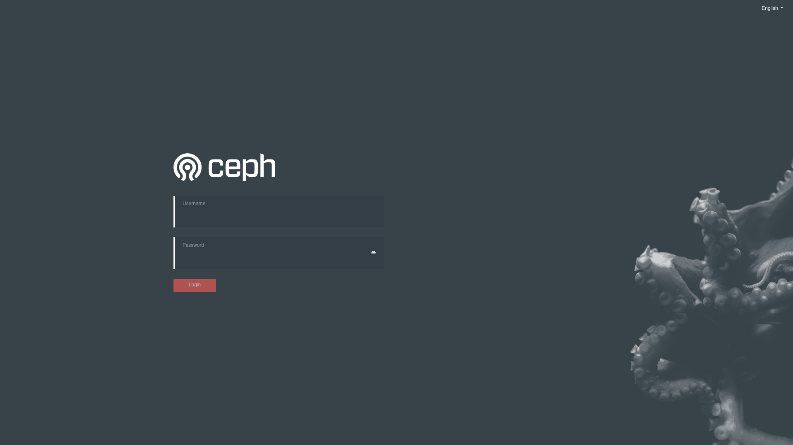

- [Rook Ceph](#rook-ceph)
  - [rook-ceph install helm charts](#rook-ceph-install-helm-charts)
  - [Rook Ceph 설치 확인](#rook-ceph-설치-확인)
  - [Rook Ceph Dashboard](#rook-ceph-dashboard)
  - [Rook Ceph Block Storage 사용 예제](#rook-ceph-block-storage-사용-예제)
  - [Rook Ceph 삭제](#rook-ceph-삭제)

# Rook Ceph
> 참조: [Rook Ceph Architecture](./01.ceph-architecture.md)
## rook-ceph install helm charts

1) Rook Ceph Operator : Ceph CR(사용자 지정 리소스)을 감시하는 Ceph Operator를 시작합니다.  
> **[참고 : operator values]**  
> kubelet root path를 지정 한다. (확인방법: ```$ systemctl status kubelet | grep root-dir```)  
> kubeletDirPath: /data/kubelet

2) Rook Ceph Cluster : 운영자가 클러스터를 구성하는 데 사용할 Ceph CR을 생성합니다.  
> **[참고 : cluster values]**  
> dataDirHostPath: ceph data path를 지정 한다.  
> dataDirHostPath: /data/rook

> **[참고 : Link]**
> https://github.com/rook/rook.git
```sh
## git clone
$ git clone --single-branch --branch v1.8.3 https://github.com/rook/rook.git
cd rook/deploy/examples
```

```sh
## helm repository add
$ helm repo add rook-release https://charts.rook.io/release

## rook-ceph operator install
$ helm upgrade -i --create-namespace --namespace rook-ceph rook-ceph rook-release/rook-ceph -f values-override-operator.yaml

## rook-ceph cluster 
$ helm upgrade -i --create-namespace --namespace rook-ceph rook-ceph-cluster --set operatorNamespace=rook-ceph rook-release/rook-ceph-cluster -f values-override-cluster.yaml
```

## Rook Ceph 설치 확인
1) 설치 pod 확인
```
$ kubectl -n rook-ceph get pods

NAME                                                 READY   STATUS      RESTARTS   AGE    IP               NODE       NOMINATED NODE   READINESS GATES
csi-cephfsplugin-hwk64                               3/3     Running     0          20h    192.168.77.191   node-191   <none>           <none>
csi-cephfsplugin-nrgnz                               3/3     Running     0          20h    192.168.77.192   node-192   <none>           <none>
csi-cephfsplugin-provisioner-7df76cbfbc-shfrt        6/6     Running     0          20h    10.0.0.254       node-191   <none>           <none>
csi-cephfsplugin-provisioner-7df76cbfbc-wgx96        6/6     Running     0          20h    10.0.0.18        node-192   <none>           <none>
csi-cephfsplugin-qd9ph                               3/3     Running     0          20h    192.168.77.193   node-193   <none>           <none>
csi-rbdplugin-c9zpl                                  3/3     Running     0          20h    192.168.77.192   node-192   <none>           <none>
csi-rbdplugin-kwp47                                  3/3     Running     0          20h    192.168.77.193   node-193   <none>           <none>
csi-rbdplugin-provisioner-757f5b7f68-7kljc           6/6     Running     0          20h    10.0.0.153       node-193   <none>           <none>
csi-rbdplugin-provisioner-757f5b7f68-zctm9           6/6     Running     0          20h    10.0.0.194       node-191   <none>           <none>
csi-rbdplugin-s5v7n                                  3/3     Running     0          20h    192.168.77.191   node-191   <none>           <none>
rook-ceph-crashcollector-node-191-7fd98687fb-29drt   1/1     Running     0          20h    10.0.0.200       node-191   <none>           <none>
rook-ceph-crashcollector-node-192-7685bbf487-8xtnv   1/1     Running     0          20h    10.0.0.27        node-192   <none>           <none>
rook-ceph-crashcollector-node-193-86b75cd8c6-c4vvz   1/1     Running     0          20h    10.0.0.160       node-193   <none>           <none>
rook-ceph-mds-ceph-filesystem-a-6868747668-8x2cs     1/1     Running     0          20h    10.0.0.26        node-192   <none>           <none>
rook-ceph-mds-ceph-filesystem-b-6cdd4b96db-b28ml     1/1     Running     0          20h    10.0.0.163       node-193   <none>           <none>
rook-ceph-mgr-a-c47b4f99d-krtcv                      1/1     Running     0          20h    10.0.0.156       node-193   <none>           <none>
rook-ceph-mon-a-58565d4cc-ml6dr                      1/1     Running     0          20h    10.0.0.138       node-193   <none>           <none>
rook-ceph-mon-b-544bf747b4-c6pns                     1/1     Running     0          20h    10.0.0.21        node-192   <none>           <none>
rook-ceph-mon-c-7768b7ffb7-fpvqk                     1/1     Running     0          20h    10.0.0.197       node-191   <none>           <none>
rook-ceph-operator-5cbd4f8bd5-pshmx                  1/1     Running     0          20h    10.0.0.151       node-193   <none>           <none>
rook-ceph-osd-0-545c7b7d8d-xvlw7                     1/1     Running     0          133m   10.0.0.205       node-191   <none>           <none>
rook-ceph-osd-1-85bc7b57b9-6pxwv                     1/1     Running     0          132m   10.0.0.30        node-192   <none>           <none>
rook-ceph-osd-2-6f8bdcd47c-2nhbb                     1/1     Running     0          132m   10.0.0.166       node-193   <none>           <none>
rook-ceph-osd-prepare-node-191-rm9fl                 0/1     Completed   0          134m   10.0.0.204       node-191   <none>           <none>
rook-ceph-osd-prepare-node-192-shlqt                 0/1     Completed   0          134m   10.0.0.29        node-192   <none>           <none>
rook-ceph-osd-prepare-node-193-9qgr5                 0/1     Completed   0          133m   10.0.0.165       node-193   <none>           <none>
rook-ceph-rgw-ceph-objectstore-a-66958d8b67-qw86b    1/1     Running     0          20h    10.0.0.28        node-192   <none>           <none>
```

2) cluster crd 확인
```sh
$ kubectl -n rook-ceph get cephclusters.ceph.rook.io

NAME        DATADIRHOSTPATH   MONCOUNT   AGE   PHASE   MESSAGE                        HEALTH      EXTERNAL
rook-ceph   /data/rook        3          20h   Ready   Cluster created successfully   HEALTH_OK
/Users/dongmook> kubectl -n rook-ceph get pods
```

## Rook Ceph Dashboard
Ceph Dashboard 화면 로그인


```sh
## rook-ceph-mgr-dashboard 서비스 포트포워딩
$ k port-forward svc/rook-ceph-mgr-dashboard :7000 -n rook-ceph

## admin 비밀번호 알아보기
$ kubectl -n rook-ceph get secret rook-ceph-dashboard-password -o jsonpath="{['data']['password']}" | base64 --decode && echo
```

## Rook Ceph Block Storage 사용 예제
1. storage class 확인
```sh
$ kubectl get sc
NAME                        PROVISIONER                     RECLAIMPOLICY   VOLUMEBINDINGMODE   ALLOWVOLUMEEXPANSION   AGE
ceph-block (default)        rook-ceph.rbd.csi.ceph.com      Delete          Immediate           true                   8d
ceph-bucket                 rook-ceph.ceph.rook.io/bucket   Delete          Immediate           false                  8d
ceph-filesystem             rook-ceph.cephfs.csi.ceph.com   Delete          Immediate           true                   8d
default-storage (default)   nfs-provisioner                 Delete          Immediate           false                  12d
```

2. nginx 샘플 배포
```sh
$ vi nginx.yaml

apiVersion: v1
kind: PersistentVolumeClaim
metadata:
  name: task-pv-claim
spec:
  storageClassName: ceph-block
  accessModes:
    - ReadWriteOnce
  resources:
    requests:
      storage: 3Gi

---
apiVersion: apps/v1
kind: Deployment
metadata:
  name: nginx-deployment
spec:
  selector:
    matchLabels:
      app: nginx
  replicas: 1
  template:
    metadata:
      labels:
        app: nginx
    spec:
      volumes:
        - name: task-pv-storage
          persistentVolumeClaim:
            claimName: task-pv-claim
      containers:
      - name: nginx
        image: nginx:1.14.2
        ports:
        - containerPort: 80
        volumeMounts:
          - mountPath: "/usr/share/nginx/html"
            name: task-pv-storage


$ kubectl create ns test
$ kubectl -n test apply nginx.yaml
```

3. Rook Ceph RBD 확인
```sh
## 노드에서 확인할 수 있다.
$ lsblk
NAME                                                                                                  MAJ:MIN RM   SIZE RO TYPE MOUNTPOINT
sda                                                                                                     8:0    0   128G  0 disk
├─sda1                                                                                                  8:1    0   487M  0 part /boot
├─sda2                                                                                                  8:2    0   1.9G  0 part
└─sda3                                                                                                  8:3    0 125.6G  0 part /
sdb                                                                                                     8:16   0    50G  0 disk
└─ceph--bf09b5f9--b1be--40ce--9a5b--d3d852876973-osd--block--8a2acfa8--ee25--442f--b10c--60cea5ab91d8 253:0    0    50G  0 lvm
rbd0                                                                                                  252:0    0     3G  0 disk /data/kubelet/pods/819ad8b9-bd34-4a59-b78e-513a028534d4/volumes/kubernetes.io~csi/pvc-87af503c-a2d8-447a-88f4-8189a35d5f35/mount
```

## Rook Ceph 삭제

1) helm chart 삭제
2) 클러스터 정리
   1) rook-ceph namespace에 있는 오퍼레이터 및 cluster(crd)를 살제 한다.
   2) ceph mons 및 osds에 의해 캐시되는 클러스터의 각 호스트에 구성 정보를 삭제 한다. (/var/lib/rook 또는 /data/rook)
3) 블록 및 파일 아티팩트 삭제
   1) 호스트의 데이터 삭제

```sh
## 1. 차트 제거
$ helm ls --namespace rook-ceph
$ helm -n rook-ceph delete rook-ceph rook-ceph-cluster

## 2. 클러스터 CRD 종료자 제거
for CRD in $(kubectl get crd -n rook-ceph | awk '/ceph.rook.io/ {print $1}'); do
    kubectl get -n rook-ceph "$CRD" -o name | \
    xargs -I {} kubectl patch -n rook-ceph {} --type merge -p '{"metadata":{"finalizers": [null]}}'
done

## 3. 중요한 리소스 종료자 제거 (osd 모든 호스트)
$ kubectl -n rook-ceph patch configmap rook-ceph-mon-endpoints --type merge -p '{"metadata":{"finalizers": [null]}}'
$ kubectl -n rook-ceph patch secrets rook-ceph-mon --type merge -p '{"metadata":{"finalizers": [null]}}'

## 4. Rook for osds에서 사용하는 노드의 디스크는 다음 방법을 사용하여 사용 가능한 상태로 재설정할 수 있습니다.
$ vi root-osds-reset.sh
#!/usr/bin/env bash
DISK="/dev/sdb"

# Zap the disk to a fresh, usable state (zap-all is important, b/c MBR has to be clean)

# You will have to run this step for all disks.
sgdisk --zap-all $DISK

# Clean hdds with dd
dd if=/dev/zero of="$DISK" bs=1M count=100 oflag=direct,dsync

# Clean disks such as ssd with blkdiscard instead of dd
blkdiscard $DISK

# These steps only have to be run once on each node
# If rook sets up osds using ceph-volume, teardown leaves some devices mapped that lock the disks.
ls /dev/mapper/ceph-* | xargs -I% -- dmsetup remove %

# ceph-volume setup can leave ceph-<UUID> directories in /dev and /dev/mapper (unnecessary clutter)
rm -rf /dev/ceph-*
rm -rf /dev/mapper/ceph--*

# Inform the OS of partition table changes
partprobe $DISK
```

