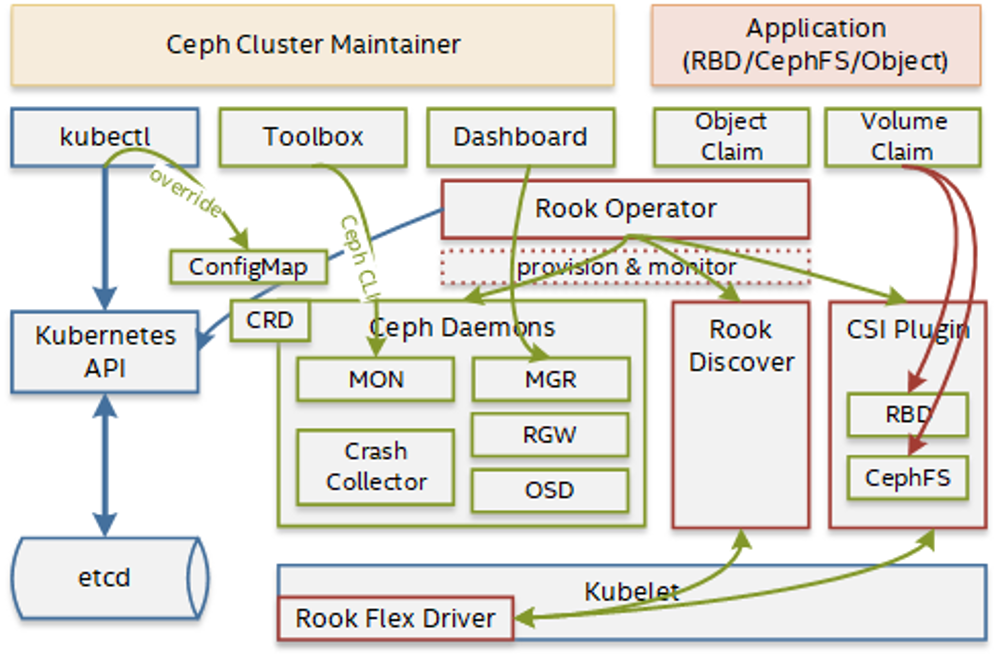

- [Ceph Architecture](#ceph-architecture)
  - [Ceph 이란?](#ceph-이란)
  - [Architecture](#architecture)
  - [Ceph 구성 요소](#ceph-구성-요소)
  - [Ceph on Kubernetes with Rook](#ceph-on-kubernetes-with-rook)
  - [Rook Ceph Work Process](#rook-ceph-work-process)

# Ceph Architecture

## Ceph 이란?
Ceph는 SDS(Software Defined Storage) 서비스를 제공하는 솔루션 중 하나로, 오픈소스이다.  

확장가능하고 open된 SDS(Software Defined Storage) 플랫폼이다.
신뢰성, 확장성, 고성능을 제공하게 설계된 분산 데이터 객체 저장소이다.
비정형데이터를 수용하고 현재의 인터페이스 및 레거시 인터페이스를 동시에 지원할 수 있다.
Unified Storage로 이야기하고 있으며 이에 다음과 같은 연결성을 제공한다.

native language interface (C/C++, python, java ..)
RESTful interface (AKA, Object Storage)
Block device interface (AKA, Block Storage)
Filesystem interface (AKA, File Storage)

## Architecture

위 그림과 같이 RADOS를 기반으로 데이터를 Read/Write하고, librados라는 라이브러리를 제공하여 RADOS에 직접 접근할 수 있도록 제공한다. 또한, RadosGW, RBD,CephFS와 같은 ceph clients를 제공하여 Ceph Storage에 접근할 수 있는 인터페이스를 제공 한다.

- **RADOS(Ceph Storage Cluster)**
RADOS는 Reliable Autonomic Distributed Object Store의 약자이고 object storage이다.  
Scalable, Reliable Storage Service for Petabyte-scale Storage Cluster로 Ceph의 데이터 접근에 대해 근간을 이루는 서비스 이다. 즉, Ceph에서 Object를 읽고 쓸때 RADOS를 사용 한다.

- **RADOSGW** (Object Storage)
Amazon S3 및 Openstack Swift와 호환되는 인터페이스가 있는 RESTfull API 서비스를 제공한다.

- **RBD** (Block Device)
스냅샷 및 clone 기능을 가지고 있는 block device 서비스를 제공한다. 이는 RADOS에서 disk image의 저장소 이다.

- **Ceph FS** (File System)
마운트 또느 사용자 공간에서 파일 시스템으로 사용할 수 있는 POSIX 호환 파일 시스템을 제공한다.

## Ceph 구성 요소

- **모니터** : Ceph Monitor ( ceph-mon)는 모니터 맵, 매니저 맵, OSD 맵, MDS 맵, CRUSH 맵을 포함한 클러스터 상태 맵을 관리합니다. 이러한 맵은 Ceph 데몬이 서로 조정하는 데 필요한 중요한 클러스터 상태입니다. 모니터는 데몬과 클라이언트 간의 인증 관리도 담당합니다. 이중화 및 고가용성을 위해 일반적으로 최소 3개의 모니터가 필요합니다.

- **관리자** : Ceph Manager 데몬( ceph-mgr)은 런타임 메트릭과 스토리지 활용도, 현재 성능 메트릭 및 시스템 로드를 포함하여 Ceph 클러스터의 현재 상태를 추적하는 역할을 합니다. Ceph Manager 데몬은 웹 기반 Ceph Dashboard 및 REST API를 포함하여 Ceph 클러스터 정보를 관리하고 노출하기 위해 Python 기반 모듈도 호스팅 합니다 . 고가용성을 위해서는 일반적으로 두 명 이상의 관리자가 필요합니다.  

- **Ceph OSD** : Ceph OSD (객체 스토리지 데몬, ceph-osd)는 데이터를 저장하고, 데이터 복제, 복구, 재조정을 처리하고 다른 Ceph OSD 데몬에서 하트비트를 확인하여 Ceph 모니터 및 관리자에 일부 모니터링 정보를 제공합니다. 이중화 및 고가용성을 위해 일반적으로 최소 3개의 Ceph OSD가 필요합니다.  

- **MDS** : Ceph Metadata Server (MDS, ceph-mds)는 Ceph 파일 시스템 을 대신하여 메타데이터를 저장 합니다 (즉, Ceph Block Devices 및 Ceph Object Storage는 MDS를 사용하지 않음). Ceph 메타데이터 서버를 사용하면 POSIX 파일 시스템 사용자가 Ceph Storage Cluster에 막대한 부담을 주지 않고 기본 명령(예 ls: find, 등) 을 실행할 수 있습니다.  

## Ceph on Kubernetes with Rook

## Rook Ceph Work Process

