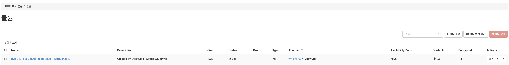

# cloud-provider-openstack 설치 방법

## 1. MasterNode 설정
> Master 노드별 설정
```sh
$ cd /etc/kubernetes/manifests

$ vi kube-apiserver.yaml
```
```yaml
apiVersion: v1
kind: Pod
metadata:
  annotations:
    kubeadm.kubernetes.io/kube-apiserver.advertise-address.endpoint: 172.16.77.31:6443
  creationTimestamp: null
  labels:
    component: kube-apiserver
    tier: control-plane
  name: kube-apiserver
  namespace: kube-system
spec:
  containers:
  - command:
    - kube-apiserver
    - --advertise-address=172.16.77.31
    - --allow-privileged=true
    - --apiserver-count=1
    - --authorization-mode=Node,RBAC
    - --bind-address=0.0.0.0
    - --client-ca-file=/etc/kubernetes/pki/ca.crt
    - --cloud-provider=external  # cloud-provider 추가
    - --default-not-ready-toleration-seconds=30
    - --default-unreachable-toleration-seconds=30
    - --enable-admission-plugins=NodeRestriction
    - --enable-bootstrap-token-auth=true
    - --encryption-provider-config=/etc/kubernetes/secrets_encryption.yaml
    - --etcd-cafile=/etc/kubernetes/pki/etcd/ca.crt
    - --etcd-certfile=/etc/kubernetes/pki/etcd/server.crt
    - --etcd-keyfile=/etc/kubernetes/pki/etcd/server.key
    - --etcd-servers=https://172.16.77.31:2379
    - --feature-gates=TTLAfterFinished=true,RemoveSelfLink=false,LocalStorageCapacityIsolation=true
    - --insecure-port=0
```

```sh
$ cd /etc/kubernetes/manifests

$ vi kube-controller-manager.yaml
```
```yaml
apiVersion: v1
kind: Pod
metadata:
  creationTimestamp: null
  labels:
    component: kube-controller-manager
    tier: control-plane
  name: kube-controller-manager
  namespace: kube-system
spec:
  containers:
  - command:
    - kube-controller-manager
    - --address=0.0.0.0
    - --allocate-node-cidrs=true
    - --authentication-kubeconfig=/etc/kubernetes/controller-manager.conf
    - --authorization-kubeconfig=/etc/kubernetes/controller-manager.conf
    - --bind-address=127.0.0.1
    - --client-ca-file=/etc/kubernetes/pki/ca.crt
    - --cloud-provider=external  # cloud-provider 추가
    - --cluster-cidr=10.32.0.0/12
    - --cluster-name=kubernetes
    - --cluster-signing-cert-file=/etc/kubernetes/pki/ca.crt
    - --cluster-signing-key-file=/etc/kubernetes/pki/ca.key
    - --controllers=*,bootstrapsigner,tokencleaner
    - --feature-gates=TTLAfterFinished=true,RemoveSelfLink=false
    - --kubeconfig=/etc/kubernetes/controller-manager.conf
    - --leader-elect=true
    - --node-monitor-grace-period=16s
    - --node-monitor-period=2s
    - --port=0
```
```sh
$ kubectl -n kube-system describe po kube-apiserver-vm-live-01
$ kubectl -n kube-system describe po kube-controller-manager-vm-live-01
    .......................
    ...............

    Port:          <none>
    Host Port:     <none>
    Command:
      kube-apiserver
      --advertise-address=172.16.77.31
      --allow-privileged=true
      --apiserver-count=1
      --authorization-mode=Node,RBAC
      --bind-address=0.0.0.0
      --client-ca-file=/etc/kubernetes/pki/ca.crt
      --cloud-provider=external # 이부분 확인
      --default-not-ready-toleration-seconds=30

    ...............
    .......................

# kube-apiserver-xxx 및 kube-controller-xxx Pod에 param 정보가 추가 되었는지 확인한다.
# 만약 설정이 설정이 안된경우 apiserver , controller-manager 재시작
```

## 2. WorkerNode 설정
> Worker 노드별 설정
```sh
$ cd /etc/sysconfig

$ vi kubelet

====================================================================

KUBELET_EXTRA_ARGS="--log-dir=/data/log \
--logtostderr=false \
--cloud-provider=external \ # 이부분 추가
--v=2 \
--container-runtime=remote \
--runtime-request-timeout=15m \
--container-runtime-endpoint=unix:///run/containerd/containerd.sock \
--node-labels=cube.acornsoft.io/clusterid=k3lab-live"

=====================================================================
$ systemctl restart kubelet

$ systemctl status kubelet

● kubelet.service - kubelet: The Kubernetes Node Agent
   Loaded: loaded (/usr/lib/systemd/system/kubelet.service; enabled; vendor preset: disabled)
  Drop-In: /usr/lib/systemd/system/kubelet.service.d
           └─10-kubeadm.conf
   Active: active (running) since Wed 2021-07-14 04:22:01 UTC; 57min ago
     Docs: https://kubernetes.io/docs/
 Main PID: 3798455 (kubelet)
    Tasks: 32 (limit: 101363)
   Memory: 94.0M
   CGroup: /system.slice/kubelet.service
           └─3798455 /usr/bin/kubelet --bootstrap-kubeconfig=/etc/kubernetes/bootstrap-kubelet.conf
```

## 3. openstack controller 배포

### 3-1 Secret 생성

> cloud.conf 정보는 openstack 의 접속 정보 및 네트워크 정보를 포함하고 있음.
```sh
[Global]
auth-url=http://192.168.77.11/identity      # 접속 URL
username=admin                              # 아이디
password=@c0rns0ft                          # 패스워드
region=RegionOne
tenant-id=1cf5fa24ba31447d8e8757015af0463b  # project ID (NO.1)
domain-id=default                           # demain ID (NO.2)

[LoadBalancer]                              # default
use-octavia=true
subnet-id=d4c17b7f-124d-424d-97ef-a8d038f4144b  #subnet ID (NO.3)
floating-network-id=3bd5f7f4-da7b-4756-8609-514f16666296  # network ID (NO.4)

```
> project ID (NO.1) -> Project ID 필드


> demain ID (NO.2)  -> 예) k3lab-live > 도메인 아이디


> subnet ID (NO.3) -> 예) k3lab-live-net > ID 항목


> network ID (NO.4) -> 예) public-subnet > 네트워크 ID 항목


> Secret 생성 (cloud-config-secret.yaml)
```sh

apiVersion: v1
data:
  cloud.conf: IyBrM2xhYi1saXZlIGNsb3VkIGNvbmZpZ3VyYXRpb24KW0dsb2JhbF0KYXV0aC11cmw9aHR0cDovLzE5Mi4xNjguNzcuMTEvaWRlbnRpdHkKdXNlcm5hbWU9YWRtaW4KcGFzc3dvcmQ9QGMwcm5zMGZ0CnJlZ2lvbj1SZWdpb25PbmUKdGVuYW50LWlkPTFjZjVmYTI0YmEzMTQ0N2Q4ZTg3NTcwMTVhZjA0NjNiCmRvbWFpbi1pZD1kZWZhdWx0CgpbTG9hZEJhbGFuY2VyXQp1c2Utb2N0YXZpYT10cnVlCnN1Ym5ldC1pZD1kNGMxN2I3Zi0xMjRkLTQyNGQtOTdlZi1hOGQwMzhmNDE0NGIKZmxvYXRpbmctbmV0d29yay1pZD0zYmQ1ZjdmNC1kYTdiLTQ3NTYtODYwOS01MTRmMTY2NjYyOTYKCiNbQmxvY2tTdG9yYWdlXQojYnMtdmVyc2lvbj12Mg==
kind: Secret
metadata:
  name: cloud-config
  namespace: kube-system
type: Opaque

# cloud.conf : base64 encodeing (cloud-config file)
$ kubectl apply -f cloud-config-secret.yaml
```

### 3-2 RBAC, openstack-cloud-controller-namager 생성
```sh
$ kubectl apply -f cloud-controller-manager-role.yaml
$ kubectl apply -f cloud-controller-manager-role-bindings.yaml
$ kubectl apply -f openstack-cloud-controller-manager-ds.yaml
```

## 4. openstack controller 배포 확인 및 테스트
```sh

# 배포 확인
$ k get po -n kube-system

NAME                                       READY   STATUS    RESTARTS   AGE
kube-proxy-rgmr7                           1/1     Running   36         97d
kube-scheduler-vm-live-01                  1/1     Running   535        21d
kube-state-metrics-55cb7cd98b-js6r5        1/1     Running   2          5d22h
metrics-server-6d7588485b-fvmr5            1/1     Running   8          5d19h
nfs-pod-provisioner-6949dbbbd5-nmz2r       1/1     Running   9          5d22h
openstack-cloud-controller-manager-bf55q   1/1     Running   0          36m
openstack-cloud-controller-manager-dqgtz   1/1     Running   0          36m
openstack-cloud-controller-manager-hgjzh   1/1     Running   0          36m
snapshot-controller-0                      1/1     Running   1          5d22h

# Pod 배포
$ kubectl run nginx --image=192.168.77.30/library/nginx:latest --port=80

$ kubectl get po
NAME                                READY   STATUS    RESTARTS   AGE
my-app-58cbb9b58d-rl2gr             1/1     Running   1          5d23h
nginx                               1/1     Running   0          73m

# LoadBalancer 타입의 service 배포
$ k expose pod nginx --type=LoadBalancer --target-port=80 --port=80 --name nginx

$ kubectl get svc
NAME         TYPE           CLUSTER-IP      EXTERNAL-IP      PORT(S)        AGE
kubernetes   ClusterIP      10.96.0.1       <none>           443/TCP        97d
nginx        LoadBalancer   10.107.33.228   192.168.77.108   80:32326/TCP   73m

# EXTERNAL-IP 로 접속 시도
```


## 5. cinder-csi-plugin 배포 확인 및 테스트

### 5 - 1 cinder plugin 배포
- Cinder CSI 드라이버는 OpenStack Cinder 볼륨의 수명 주기를 관리하기 위해 Container Orchestrator에서 사용하는 CSI 사양 호환 드라이버 이다.
- 현재 openstack 내에 지원 가능한 볼륨 타입 : iscsi, nfs, ceph(192.168.77.11 장비에서 service 중단 상태)
- 참고 : https://github.com/kubernetes/cloud-provider-openstack
```sh
# cinder plugin 설치

$ kubectl apply -f cinder-csi-plugin/

# cinder 배포 확인
$ kubectl get po -n kube-system

NAME                                       READY   STATUS    RESTARTS   AGE     IP             NODE         NOMINATED NODE   READINESS GATES
csi-cinder-controllerplugin-0              6/6     Running   0          16h     10.47.21.226   vm-live-05   <none>           <none>
csi-cinder-nodeplugin-9lmxq                3/3     Running   0          16h     172.16.77.31   vm-live-01   <none>           <none>
csi-cinder-nodeplugin-gh55g                3/3     Running   0          16h     172.16.77.32   vm-live-02   <none>           <none>
csi-cinder-nodeplugin-jg8dz                3/3     Running   0          16h     172.16.77.36   vm-live-06   <none>           <none>
csi-cinder-nodeplugin-kvfd7                3/3     Running   0          16h     172.16.77.35   vm-live-05   <none>           <none>
csi-cinder-nodeplugin-wv5vn                3/3     Running   0          16h     172.16.77.34   vm-live-04   <none>           <none>
csi-cinder-nodeplugin-xl5kz                3/3     Running   0          16h     172.16.77.33   vm-live-03   <none>           <none>

```
### 5 - 2 cinder 통해 kubernetes에 볼륨 생성 테스트
- cinder 드라이버가 설치된 이후 StorageClass, PersistentVolumeClaim, Pod 배포 하여 openstack 내에 볼륨이 생성되는지 확인한다.
```sh

# StorageClass 생성
apiVersion: storage.k8s.io/v1
kind: StorageClass
metadata:
  name: csi-sc-cinderplugin
provisioner: cinder.csi.openstack.org
parameters:
  type: nfs or iscsi (현재 ceph는 설정 불가 이며 default는 nfs로 설정됨)
---

# PersistentVolumeClaim 생성
apiVersion: v1
kind: PersistentVolumeClaim
metadata:
  name: csi-pvc-cinderplugin
spec:
  accessModes:
  - ReadWriteOnce
  resources:
    requests:
      storage: 1Gi
  storageClassName: csi-sc-cinderplugin

---

# Pod 생성
apiVersion: v1
kind: Pod
metadata:
  name: nginx
spec:
  containers:
  - image: nginx
    imagePullPolicy: IfNotPresent
    name: nginx
    ports:
    - containerPort: 80
      protocol: TCP
    volumeMounts:
      - mountPath: /var/lib/www/html
        name: csi-data-cinderplugin
  nodeSelector:                         #특정노드에 배포 테스트
    kubernetes.io/hostname: vm-live-04
  volumes:
  - name: csi-data-cinderplugin
    persistentVolumeClaim:
      claimName: csi-pvc-cinderplugin
      readOnly: false
```

- StorageClass, PersistentVolumeClaim, Pod 생성 이후 openstack에서 배포된 pvc가 생성되었는지 확인한다.
  - path: 프로젝트 > 볼륨 > 볼륨

  
