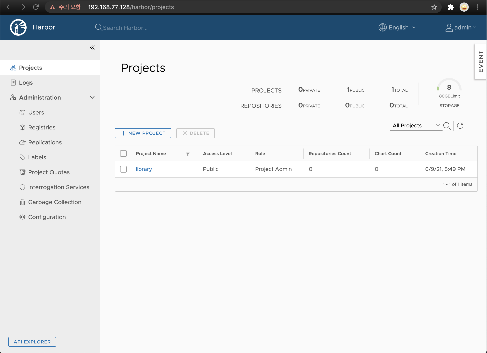

[TOC]

# 1. Package repository
 * Air-gap 환경일 경우 local repository 설정
[step1-local repository.md](step1-local repository.md) 참고

 * 외부 네트웍이 가능한 환경일 경우
[step4-configure package repo.md](step4-configure package repo.md) 참고

### Docker 설치
[step5-configure CRI.md](step5-configure CRI.md) 참고

### Harbor 설치
 * Harbor는 harbor component가 모두 포함되어 있는 offline installer로 설치됨.
 * docker-compose 명령 설치, harbor 인증서 생성, harbor에서 제공하는 install.sh을 실행하는 순으로 진행.
 * harbor의 ca.crt 파일을 클러스터의 /etc/docker/certs.d/{harbor-ip}/ 에 복사하기 위한 목적으로 harbor component중 nginx에 관련 설정을 넣고 재기동함.

```bash
$ mkdir -p /var/lib/cocktail/harbor
$ mkdir -p /var/lib/cocktail/cert
$ mkdir -p /data/harbor/cert
$ mkdir -p /etc/docker/certs.d/{harbor-ip}

# curl -LO https://github.com/docker/compose/releases/download/1.29.2/docker-compose-Linux-x86_64
$ scp docker-compose-Linux-x86_64 {user-id}@{harbor-ip}:/tmp

$ cp /tmp/harbor-offline-installer-v1.10.3.tgz /var/lib/cocktail
$ cd /var/lib/cocktail
$ tar -zxvf harbor-offline-installer-v1.10.3.tgz

$ chmod +x /usr/local/bin/docker-compose
$ ln -s /usr/local/bin/docker-compose /usr/bin/docker-compose

$ cat > /var/lib/cocktail/cert/openssl.conf <<EOF
[ req ]
distinguished_name = req_distinguished_name
[req_distinguished_name]

[ v3_ca ]
basicConstraints = critical, CA:TRUE
keyUsage = critical, digitalSignature, keyEncipherment, keyCertSign

[ v3_req_client ]
basicConstraints = CA:FALSE
keyUsage = critical, digitalSignature, keyEncipherment
extendedKeyUsage = clientAuth

[ v3_req_server ]
basicConstraints = CA:FALSE
keyUsage = critical, digitalSignature, keyEncipherment
extendedKeyUsage = serverAuth
subjectAltName = @alt_names_registry

[ alt_names_registry ]
DNS.1 = localhost
DNS.2 = {harbor-hostname}
IP.1 = 127.0.0.1
IP.2 = {harbor-ip}
EOF


$ openssl genrsa -out /var/lib/cocktail/cert/ca.key 2048
$ openssl req -x509 -new -nodes -key /var/lib/cocktail/cert/ca.key -days 36000 -out /data/harbor/cert/ca.crt -subj '/CN=harbor-ca' -extensions v3_ca -config /var/lib/cocktail/cert/openssl.conf
$ openssl genrsa -out /data/harbor/cert/harbor.key 2048
$ openssl req -new -key /data/harbor/cert/harbor.key -subj '/CN=harbor' |
  openssl x509 -req -CA /data/harbor/cert/ca.crt -CAkey /var/lib/cocktail/cert/ca.key -CAcreateserial -out /data/harbor/cert/harbor.crt -days 36000 -extensions v3_req_server -extfile /var/lib/cocktail/cert/openssl.conf

// 공인인증서를 지정할 경우에는 해당 인증서를 복사해 준다.
$ scp harbor.crt root@{harbor-ip}:/data/harbor/cert/harbor.crt
$ scp harbor.key root@{harbor-ip}:/data/harbor/cert/harbor.key

$ vi /var/lib/cocktail/harbor/harbor.yml // hostname, 인증서, data_volume 등 수정.

$ cd /var/lib/cocktail/harbor
$ ./install.sh --with-clair --with-chartmuseum > /var/lib/cocktail/harbor/harbor-install.log

$ docker-compose ps
      Name                     Command                       State                              Ports
------------------------------------------------------------------------------------------------------------------------
chartmuseum         ./docker-entrypoint.sh           Up (health: starting)   9999/tcp
clair               ./docker-entrypoint.sh           Up (health: starting)   6060/tcp, 6061/tcp
clair-adapter       /clair-adapter/clair-adapter     Up (health: starting)   8080/tcp
harbor-core         /harbor/harbor_core              Up (health: starting)
harbor-db           /docker-entrypoint.sh            Up (health: starting)   5432/tcp
harbor-jobservice   /harbor/harbor_jobservice  ...   Up (health: starting)
harbor-log          /bin/sh -c /usr/local/bin/ ...   Up (health: starting)   127.0.0.1:1514->10514/tcp
harbor-portal       nginx -g daemon off;             Up (health: starting)   8080/tcp
nginx               nginx -g daemon off;             Up (health: starting)   0.0.0.0:80->8080/tcp, 0.0.0.0:443->8443/tcp
redis               redis-server /etc/redis.conf     Up (health: starting)   6379/tcp
registry            /home/harbor/entrypoint.sh       Up (health: starting)   5000/tcp
registryctl         /home/harbor/start.sh            Up (health: starting)

$ cp /data/harbor/cert/ca.crt /etc/docker/certs.d/{registry-ip}

$ mkdir /var/lib/cocktail/harbor/common/config/nginx/cert
$ cp /data/harbor/cert/ca.crt /var/lib/cocktail/harbor/common/config/nginx/cert/ca.crt
$ vi /var/lib/cocktail/harbor/common/config/nginx/nginx.conf
   ...
     location /ca.crt {
            alias /etc/nginx/cert/ca.crt;
     }
   ...

$ docker-compose exec proxy nginx -s reload
```




### 폐쇄망일 경우 harbor 백업파일을 복원함.
```bash
$ scp registry-restore.sh root@{harbor-ip}:/tmp/registry-restore.sh

$ scp harbor-backup.tgz root@{harbor-ip}:/tmp/harbor-backup.tgz

$ cd /var/lib/cocktail/harbor
$ docker-compose down -v

$ /tmp/registry-restore.sh /tmp/harbor-backup.tgz {registry-ip} > /var/lib/cocktail/harbor/harbor-restore.log
$ docker-compose up -d

```