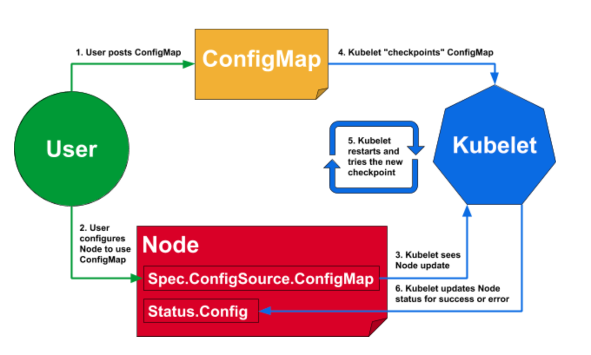

# Dynamic Kubelet Configuration
> Kubelet은 시작시 미리 지정된 파일에서 구성 파일을로드합니다. 변경된 구성은 런타임 동안 실행중인 Kubelet 프로세스에 적용되지 않으므로 수정 후 Kubelet을 수동으로 다시 시작해야합니다.
>
> 동적 Kubelet 구성 은 이러한 부담을 제거하여 Kubelet이 구성 변경을 모니터링하고 업데이트 될 때 다시 시작되도록합니다.

Follow these steps to get started with Dynamic Kubelet Configuration:
1. Kubernetes의 ConfigMap을 사용 합니다

## 동적 구성을위한 Kubelet 플래그
동적 kubelet 구성은 기본적으로 활성화되어 있지 않습니다. 구체적으로, 필수 구성 중 하나가 누락되었습니다. 동적 구성에는 Kubelet에 대한 다음 플래그가 필요합니다.

1. --feature-gates="DynamicKubeletConfig=true": Kubernetes 1.11 2 이후 기본적으로 활성화되어 있으므로 수동으로 수행 할 작업이 없습니다.
2. --dynamic-config-dir=<path>: Kubelet에 대한이 플래그는 동적 kubelet 구성을 활성화하는 데 필요합니다.

--dynamic-config-dir플래그가 필요한 이유 는 무엇 입니까?



위의 그림은 Kubelet이 동적 Kubelet 재구성을 사용하는 방법을 보여줍니다. 4 ~ 5 단계에서 Kubelet 은 수정 된 configmap을 apiserver에서 로컬 스토리지로 "체크 포인트" 하고 재시작 후 데이터를로드합니다. 여기서 체크 포인트 된 configmap은 어딘가에 저장되어야하며 --dynamic-config-dir하나입니다. 를 지정 --dynamic-config-dir하면 Kubelet은 구성 체크 포인트를 사용하여 자동으로 초기화됩니다.


## 동적 구성 설정
동적 Kubelet 구성은 ConfigMap 객체를 사용합니다. 따라서 Kubelet 구성 및 관련 승인 된 액세스 권한을위한 ConfigMap 개체가 필요합니다.

## ConfigMap 생성
Kubelet 구성은 플래그 및 --config파일로 지정된 기존 구성과 함께 사용할 수 없습니다. 즉, 구성이 플래그 또는 --config파일로 설정되어 있어도 이 구성은 활성화되지 않고 동적 구성 만 적용됩니다. 이러한 이유로 1 은 현재 구성에서 시작하는 것이 좋습니다.

- 현재 구성을 ConfigMap으로 생성
```sh
$ kubectl proxy --port=8001 &
$ NODE_NAME="the-name-of-the-node-you-are-reconfiguring"; curl -sSL "http://localhost:8001/api/v1/nodes/${NODE_NAME}/proxy/configz" | jq '.kubeletconfig|.kind="KubeletConfiguration"|.apiVersion="kubelet.config.k8s.io/v1beta1"' > kubelet_configz_${NODE_NAME}
$ kubectl (-n kube-system) create configmap node-config --from-file=kubelet=kubelet_configz_${NODE_NAME}
```
>컨트롤 플레인 노드에서만 작동하며 현재이 작업에 필요한 권한을 파악할 수 없습니다.
>
>configmap이 kube-system 네임스페이스 일 필요가 없다는 것을 알았습니다. 기본 네임 스페이스에 저장된 경우에도 작동합니다.

- 또는 최초 설치 버전의 ConfigMap을 사용 할 수 있다.
```sh
## Kubernetes 버전으로 생성된 kubelet configmap을 확인 할 수 있다.
$ kubectl -n kube-system get cm
NAME                                 DATA   AGE
calico-config                        4      25d
coredns                              1      25d
extension-apiserver-authentication   6      25d
istio-ca-root-cert                   1      25d
kube-proxy                           2      25d
kube-root-ca.crt                     1      25d
kubeadm-config                       2      25d
kubelet-config-1.21                  1      25d
```

## ConfigMap에 더 많은 구성 추가
다음 명령을 사용하여 ConfigMap 개체를 확인해야합니다.
```sh
$ kubectl get configmaps (-n NAMESPACE)
```
이제 edit하위 명령을 사용 하여 ConfigMap 개체를 편집 할 수 있습니다.
```sh
$ kubectl edit configmaps node-config (-n NAMESPACE)
```

ConfigMap 개체의 형식은 다음과 같습니다.
```yaml
apiVersion: v1
kind: ConfigMap
metadta: <not important>
name: node-config
namespace: default
data:
    kubelet: |     # <- Do not omit '|'.
        {
            "kind": "KubeletConfiguration",
            "apiVersion": "kubelet.config.k8s.io/v1beta1",
            <other Kubelet configurations in JSON format>
        }
```
ConfigMap 객체 자체는 YAML 형식을 따르지만 해당 콘텐츠는 data.kubeletJSON 형식 을 따릅니다. 혼동하지 마십시오.  
또는 
사용 가능한 Kubelet 구성 키 / 값은 [ [여기](https://github.com/kubernetes/kubelet/blob/master/config/v1beta1/types.go#L75) ] 에서 조사 할 수 있습니다.


제 경우에는 동적 Kubernetes 구성을 통해 할당 가능한 리소스를 제한하려고합니다. ConfigMap 개체에 여러 Kubelet 플래그를 추가했습니다.
```yaml
## kubectl -n kube-system edit cm kubelet-config-1.21
<omitted>
data:
  kubelet: |
    evictionHard:
      memory.available: "500Mi"
      nodefs.available: "1Gi"
      imagefs.available: "100Gi"
    evictionMinimumReclaim:
      memory.available: "0Mi"
      nodefs.available: "500Mi"
      imagefs.available: "2Gi"
```

## 새 구성을 사용하도록 노드 설정
한 가지 더해야 할 일은 ConfigMap을 사용 하여 업데이트 할 노드를 수정 해야 합니다.

- 다음 명령을 사용하여 편집기를 지정하십시오.
```sh
$ kubectl edit node ${NODE_NAME}
```

처음 편집하는 경우 spec 섹션에 아무것도 없습니다. 다음과 같이 configSource 요소를 추가 합니다 (YAML 형식입니다).
```yaml
spec:
  configSource:
    configMap:
      name: CONFIG_MAP_NAME # replace CONFIG_MAP_NAME with the name of the ConfigMap
      namespace: kube-system
      kubeletConfigKey: kubelet
```
각각의 키는 다음을 의미합니다.

- kubeletConfigKey: data ConfigMap 개체의 사전에 있는 키 입니다. 우리의 경우에는 kubelet( kubelet: | { ... }) 로 지정했습니다.
- name: ConfigMap 개체의 이름입니다.
- namespace: ConfigMap 개체가있는 네임스페이스 입니다.

사양을 지정하면 대상 노드의 Kubelet이 자동으로 다시 시작되어 동적 구성을 적용합니다.


## 동적 Kubelet 구성 확인

다음 명령오로 결과를 확인하십시오.
```sh
$ kubectl get nodes ${NODE_NAME} -o yaml
```

1. 먼저 사양이 성공적으로 적용되었는지 확인합니다.
```yaml
spec:
    configSource:
        kubeletConfigKey: kubelet
        name: node-config
        namespace: default
```

2. 둘째, Kubelet 은 구성이 성공적으로 적용되었는지 여부에 관계없이 상태를 업데이트합니다 .
```yaml
status:
  addresses: <omitted>
  allocatable: <omitted>
  capacity: <omitted>
  conditions: <omitted>
    active:              <-- must exist
      configMap:
        kubeletConfigKey: kubelet
        name: node-config 
        namespace: default
        resourceVersion: "1024519"
        uid: a8b4da9d-0b6e-478d-9e35-4a3696f5778c
    assigned:
      configMap:
        kubeletConfigKey: kubelet
        name: node-config 
        namespace: default
        resourceVersion: "1024519"
        uid: a8b4da9d-0b6e-478d-9e35-4a3696f5778c
    lastKnownGood:
      configMap:
        kubeletConfigKey: kubelet
        name: node-config 
        namespace: default
        resourceVersion: "1024519"
        uid: a8b4da9d-0b6e-478d-9e35-4a3696f5778c
```
status.conditions.active필드가 존재 하고에 오류 필드가 없는지 확인해야합니다 status.conditions.assigned. 지정된 구성을 적용 할 때 에러가 발생하는 경우와 Kubelet 재시작 status.conditions.lastKnownGood따라서 config (설정) status.conditions.active.configMap.resourceVersion의 것과 다를 수도 status.conditions.assigned.

오류가 발생하면 systemd 저널 로그에 오류가 무엇인지 표시됩니다.
```yaml
## This error is logged when you missed data.kubelet.kind.
Aug 24 13:16:04 localhost.worker kubelet[278409]: E0824 13:16:04.368361  278409 controller.go:151] kubelet config controller: failed to load config, see Kubelet log for details, error: failed to decode: Object 'Kind' is missing in '{

```

3. 또한 내 구성에는 리소스 제한이 포함되어 있습니다. 의도 한대로 적용됩니다.
```sh
$ kubectl get nodes ${NODE_NAME} -o yaml
status:
  allocatable:
    cpu: "1"
    ephemeral-storage: "66100978374"
    hugepages-1Gi: "0"
    hugepages-2Mi: "0"
    memory: 4775280Ki
    pods: "110"
  capacity:
    cpu: "4"
    ephemeral-storage: 71724152Ki
    hugepages-1Gi: "0"
    hugepages-2Mi: "0"
    memory: 8023408Ki
    pods: "110"
```

4. 내 구성에서 CPU 및 메모리 리소스를 제한 했으므로 실제로 Linux cgroup에 적용되는지 확인하십시오.
```sh
/sys/fs/cgroup/memory/kubepods.slice $ cat memory.limit_in_bytes
4994744320 // Similar to allocatable memory 4775280Ki
```


## 로컬 기본 구성으로 되돌리기
기본 구성을 사용하도록 노드를 재설정하십시오.

1. 노드 편집 :
```sh
$ kubectl edit node ${NODE_NAME}
```

2. Node.Spec.ConfigSource필드를 제거하십시오 . 예를 들어, 다음 행을 모두 제거하십시오.
```yaml
 configSource:
     configMap:
         name: CONFIG_MAP_NAME
         namespace: kube-system
         kubeletConfigKey: kubelet
```

3. 업데이트를 확인하십시오.
```
$ kubectl get node ${NODE_NAME} -o yaml
```

-------
# 참조
> [라이브 클러스터에서 Kubelet 재구성](https://www.ibm.com/docs/en/cloud-private/3.1.2?topic=administration-reconfiguring-kubelet-in-live-cluster)
> [라이브 클러스터에서 노드의 Kubelet 재구성](https://kubernetes.io/docs/tasks/administer-cluster/reconfigure-kubelet/)