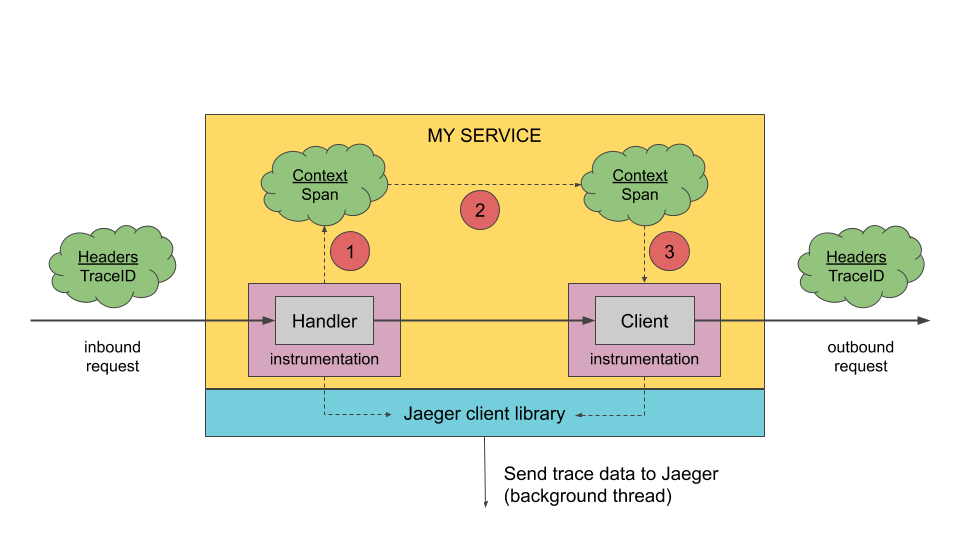

# Jaeger Getting Start

Follow these steps to get started with Jaeger:
- 1. Helm3 준비 - helm.sh 사용하기 위해
- 2. Elasticsearch 설정 값 확인
- 3. 

## Architecture
- Span: 

- Trace:
  - 수집가는 스토리지에 직접 쓰고 있는 구성


  - 수집기는 예비 버퍼로 Kafka에 쓰고 있는 구성


- Jaeger client libraries:


## Installing the Chart with jaeger-operator
- Helm 차트를 사용하여 최신 Jaeger Operator를 설치하려면 다음을 실행한다.
```sh
helm upgrade jaeger-operator -i \
  -n monitoring \
  --create-namespace \
  --cleanup-on-fail \
  --repo https://jaegertracing.github.io/helm-charts \
  jaeger-operator \
  -f values.yaml
```

- values.yaml 수정
```yaml
## operator image 설정
image:
  repository: jaegertracing/jaeger-operator
  tag: 1.23.0

## spec 설정
## 배포 전략 -> production
## jager agent는 -> DaemonSet
## storage: -> elasticsearch 사용
jaeger:
  # Specifies whether Jaeger instance should be created
  create: true
  # namespace where Jaeger resource should be created default to .Release.Namespace
  namespace:
  spec:
    strategy: production
    agent:
      strategy: DaemonSet
    ingress:
      enabled: false
    storage:
      type: elasticsearch
      elasticsearch:
        resources:
          requests:
            cpu: 200m
            memory: 4Gi
          limits:
            cpu: 200m
            memory: 4Gi
      options:
        es:
          server-urls: https://quickstart-es-http.monitoring.svc:9200
          index-prefix: jaeger-prefix
          tags-as-fields:
            all: true
          tls:
            ca: /es/certificates/ca.crt
      secretName: jaeger-secret
    volumeMounts:
      - name: certificates
        mountPath: /es/certificates/
        readOnly: true
    volumes:
      - name: certificates
        secret:
          secretName: es-certs-public

## k8s 권한 설정
rbac:
  # Specifies whether RBAC resources should be created
  create: true
  # PodSecurityPolicy는 Kubernetes v1.21부터 더 이상 사용되지 않으며 v1.25에서 제거됩니다.
  pspEnabled: false
  clusterRole: true
```

## Jaeger Instance 생성 - values 값이 jaeger.create: false 일때
```yaml
cat <<EOF | kubectl -n monitoring apply -f -
apiVersion: jaegertracing.io/v1
kind: Jaeger
metadata:
  name: simple-prod
spec:
  strategy: production
  storage:
    type: elasticsearch # <1>
    options:
      es:
        server-urls: https://quickstart-es-http.default.svc:9200 # <2>
        index-prefix: my-prefix
        tls: # <3>
          ca: /es/certificates/ca.crt
    secretName: jaeger-secret # <4>
  volumeMounts: # <5>
    - name: certificates
      mountPath: /es/certificates/
      readOnly: true
  volumes:
    - name: certificates
      secret:
        secretName: quickstart-es-http-certs-public
EOF

## <1> 스토리지 유형 Elasticsearch.

## <2> 기본 네임 스페이스에서 실행되는 Elasticsearch 서비스에 대한 URL입니다.

## <3> TLS 구성. 오직 CA 인증서이 경우, 그러나 또한 포함 할 수 있습니다 es.tls.key및 es.tls.cert상호 TLS를 사용하는 경우.

## <4> 환경 변수 ES_PASSWORD및 ES_USERNAME. 작성자kubectl create secret generic jaeger-secret --from-literal=ES_PASSWORD=changeme --from-literal=ES_USERNAME=elastic

## <5> 모든 스토리지 구성 요소에 마운트되는 볼륨 마운트 및 볼륨.
```

## Jaeger Ingress 설정
- tls secret을 생성후 적용 한다.
```sh
cat <<EOF | kubectl -n monitoring apply -f -
apiVersion: networking.k8s.io/v1
kind: Ingress
metadata:
  name: jaeger
spec:
  rules:
  - host: jaeger.k3.acornsoft.io
    http:
      paths:
      - backend:
          service:
            name: jaeger-operator-jaeger-query
            port:
              number: 16686
        path: /
        pathType: Prefix
  tls:
  - hosts:
    - jaeger.k3.acornsoft.io
    secretName: tls-acornsoft-star
EOF
```

## Jaeger local Storage 사용 설정
- values.yaml 수정
```yaml

## spec 설정
## 배포 전략 -> production
## jager agent는 -> DaemonSet
## storage: -> local storage 사용 - emptyDir

jaeger:
  # Specifies whether Jaeger instance should be created
  create: true
  # namespace where Jaeger resource should be created default to .Release.Namespace
  namespace:
  spec:
    strategy: production
    agent:
      strategy: DaemonSet
    ingress:
      enabled: false
    query:
      serviceType: NodePort
      nodePort: 30186
    storage:
      type: badger
      options:
        badger:
          ephemeral: false
          directory-key: "/badger/key"
          directory-value: "/badger/data"
    volumeMounts:
    - name: data
      mountPath: /badger
    volumes:
    - name: data
      emptyDir: {}
```

## ElasticSearch 사용 설정
- 환경 변수 ES_PASSWORD및 ES_USERNAME의 값을 secret으로 생성 한다.
```sh
## changeme를 elastic user명과 패스워드로 수정 한다.
kubectl -n monitoring create secret generic jaeger-secret --from-literal=ES_PASSWORD=admin --from-literal=ES_USERNAME=admin
```

- tls 설정: eslastic 에서 생성한 인증서를 사용 한다.
```sh
## es ca.crt 값을 secret으로 생성
kubectl -n monitoring create secret generic es-certs-public --from-file=ca.crt=tls.crt

## 또는 아래 방법으로 생성 한다. (changeme를 ca.crt 값으로 수정 한다.)
cat <<EOF | kubectl -n monitoring apply -f -
apiVersion: v1
kind: Secret
metadata:
  name: es-certs-public
type: Opaque
data:
  ca.crt: changeme
EOF
```

## ElasticSearch UI 에서 로깅 확인
- 

# 참조
> [jaeger-operator](https://github.com/jaegertracing/helm-charts/tree/main/charts/jaeger-operator)
> [Architecture](https://www.jaegertracing.io/docs/1.23/architecture/)
> [Client Libraries](https://www.jaegertracing.io/docs/1.23/client-libraries/)