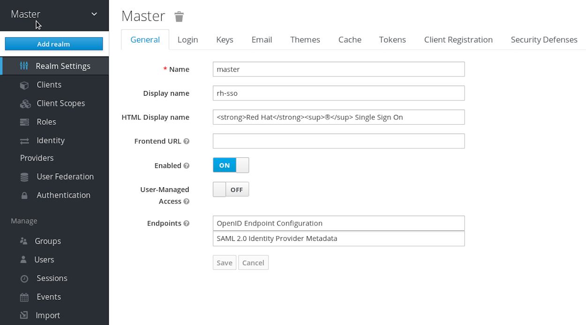

##  Keycloak 설치 및 설정 방법

## 1. Repository 등록
> ca.crt  다운로드 URL : https://regi.k3.acornsoft.io/ca.crt
```sh
helm repo add --ca-file ./ca.crt keycloak https://192.168.77.30/chartrepo/k3lab-charts
```

## 2. keycloak-values.yaml 정의
```yaml

............................

# Additional environment variables for Keycloak
# Ingress 설정 시 Proxy 설정을 반듯이 해줘야 한다. 그렇지 않은 경우 도메인으로 접속 후 admin console에 접근 하지 못한다.
extraEnv: |
  - name: PROXY_ADDRESS_FORWARDING
    value: "true"
  - name: KEYCLOAK_LOGLEVEL
      value: DEBUG


............................


ingress:
  # If `true`, an Ingress is created
  enabled: true
  # The Service port targeted by the Ingress
  servicePort: http
  # Ingress annotations
  annotations: {}
    ## Resolve HTTP 502 error using ingress-nginx:
    ## See https://www.ibm.com/support/pages/502-error-ingress-keycloak-response
    # nginx.ingress.kubernetes.io/proxy-buffer-size: 128k

  # Additional Ingress labels
  labels: {}
   # List of rules for the Ingress
  rules:
    -
      # Ingress host
      host: kc-sso.k3.acornsoft.io
      # Paths for the host
      paths:
        - /
  # TLS configuration
  tls:
    - hosts:
        - kc-sso.k3.acornsoft.io
      secretName: "tls-acornsoft-star"

  # ingress for console only (/auth/admin)
  console:
    # If `true`, an Ingress is created for console path only
    enabled: true
    # Ingress annotations for console ingress only
    # Useful to set nginx.ingress.kubernetes.io/whitelist-source-range particularly
    annotations: {}
    rules:
      -
        # Ingress host
        host: kc-sso.k3.acornsoft.io
        # Paths for the host
        paths:
          - /auth/admin/

............................

ingress:
  # -- Enable [ingress](https://kubernetes.io/docs/concepts/services-networking/ingress/).
  enabled: true

  # -- Ingress [class name](https://kubernetes.io/docs/concepts/services-networking/ingress/#ingress-class).
  className: ""

  # -- Annotations to be added to the ingress.
  annotations:
    kubernetes.io/ingress.class: nginx
    kubernetes.io/tls-acme: "true"
    nginx.ingress.kubernetes.io/proxy-body-size: 50000m

  # -- Ingress host configuration.
  # @default -- See [values.yaml](values.yaml).

  # ===========================Dex Server URL===========================
  # https://dex.k3.acornsoft.io/dex, https://dex.k3.acornsoft.io/dex/callback(gitlab에 정의된 callback url)

    # ===========================Dex Client URL===========================
  # https://dex.k3.acornsoft.io (Dex client login), https://dex.k3.acornsoft.io/callback(Dex Server에서 gitlab 콜백을 받은 후에 Dex client로 콜백해주는 URL)
  hosts:
    - host: dex.k3.acornsoft.io
      paths:
        - path: /dex
          pathType: Prefix
          fullName: dex
          svcPort: 5556
        - path: /
          pathType: Prefix
          fullName: kid
          svcPort: 5555

  # -- Ingress TLS configuration.
  # @default -- See [values.yaml](values.yaml).
  tls:
   - secretName: tls-acornsoft-star
     hosts:
       - dex.k3.acornsoft.io

# -- Container resource [requests and limits](https://kubernetes.io/docs/concepts/configuration/manage-resources-containers/).
# See the [API reference](https://kubernetes.io/docs/reference/kubernetes-api/workload-resources/pod-v1/#resources) for details.
# @default -- No requests or limits.
resources:
  # We usually recommend not to specify default resources and to leave this as a conscious
  # choice for the user. This also increases chances charts run on environments with little
  # resources, such as Minikube. If you do want to specify resources, uncomment the following
  # lines, adjust them as necessary, and remove the curly braces after 'resources:'.
  limits:
    cpu: 100m
    memory: 128Mi
  requests:
    cpu: 100m
    memory: 128Mi

............................

```

## 3. Keycloak 설치
```
$ helm upgrade -i dex k3lab/cloak --cleanup-on-fail -f keycloak-values.yaml -n keycloak

$ kubectl get po -n keycloak
NAME                    READY   STATUS    RESTARTS   AGE
keycloak-0              1/1     Running   0          19h
keycloak-postgresql-0   1/1     Running   0          9h

$ kubectl get svc -n keycloak
NAME                           TYPE        CLUSTER-IP       EXTERNAL-IP   PORT(S)                    AGE
keycloak-headless              ClusterIP   None             <none>        80/TCP                     3d20h
keycloak-http                  ClusterIP   10.105.7.201     <none>        80/TCP,8443/TCP,9990/TCP   3d20h
keycloak-postgresql            ClusterIP   10.104.255.229   <none>        5432/TCP                   3d20h
keycloak-postgresql-headless   ClusterIP   None             <none>        5432/TCP                   3d20h

$ kubectl get ing -n keycloak
NAME               CLASS    HOSTS                    ADDRESS        PORTS     AGE
keycloak           <none>   kc-sso.k3.acornsoft.io   172.16.77.31   80, 443   3d20h
keycloak-console   <none>   kc-sso.k3.acornsoft.io   172.16.77.31   80, 443   3d20h

```

## 4. Keycloak 설정

### 4 - 1 Admin console
- 최초 설치 후 keycloak 도메인으로(https://kc-sso.k3.acornsoft.io) 접속 후 admin 계정 생성


### 4 - 2 Realm 생성
- 왼쪽 상단 Master realm 에 마우스를 올리면 Add realm 버튼 활성화 후 클릭


- realm 명 등록 후 생성 클릭


### 4 - 3 Clients 등록
- Clients에 Application(예: kiali, kibana)을 등록 시킨다.
-

