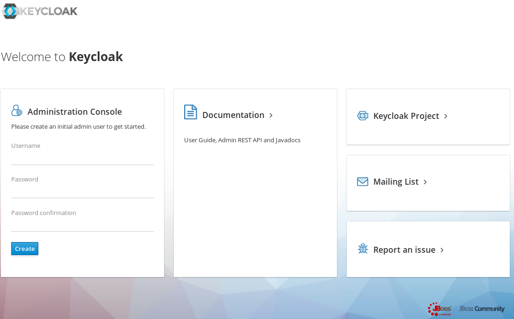
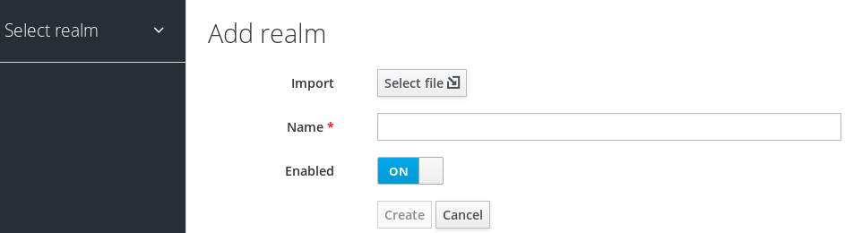
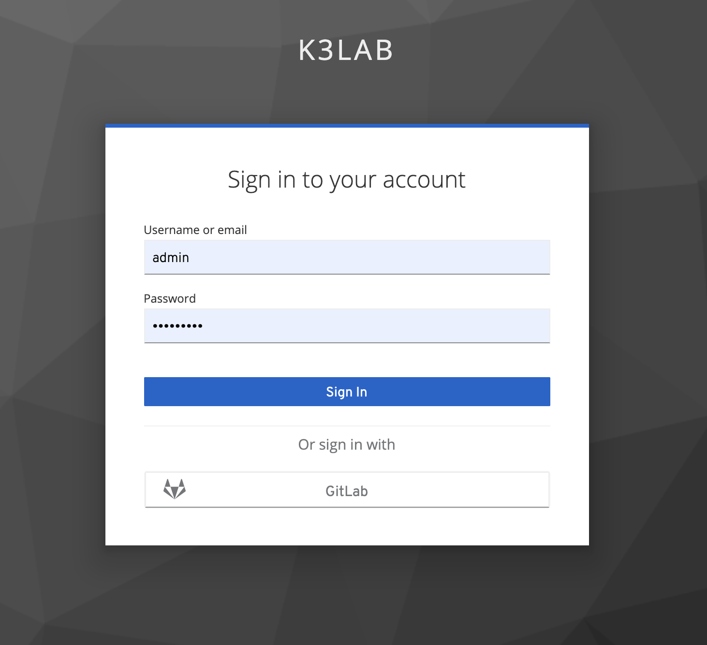

##  Keycloak 설치 및 설정 방법

## 1. Repository 등록
> ca.crt  다운로드 URL : https://regi.k3.acornsoft.io/ca.crt
```sh
helm repo add --ca-file ./ca.crt keycloak https://192.168.77.30/chartrepo/k3lab-charts
```

## 2. keycloak-values.yaml 정의
```yaml

............................

# Additional environment variables for Keycloak
# Ingress 설정 시 Proxy 설정을 반듯이 해줘야 한다. 그렇지 않은 경우 도메인으로 접속 후 admin console에 접근 하지 못한다.
extraEnv: |
  - name: PROXY_ADDRESS_FORWARDING
    value: "true"
  - name: KEYCLOAK_LOGLEVEL
      value: DEBUG


............................


ingress:
  # If `true`, an Ingress is created
  enabled: true
  # The Service port targeted by the Ingress
  servicePort: http
  # Ingress annotations
  annotations:
    kubernetes.io/ingress.class: nginx
    kubernetes.io/tls-acme: "true"
    nginx.ingress.kubernetes.io/proxy-body-size: 50000m

  # Additional Ingress labels
  labels: {}
   # List of rules for the Ingress
  rules:
    -
      # Ingress host
      host: kc-sso.k3.acornsoft.io
      # Paths for the host
      paths:
        - /
  # TLS configuration
  tls:
    - hosts:
        - kc-sso.k3.acornsoft.io
      secretName: "tls-acornsoft-star"

  # ingress for console only (/auth/admin)
  console:
    # If `true`, an Ingress is created for console path only
    enabled: true
    # Ingress annotations for console ingress only
    # Useful to set nginx.ingress.kubernetes.io/whitelist-source-range particularly
    annotations: {}
    rules:
      -
        # Ingress host
        host: kc-sso.k3.acornsoft.io
        # Paths for the host
        paths:
          - /auth/admin/

............................

```

## 3. Keycloak 설치 및 확인
```
$ helm upgrade -i dex k3lab/cloak --cleanup-on-fail -f keycloak-values.yaml -n keycloak

$ kubectl get po -n keycloak
NAME                    READY   STATUS    RESTARTS   AGE
keycloak-0              1/1     Running   0          19h
keycloak-postgresql-0   1/1     Running   0          9h

$ kubectl get svc -n keycloak
NAME                           TYPE        CLUSTER-IP       EXTERNAL-IP   PORT(S)                    AGE
keycloak-headless              ClusterIP   None             <none>        80/TCP                     3d20h
keycloak-http                  ClusterIP   10.105.7.201     <none>        80/TCP,8443/TCP,9990/TCP   3d20h
keycloak-postgresql            ClusterIP   10.104.255.229   <none>        5432/TCP                   3d20h
keycloak-postgresql-headless   ClusterIP   None             <none>        5432/TCP                   3d20h

$ kubectl get ing -n keycloak
NAME               CLASS    HOSTS                    ADDRESS        PORTS     AGE
keycloak           <none>   kc-sso.k3.acornsoft.io   172.16.77.31   80, 443   3d20h
keycloak-console   <none>   kc-sso.k3.acornsoft.io   172.16.77.31   80, 443   3d20h

```

## 4. Keycloak 설정

### 4 - 1 Admin console
- 최초 설치 후 keycloak 도메인으로(https://kc-sso.k3.acornsoft.io) 접속 후 admin 계정 생성


### 4 - 2 Realm 생성
- 왼쪽 상단 Master realm 에 마우스를 올리면 Add realm 버튼 활성화 후 클릭


- realm 명 등록 후 생성 클릭


### 4 - 3 Clients 등록
- SSO로 인증하길 원하는 Application(예: kiali, kibana)을 Clients에 등록 시킨다.
- Path : Clients > Create 클릭(예시: kiali)

- Clients > Settings 탭에 Kiali 정보를 입력 한다.

- kiali client 등록 후 Client ID, Secret 데이터를 kiali 에 등록 시킨다.(설치 방식에 따라 달라질 수 있다. 예: operator, helm chart)
### 4 - 4 Keycloak 사용자 생성
- Manage > Users > Add user 생성 후 패스워드 설정


### 4 - 5 Keycloak SSO 연동을 위한 Kiali 설정
```sh
# operator로 설치 된 경우 custom resource 수정
# helm chart로 설치된 경우 configmap 수정

$ kubectl edit kialis.kiali.io kiali -n monitoring

--------------------------------------
spec:
  auth:
    openid:
      client_id: kiali-client
      disable_rbac: true
      issuer_uri: https://kc-sso.k3.acornsoft.io/auth/realms/k3lab
      scopes:
      - openid
      username_claim: sub
    strategy: openid
```

- 설정 완료 후 kiali 접속(https://kiali.k3.acornsoft.io/kiali/)하게 되면 Login with OpenID 버튼 활성화


- Login with OpenID 클릭 후 Keycloak 로그인 화면으로 이동


- Keycloak에서 생성된 Kiali 사용자를 통해 로그인 시도


### 4 - 6 Keycloak + GitLab Identity Providers 설정
- GitLab Identity Provider 설정은 두가지 방식으로 설정 가능하다.

  #### 4-6-1 공식 GitLab 을 사용 하는 방식 (https://about.gitlab.com/) : Identity Providers > Add provider > Social > Gitlab
  - Redirect URI : Gitlab Application 등록 처리 시 Redirect URI에 등록될 주소
  - Application Id: Gitlab Application 등록 처리 후 ID 정보를 해당 필드에 등록 시킨다.
  - Application Secret: Gitlab Application 등록 처리 후 Secret 정보를 해당 필드에 등록 시킨다.
  - Gitlab Application(keycloak 등록) 생성 후 발급 받은 Application ID and Secret을 각각 필드에 등록 후 최종 저장을 해야함(아래 Gitlab 설정 먼저 처리함)

  

  - Gitlab 로그인 후 상단 Preferences > Applications
    - Application 이름 등록
    - Redirect URI 는 Keycloak에서 발급 받은 Redirect URI 등록(바로 상단에 Redirect URI)
    - Scopes[read_user, openid, profile, email] 선택 후 Save Application 클릭

    
    

  - 설정 완료 후 Keycloak 로그인 화면에서 GitLab Identity Provider 버튼 활성화
  

  #### 4-6-2 Private GitLab을 사용하는 방식 (http://git.k3.acornsoft.io/) : Identity Providers > Add provider > User-defined > OpenID Connect v1.0
  - Gitlab Application 등록 처리는 상단과 동일함
  - Identity Provider 정보 등록 처리(Private Gitlab 이기 때문에 OpenID Connect Config에 대한 부분을 수동으로 등록 해야 함)
  
  - Mappers 탭에 설정된 필드 정보 등록(Gitlab 과 Keycloak 의 사용자 정보를 매핑 처리)
  


## 5. Keycloak으로 부터 OIDC or SAML 연동이 가능한 어플리케이션 정리


