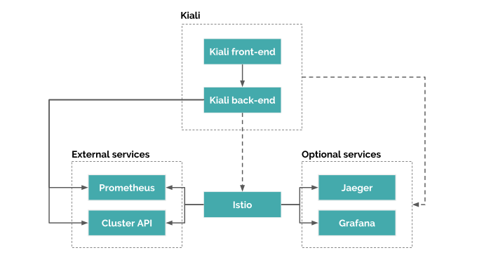

# Kiali Getting Start

Follow these steps to get started with Istio:
- 1. 사전 준비 helm3
- 2. Kiali 리소스를 이미 설치 한 경우 먼저 제거해야 한다
  
## Architecture

## Kiali Operator Helm 차트 설치
- Helm 차트를 사용하여 Kiali CR (istio 네임 스페이스에 Kiali 서버가 설치되도록 트리거)과 함께 최신 Kiali Operator를 설치하려면 다음을 실행한다.
- kiali-operator의 버전을 확인 하여 values의 image.tag 항목에 적용 한다.
```sh
helm upgrade kiali-operator -i \
  -n monitoring \
  --create-namespace \
  --cleanup-on-fail \
  --set cr.create=true \
  --set cr.namespace=monitoring \
  --set auth.strategy="token" \
  --repo https://kiali.org/helm-charts \
  kiali-operator \
  -f values.yaml
```
- To install a specific version X.Y.Z, simply pass --version X.Y.Z to the helm command

## Kiali CR Configuration
- values 설정:
  - logger 설정: debug
  - prometheus
    - url 설정: k8s service DNS:port (prometheus-server.monitoring:9090)
  - grafana
    - in_cluster_url 설정: k8s service DNS:port (grafana.monitoring:3000)
    - url 설정: 외부 url 주소
  - tracing
    - in_cluster_url 설정: k8s service DNS:port (tracing.monitoring/jaeger)
    - url 설정: 외부 url 주소

```yaml
# vi values.yaml
nameOverride: ""
fullnameOverride: ""

image:
  repo: quay.io/kiali/kiali-operator
  tag: v1.36
  pullPolicy: Always
  pullSecrets: []

# Deployment options for the operator pod.
nodeSelector: {}
podAnnotations: {}
env: []
tolerations: []
resources: {}
affinity: {}
replicaCount: 1
priorityClassName: ""

# metrics.enabled: set to true if you want Prometheus to collect metrics from the operator
metrics:
  enabled: true

# debug.enabled: when true the full ansible logs are dumped after each reconciliation run
# debug.verbosity: defines the amount of details the operator will log (higher numbers are more noisy)
# debug.enableProfiler: when true (regardless of debug.enabled), timings for the most expensive tasks will be logged after each reconciliation loop
debug:
  enabled: true
  verbosity: "1"
  enableProfiler: false

# Defines where the operator will look for Kial CR resources. "" means "all namespaces".
watchNamespace: ""

# Set to true if you want the operator to be able to create cluster roles. This is necessary
# if you want to support Kiali CRs with spec.deployment.accessible_namespaces of '**'.
# Note that this will be overriden to "true" if cr.create is true and cr.spec.deployment.accessible_namespaces is ['**'].
clusterRoleCreator: true

# Set to true if you want to allow the operator to only be able to install Kiali in view-only-mode.
# The purpose for this setting is to allow you to restrict the permissions given to the operator itself.
onlyViewOnlyMode: false

# allowAdHocKialiNamespace tells the operator to allow a user to be able to install a Kiali CR in one namespace but
# be able to install Kiali in another namespace. In other words, it will allow the Kiali CR spec.deployment.namespace
# to be something other than the namespace where the CR is installed. You may want to disable this if you are
# running in a multi-tenant scenario in which you only want a user to be able to install Kiali in the same namespace
# where the user has permissions to install a Kiali CR.
allowAdHocKialiNamespace: true

# allowAdHocKialiImage tells the operator to allow a user to be able to install a custom Kiali image as opposed
# to the image the operator will install by default. In other words, it will allow the
# Kiali CR spec.deployment.image_name and spec.deployment.image_version to be configured by the user.
# You may want to disable this if you do not want users to install their own Kiali images.
allowAdHocKialiImage: false

# For what a Kiali CR spec can look like, see:
# https://github.com/kiali/kiali-operator/blob/master/deploy/kiali/kiali_cr.yaml
cr:
  create: true
  name: kiali
  # If you elect to create a Kiali CR (--set cr.create=true)
  # and the operator is watching all namespaces (--set watchNamespace="")
  # then this is the namespace where the CR will be created (the default will be the operator namespace).
  namespace: ""

  spec:
    deployment:
      image_name: quay.io/kiali/kiali
      image_version: v1.36
      ingress_enabled: false
      logger:
        log_level: debug
        log_format: text
        sampler_rate: "1"
        time_field_format: "2006-01-02T15:04:05Z07:00"
      accessible_namespaces:
      - '**'
    external_services:
      grafana:
        in_cluster_url: 'http://grafana.monitoring:3000'
        url: ''
      prometheus:
        url: 'http://prometheus-server.monitoring:9090'
      tracing:
        in_cluster_url: 'http://jaeger-operator-jaeger-query.monitoring:16686'
        url: ''
```

- Kiali CR 수정
```sh
kubectl -n monitoring edit Kiali kiali
```

## Kiali login Token 확인
- linux 일때 아래 명령어 사용:
```sh
k -n monitoring get secrets kiali-operator-token-xxxxx -o go-template='{{range $k,$v := .data}}{{"### "}}{{$k}}{{"\n"}}{{$v|base64decode}}{{"\n\n"}}{{end}}' 
```

- window 일때 아래 명령어 사요:
```
powershell "[convert]::ToBase64String([Text.Encoding]::UTF8.GetBytes(\"Hello world!\"))"
```

## Kiali Ingress 설정
- tls secret을 생성후 적용 한다.
- Kiali operator CR 에서 관리 하는 ingress 이름과 같으면 operator의 영향을 받는다. - CR에서 ingress 설정을 직접 관리 할 수 있다.
```sh
cat <<EOF | kubectl -n monitoring apply -f -
apiVersion: networking.k8s.io/v1
kind: Ingress
metadata:
  name: kiali-ingress
spec:
  rules:
  - host: kiali.k3.acornsoft.io
    http:
      paths:
      - backend:
          service:
            name: kiali
            port:
              number: 20001
        path: /
        pathType: Prefix
  tls:
  - hosts:
    - kiali.k3.acornsoft.io
    secretName: tls-acornsoft-star
EOF
```

## Kiali Operator 및 Kiali 제거
- Kiali CR을 먼저 삭제하지 못하면 클러스터에서 CR이 배포 된 네임 스페이스를 삭제할 수 없으며 Kiali 서버의 나머지는 삭제되지 않는다
  - Kiali CR을 성공적으로 삭제 한 후 Helm을 사용하여 Kiali Operator를 제거 할 수 있다
  - Helm은 CRD를 삭제하지 않기 때문에 모든 것을 정리하려면 아래 명령어를 수행해야 한다.
```sh
kubectl -n monitoring delete kialis.kiali.io kiali
helm uninstall --namespace monitoring kiali-operator
kubectl delete crd monitoringdashboards.monitoring.kiali.io
kubectl delete crd kialis.kiali.io
```

#### Kiali CR stuck 해결
```sh
$ kubectl -n monitoring patch kialis.kiali.io kiali -p '{"metadata":{"finalizers": []}}' --type=merge ; true
```
-----
# 참조
> [다른 Prometheus 인스턴스 사용](https://kiali.io/documentation/latest/runtimes-monitoring/)
> [Kiali에 대한 로그는 어떻게 얻습니까?](https://kiali.io/documentation/latest/faq/#logs)