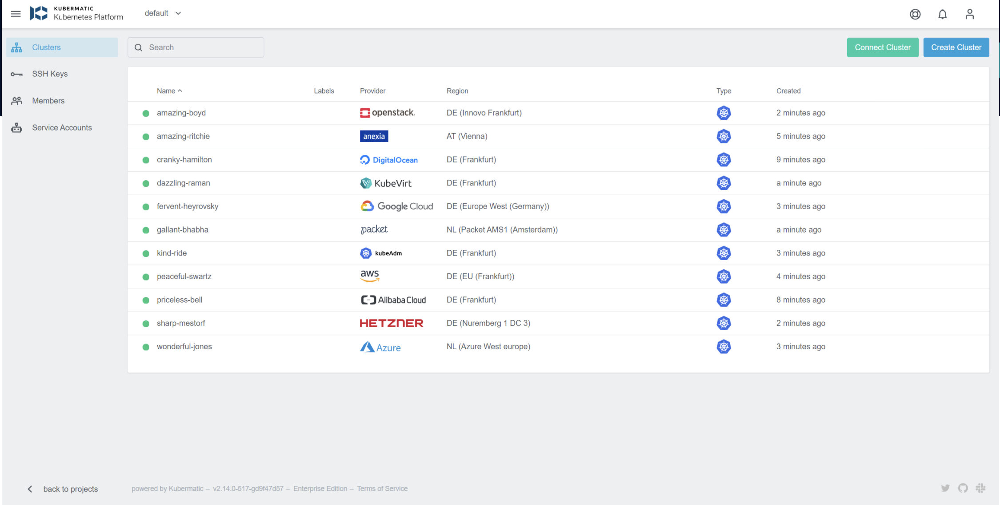
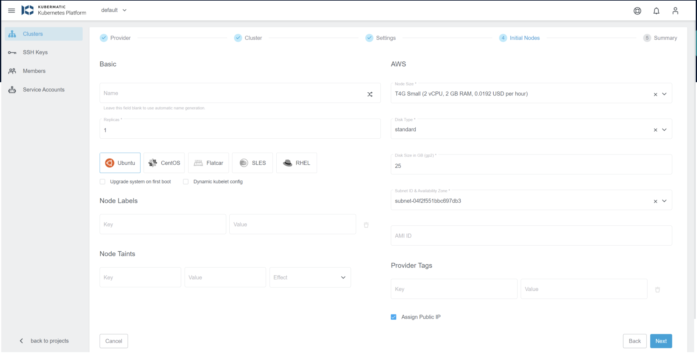
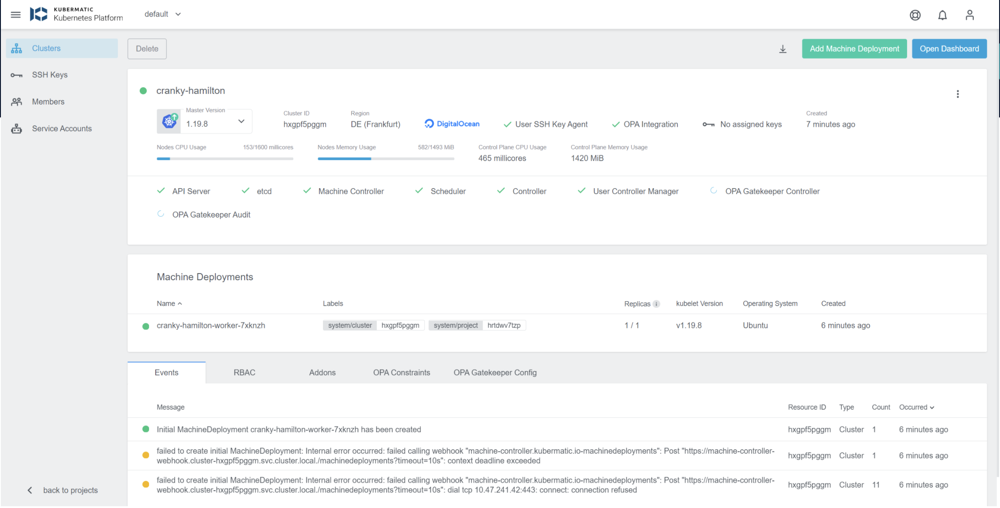

# KuberMatic

## Kubermatic Kubernetes Platform 이란?
> KKP(Kubermatic Kubernetes Platform)는 엔터프라이즈 고객의 요구 사항을 위해 설계된 Kubernetes 관리 플랫폼입니다. 이는 DevOps 팀이 셀프 서비스 개발자 및 운영 포털을 사용할 수 있도록 하는 동시에 대규모 Kubernetes 관리의 운영 문제를 해결합니다. 다른 플랫폼과 달리 Kubermatic Kubernetes Platform은 인프라에 구애받지 않고 벤더 중립적입니다.

## Kubermatic Kubernetes Platform 어떻게 다른가?

1. Kubermatic Kubernetes Platform은 모든 환경에서 작동하며 완전히 사용자 지정 가능한 업스트림 Kubernetes를 제공하므로 다음을 수행할 수 있습니다.
 - 원하는 인프라 설정을 자유롭게 선택(온프레미스, 하이브리드 클라우드, 멀티 클라우드)
 - Kubernetes는 물론 Kubernetes 확장, 플러그인 또는 통합을 지원하는 모든 도구 사용
 - 기존 환경과 워크플로를 쉽게 통합
 - 원하는 대로 새로운 오픈 소스 기술 수용

2. 클라우드 제공업체의 관리형 서비스는 단일 창에서 다양한 인프라 전반에 걸쳐 컨테이너화된 워크로드를 배포하고 관리하는 유연성과 능력을 제한합니다. Kubermatic Kubernetes Platform으로 다음을 수행할 수 있습니다.
- 공급업체 종속을 피하고 각 개별 작업에 대해 동급 최고의 제공업체 선택
- 최적화된 가격의 이점을 누리고 요구 사항 변화에 따라 워크로드 마이그레이션
- 하나의 중앙 인터페이스에서 어디에서나 동일한 도구 및 워크플로 사용

3. Kubermatic Kubernetes Platform의 고유한 Kubernetes-in-Kubernetes 아키텍처 덕분에 팀은 공간과 인프라 비용을 최소화하면서 비교할 수 없는 복원력의 이점을 누릴 수 있습니다.
- 진정으로 독립적이고 인프라에 구애받지 않는 플랫폼
- 소비 기반 구독을 통한 경쟁력 있는 가격 책정
- 강력한 커뮤니티 옹호 및 기능 요청의 신속한 구현

## 제품

1. Kubermatic Kubernetes Platform
> 단일 관리 UI(중앙집중관리) 및 API를 통해 멀티클라우드, 온프레미스 및 엣지 클러스터 운영을 자동화하는 엔터프라이즈 소프트웨어로 클라우드 네이티브 변환을 즉시 제공 할 수 있습니다.

- 
- 
- 

2.

## 기술 솔루션