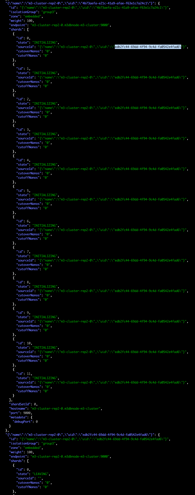
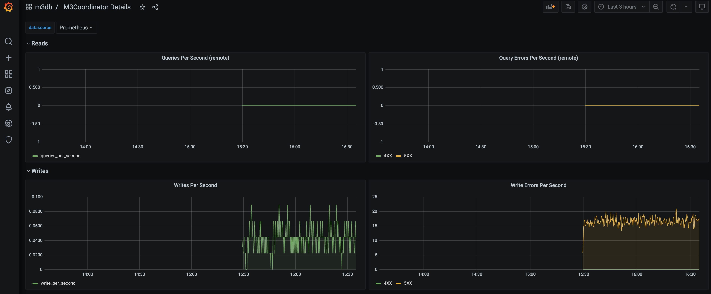
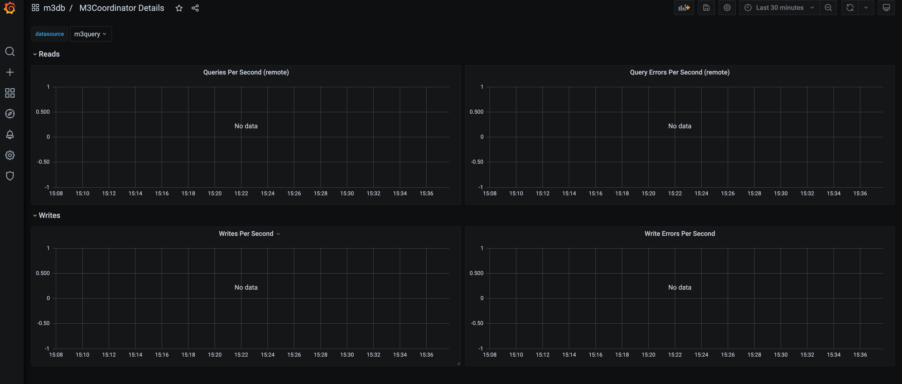

## install log
```log
11:17 dongmook:/Users/dongmook/git-workspaces/onassis/m3db/assets/m3cluster> ./install.sh
namespace/m3db created
serviceaccount/m3db-operator created
clusterrole.rbac.authorization.k8s.io/m3db-operator created
clusterrolebinding.rbac.authorization.k8s.io/m3db-operator created
statefulset.apps/m3db-operator created
service/etcd created
service/etcd-cluster created
statefulset.apps/etcd created
daemonset.apps/sysctl-setter-ds created
Error from server (NotFound): customresourcedefinitions.apiextensions.k8s.io "m3dbclusters.operator.m3db.io" not found
2021년 7월 28일 수요일 11시 17분 16초 KST
waiting to create operator
NAME                            CREATED AT
m3dbclusters.operator.m3db.io   2021-07-28T02:17:18Z
Error from server (NotFound): pods "etcd-2" not found
2021년 7월 28일 수요일 11시 17분 19초 KST
waiting to ready state of etcd cluster
Error from server (NotFound): pods "etcd-2" not found
2021년 7월 28일 수요일 11시 17분 23초 KST
waiting to ready state of etcd cluster
Error from server (NotFound): pods "etcd-2" not found
2021년 7월 28일 수요일 11시 17분 26초 KST
waiting to ready state of etcd cluster
pod/etcd-2 condition met
m3dbcluster.operator.m3db.io/m3-cluster created
Error from server (NotFound): pods "m3-cluster-rep2-0" not found
2021년 7월 28일 수요일 11시 17분 31초 KST
waiting to craete m3cb cluster
NAME                READY   STATUS              RESTARTS   AGE
m3-cluster-rep2-0   0/1     ContainerCreating   0          2s
pod/m3-cluster-rep2-0 condition met
*   Trying ::1:7201...
* TCP_NODELAY set
* Connected to localhost (::1) port 7201 (#0)
> POST /api/v1/services/m3aggregator/placement/init HTTP/1.1
> Host: localhost:7201
> User-Agent: curl/7.67.0
> Accept: */*
> Cluster-Environment-Name: m3db/m3-cluster
> Content-Length: 626
> Content-Type: application/x-www-form-urlencoded
> 
} [626 bytes data]
* upload completely sent off: 626 out of 626 bytes
* Mark bundle as not supporting multiuse
< HTTP/1.1 200 OK
< Access-Control-Allow-Headers: accept, content-type, authorization
< Access-Control-Allow-Methods: POST, GET, OPTIONS, PUT, DELETE
< Access-Control-Allow-Origin: *
< Content-Type: application/json
< Date: Wed, 28 Jul 2021 02:18:05 GMT
< Transfer-Encoding: chunked
< 
{ [3064 bytes data]
* Connection #0 to host localhost left intact
{
  "placement": {
    "instances": {
      "m3aggregator-0": {
        "id": "m3aggregator-0",
        "isolationGroup": "group1",
        "zone": "embedded",
        "weight": 100,
        "endpoint": "m3aggregator.m3db:6000",
        "shards": [
          {
            "id": 0,
            "state": "INITIALIZING",
            "sourceId": "",
            "cutoverNanos": "1627438740000000000",
            "cutoffNanos": "0"
          },
          {
            "id": 1,
            "state": "INITIALIZING",
            "sourceId": "",
            "cutoverNanos": "1627438740000000000",
            "cutoffNanos": "0"
          },
          {
            "id": 2,
            "state": "INITIALIZING",
            "sourceId": "",
            "cutoverNanos": "1627438740000000000",
            "cutoffNanos": "0"
          },
          {
            "id": 3,
            "state": "INITIALIZING",
            "sourceId": "",
            "cutoverNanos": "1627438740000000000",
            "cutoffNanos": "0"
          },
          {
            "id": 4,
            "state": "INITIALIZING",
            "sourceId": "",
            "cutoverNanos": "1627438740000000000",
            "cutoffNanos": "0"
          },
          {
            "id": 5,
            "state": "INITIALIZING",
            "sourceId": "",
            "cutoverNanos": "1627438740000000000",
            "cutoffNanos": "0"
          },
          {
            "id": 6,
            "state": "INITIALIZING",
            "sourceId": "",
            "cutoverNanos": "1627438740000000000",
            "cutoffNanos": "0"
          },
          {
            "id": 7,
            "state": "INITIALIZING",
            "sourceId": "",
            "cutoverNanos": "1627438740000000000",
            "cutoffNanos": "0"
          },
          {
            "id": 8,
            "state": "INITIALIZING",
            "sourceId": "",
            "cutoverNanos": "1627438740000000000",
            "cutoffNanos": "0"
          },
          {
            "id": 9,
            "state": "INITIALIZING",
            "sourceId": "",
            "cutoverNanos": "1627438740000000000",
            "cutoffNanos": "0"
          },
          {
            "id": 10,
            "state": "INITIALIZING",
            "sourceId": "",
            "cutoverNanos": "1627438740000000000",
            "cutoffNanos": "0"
          },
          {
            "id": 11,
            "state": "INITIALIZING",
            "sourceId": "",
            "cutoverNanos": "1627438740000000000",
            "cutoffNanos": "0"
          }
        ],
        "shardSetId": 1,
        "hostname": "m3aggregator-0",
        "port": 6000,
        "metadata": {
          "debugPort": 0
        }
      },
      "m3aggregator-1": {
        "id": "m3aggregator-1",
        "isolationGroup": "group2",
        "zone": "embedded",
        "weight": 100,
        "endpoint": "m3aggregator.m3db:6000",
        "shards": [
          {
            "id": 0,
            "state": "INITIALIZING",
            "sourceId": "",
            "cutoverNanos": "1627438740000000000",
            "cutoffNanos": "0"
          },
          {
            "id": 1,
            "state": "INITIALIZING",
            "sourceId": "",
            "cutoverNanos": "1627438740000000000",
            "cutoffNanos": "0"
          },
          {
            "id": 2,
            "state": "INITIALIZING",
            "sourceId": "",
            "cutoverNanos": "1627438740000000000",
            "cutoffNanos": "0"
          },
          {
            "id": 3,
            "state": "INITIALIZING",
            "sourceId": "",
            "cutoverNanos": "1627438740000000000",
            "cutoffNanos": "0"
          },
          {
            "id": 4,
            "state": "INITIALIZING",
            "sourceId": "",
            "cutoverNanos": "1627438740000000000",
            "cutoffNanos": "0"
          },
          {
            "id": 5,
            "state": "INITIALIZING",
            "sourceId": "",
            "cutoverNanos": "1627438740000000000",
            "cutoffNanos": "0"
          },
          {
            "id": 6,
            "state": "INITIALIZING",
            "sourceId": "",
            "cutoverNanos": "1627438740000000000",
            "cutoffNanos": "0"
          },
          {
            "id": 7,
            "state": "INITIALIZING",
            "sourceId": "",
            "cutoverNanos": "1627438740000000000",
            "cutoffNanos": "0"
          },
          {
            "id": 8,
            "state": "INITIALIZING",
            "sourceId": "",
            "cutoverNanos": "1627438740000000000",
            "cutoffNanos": "0"
          },
          {
            "id": 9,
            "state": "INITIALIZING",
            "sourceId": "",
            "cutoverNanos": "1627438740000000000",
            "cutoffNanos": "0"
          },
          {
            "id": 10,
            "state": "INITIALIZING",
            "sourceId": "",
            "cutoverNanos": "1627438740000000000",
            "cutoffNanos": "0"
          },
          {
            "id": 11,
            "state": "INITIALIZING",
            "sourceId": "",
            "cutoverNanos": "1627438740000000000",
            "cutoffNanos": "0"
          }
        ],
        "shardSetId": 1,
        "hostname": "m3aggregator-1",
        "port": 6000,
        "metadata": {
          "debugPort": 0
        }
      }
    },
    "replicaFactor": 2,
    "numShards": 12,
    "isSharded": true,
    "cutoverTime": "1627438685574134260",
    "isMirrored": true,
    "maxShardSetId": 1
  },
  "version": 0
}
*   Trying ::1:7201...
* TCP_NODELAY set
* Connected to localhost (::1) port 7201 (#0)
> POST /api/v1/topic/init HTTP/1.1
> Host: localhost:7201
> User-Agent: curl/7.67.0
> Accept: */*
> Cluster-Environment-Name: m3db/m3-cluster
> Topic-Name: aggregator_ingest
> Content-Length: 28
> Content-Type: application/x-www-form-urlencoded
> 
} [28 bytes data]
* upload completely sent off: 28 out of 28 bytes
* Mark bundle as not supporting multiuse
< HTTP/1.1 200 OK
< Access-Control-Allow-Headers: accept, content-type, authorization
< Access-Control-Allow-Methods: POST, GET, OPTIONS, PUT, DELETE
< Access-Control-Allow-Origin: *
< Content-Type: application/json
< Date: Wed, 28 Jul 2021 02:18:06 GMT
< Content-Length: 92
< 
{ [92 bytes data]
* Connection #0 to host localhost left intact
{
  "topic": {
    "name": "aggregator_ingest",
    "numberOfShards": 12,
    "consumerServices": []
  },
  "version": 1
}
*   Trying ::1:7201...
* TCP_NODELAY set
* Connected to localhost (::1) port 7201 (#0)
> POST /api/v1/topic HTTP/1.1
> Host: localhost:7201
> User-Agent: curl/7.67.0
> Accept: */*
> Cluster-Environment-Name: m3db/m3-cluster
> Topic-Name: aggregator_ingest
> Content-Length: 226
> Content-Type: application/x-www-form-urlencoded
> 
} [226 bytes data]
* upload completely sent off: 226 out of 226 bytes
* Mark bundle as not supporting multiuse
< HTTP/1.1 200 OK
< Access-Control-Allow-Headers: accept, content-type, authorization
< Access-Control-Allow-Methods: POST, GET, OPTIONS, PUT, DELETE
< Access-Control-Allow-Origin: *
< Content-Type: application/json
< Date: Wed, 28 Jul 2021 02:18:06 GMT
< Content-Length: 243
< 
{ [243 bytes data]
* Connection #0 to host localhost left intact
{
  "topic": {
    "name": "aggregator_ingest",
    "numberOfShards": 12,
    "consumerServices": [
      {
        "serviceId": {
          "name": "m3aggregator",
          "environment": "m3db/m3-cluster",
          "zone": "embedded"
        },
        "consumptionType": "REPLICATED",
        "messageTtlNanos": "300000000000"
      }
    ]
  },
  "version": 2
}
*   Trying ::1:7201...
* TCP_NODELAY set
* Connected to localhost (::1) port 7201 (#0)
> POST /api/v1/topic/init HTTP/1.1
> Host: localhost:7201
> User-Agent: curl/7.67.0
> Accept: */*
> Cluster-Environment-Name: m3db/m3-cluster
> Topic-Name: aggregated_metrics
> Content-Length: 28
> Content-Type: application/x-www-form-urlencoded
> 
} [28 bytes data]
* upload completely sent off: 28 out of 28 bytes
* Mark bundle as not supporting multiuse
< HTTP/1.1 200 OK
< Access-Control-Allow-Headers: accept, content-type, authorization
< Access-Control-Allow-Methods: POST, GET, OPTIONS, PUT, DELETE
< Access-Control-Allow-Origin: *
< Content-Type: application/json
< Date: Wed, 28 Jul 2021 02:18:07 GMT
< Content-Length: 93
< 
{ [93 bytes data]
* Connection #0 to host localhost left intact
{
  "topic": {
    "name": "aggregated_metrics",
    "numberOfShards": 12,
    "consumerServices": []
  },
  "version": 1
}
*   Trying ::1:7201...
* TCP_NODELAY set
* Connected to localhost (::1) port 7201 (#0)
> POST /api/v1/services/m3coordinator/placement/init HTTP/1.1
> Host: localhost:7201
> User-Agent: curl/7.67.0
> Accept: */*
> Cluster-Environment-Name: m3db/m3-cluster
> Content-Length: 445
> Content-Type: application/x-www-form-urlencoded
> 
} [445 bytes data]
* upload completely sent off: 445 out of 445 bytes
* Mark bundle as not supporting multiuse
< HTTP/1.1 200 OK
< Access-Control-Allow-Headers: accept, content-type, authorization
< Access-Control-Allow-Methods: POST, GET, OPTIONS, PUT, DELETE
< Access-Control-Allow-Origin: *
< Content-Type: application/json
< Date: Wed, 28 Jul 2021 02:18:07 GMT
< Content-Length: 594
< 
{ [594 bytes data]
* Connection #0 to host localhost left intact
{
  "placement": {
    "instances": {
      "m3coordinator-0": {
        "id": "m3coordinator-0",
        "isolationGroup": "",
        "zone": "embedded",
        "weight": 0,
        "endpoint": "m3coordinator.m3db:7507",
        "shards": [],
        "shardSetId": 0,
        "hostname": "m3coordinator-0",
        "port": 7507,
        "metadata": {
          "debugPort": 0
        }
      },
      "m3coordinator-1": {
        "id": "m3coordinator-1",
        "isolationGroup": "",
        "zone": "embedded",
        "weight": 0,
        "endpoint": "m3coordinator.m3db:7507",
        "shards": [],
        "shardSetId": 0,
        "hostname": "m3coordinator-1",
        "port": 7507,
        "metadata": {
          "debugPort": 0
        }
      }
    },
    "replicaFactor": 1,
    "numShards": 0,
    "isSharded": false,
    "cutoverTime": "0",
    "isMirrored": false,
    "maxShardSetId": 0
  },
  "version": 0
}
*   Trying ::1:7201...
* TCP_NODELAY set
* Connected to localhost (::1) port 7201 (#0)
> POST /api/v1/topic HTTP/1.1
> Host: localhost:7201
> User-Agent: curl/7.67.0
> Accept: */*
> Cluster-Environment-Name: m3db/m3-cluster
> Topic-Name: aggregated_metrics
> Content-Length: 223
> Content-Type: application/x-www-form-urlencoded
> 
} [223 bytes data]
* upload completely sent off: 223 out of 223 bytes
* Mark bundle as not supporting multiuse
< HTTP/1.1 200 OK
< Access-Control-Allow-Headers: accept, content-type, authorization
< Access-Control-Allow-Methods: POST, GET, OPTIONS, PUT, DELETE
< Access-Control-Allow-Origin: *
< Content-Type: application/json
< Date: Wed, 28 Jul 2021 02:18:08 GMT
< Content-Length: 241
< 
{ [241 bytes data]
* Connection #0 to host localhost left intact
{
  "topic": {
    "name": "aggregated_metrics",
    "numberOfShards": 12,
    "consumerServices": [
      {
        "serviceId": {
          "name": "m3coordinator",
          "environment": "m3db/m3-cluster",
          "zone": "embedded"
        },
        "consumptionType": "SHARED",
        "messageTtlNanos": "300000000000"
      }
    ]
  },
  "version": 2
}
configmap/m3coordinator created
service/m3coordinator created
statefulset.apps/m3coordinator created
configmap/m3aggregator created
service/m3aggregator created
statefulset.apps/m3aggregator created
configmap/m3query created
service/m3query created
statefulset.apps/m3query created
service "m3coordinator-m3-cluster" deleted
16:32 dongmook:/Users/dongmook/git-workspaces/onassis/m3db/assets/m3cluster> export KUBECONFIG=$HOME/.kube/kubeconfig-virtualbox-zbx-m3db
16:32 dongmook:/Users/dongmook/git-workspaces/onassis/m3db/assets/m3cluster> k get nodes -o wide                                                                                       
NAME    STATUS                     ROLES                  AGE   VERSION   INTERNAL-IP      EXTERNAL-IP   OS-IMAGE         KERNEL-VERSION               CONTAINER-RUNTIME
node1   Ready,SchedulingDisabled   control-plane,master   20d   v1.20.7   192.168.77.229   <none>        CentOS Linux 8   5.13.2-1.el8.elrepo.x86_64   containerd://1.4.6
node2   Ready                      node                   19d   v1.20.7   192.168.77.230   <none>        CentOS Linux 8   5.13.2-1.el8.elrepo.x86_64   containerd://1.4.6
node3   Ready                      node                   19d   v1.20.7   192.168.77.231   <none>        CentOS Linux 8   5.13.2-1.el8.elrepo.x86_64   containerd://1.4.6
node4   Ready                      node                   19d   v1.20.7   192.168.77.232   <none>        CentOS Linux 8   5.13.2-1.el8.elrepo.x86_64   containerd://1.4.6
node5   Ready                      node                   19d   v1.20.7   192.168.77.233   <none>        CentOS Linux 8   5.13.2-1.el8.elrepo.x86_64   containerd://1.4.6
node7   Ready                      node                   19d   v1.20.7   192.168.77.235   <none>        CentOS Linux 8   5.13.2-1.el8.elrepo.x86_64   containerd://1.4.6
16:32 dongmook:/Users/dongmook/git-workspaces/onassis/m3db/assets/m3cluster> kubectl -n m3db exec etcd-0 -- env ETCDCTL_API=3 etcdctl member list --write-out=table
kubectl -n m3db exec etcd-0 -- env ETCDCTL_API=3 etcdctl endpoint status --write-out=table
kubectl -n m3db exec etcd-1 -- env ETCDCTL_API=3 etcdctl endpoint status --write-out=table
kubectl -n m3db exec etcd-2 -- env ETCDCTL_API=3 etcdctl endpoint status --write-out=table
kubectl -n m3db exec etcd-0 -- env ETCDCTL_API=3 etcdctl endpoint health --write-out=table
kubectl -n m3db exec etcd-1 -- env ETCDCTL_API=3 etcdctl endpoint health --write-out=table
kubectl -n m3db exec etcd-2 -- env ETCDCTL_API=3 etcdctl endpoint health --write-out=table
+------------------+---------+--------+-------------------------+-------------------------+
|        ID        | STATUS  |  NAME  |       PEER ADDRS        |      CLIENT ADDRS       |
+------------------+---------+--------+-------------------------+-------------------------+
| 2e80f96756a54ca9 | started | etcd-0 | http://etcd-0.etcd:2380 | http://etcd-0.etcd:2379 |
| 7fd61f3f79d97779 | started | etcd-1 | http://etcd-1.etcd:2380 | http://etcd-1.etcd:2379 |
| b429c86e3cd4e077 | started | etcd-2 | http://etcd-2.etcd:2380 | http://etcd-2.etcd:2379 |
+------------------+---------+--------+-------------------------+-------------------------+
+----------------+------------------+---------+---------+-----------+-----------+------------+
|    ENDPOINT    |        ID        | VERSION | DB SIZE | IS LEADER | RAFT TERM | RAFT INDEX |
+----------------+------------------+---------+---------+-----------+-----------+------------+
| 127.0.0.1:2379 | 2e80f96756a54ca9 |  3.3.18 |  164 kB |     false |      1006 |        539 |
+----------------+------------------+---------+---------+-----------+-----------+------------+
+----------------+------------------+---------+---------+-----------+-----------+------------+
|    ENDPOINT    |        ID        | VERSION | DB SIZE | IS LEADER | RAFT TERM | RAFT INDEX |
+----------------+------------------+---------+---------+-----------+-----------+------------+
| 127.0.0.1:2379 | 7fd61f3f79d97779 |  3.3.18 |  164 kB |     false |      1006 |        539 |
+----------------+------------------+---------+---------+-----------+-----------+------------+
+----------------+------------------+---------+---------+-----------+-----------+------------+
|    ENDPOINT    |        ID        | VERSION | DB SIZE | IS LEADER | RAFT TERM | RAFT INDEX |
+----------------+------------------+---------+---------+-----------+-----------+------------+
| 127.0.0.1:2379 | b429c86e3cd4e077 |  3.3.18 |  164 kB |      true |      1006 |        539 |
+----------------+------------------+---------+---------+-----------+-----------+------------+
+----------------+--------+------------+-------+
|    ENDPOINT    | HEALTH |    TOOK    | ERROR |
+----------------+--------+------------+-------+
| 127.0.0.1:2379 |   true | 6.050839ms |       |
+----------------+--------+------------+-------+
+----------------+--------+-------------+-------+
|    ENDPOINT    | HEALTH |    TOOK     | ERROR |
+----------------+--------+-------------+-------+
| 127.0.0.1:2379 |   true | 19.455024ms |       |
+----------------+--------+-------------+-------+
+----------------+--------+------------+-------+
|    ENDPOINT    | HEALTH |    TOOK    | ERROR |
+----------------+--------+------------+-------+
| 127.0.0.1:2379 |   true | 3.545629ms |       |
+----------------+--------+------------+-------+
```


## etcd 2대 죽었을때 
- etcd 정상 작동 하지 않는다.
```log
Command: kubectl get nodes -o wide
NAME    STATUS                     ROLES                  AGE   VERSION   INTERNAL-IP      EXTERNAL-IP   OS-IMAGE         KERNEL-VERSION               CONTAINER-RUNTIME
node1   Ready,SchedulingDisabled   control-plane,master   19d   v1.20.7   192.168.77.229   <none>        CentOS Linux 8   5.13.2-1.el8.elrepo.x86_64   containerd://1.4.6
node2   Ready                      node                   19d   v1.20.7   192.168.77.230   <none>        CentOS Linux 8   5.13.2-1.el8.elrepo.x86_64   containerd://1.4.6
node3   NotReady                   node                   19d   v1.20.7   192.168.77.231   <none>        CentOS Linux 8   5.13.2-1.el8.elrepo.x86_64   containerd://1.4.6
node4   Ready                      node                   19d   v1.20.7   192.168.77.232   <none>        CentOS Linux 8   5.13.2-1.el8.elrepo.x86_64   containerd://1.4.6
node5   Ready                      node                   19d   v1.20.7   192.168.77.233   <none>        CentOS Linux 8   5.13.2-1.el8.elrepo.x86_64   containerd://1.4.6
node7   Ready                      node                   18d   v1.20.7   192.168.77.235   <none>        CentOS Linux 8   5.13.2-1.el8.elrepo.x86_64   containerd://1.4.6
------------------------------------------------------------------------------------

NAME                     READY   STATUS             RESTARTS   AGE     IP             NODE    NOMINATED NODE   READINESS GATES
etcd-0                   1/1     Terminating        1          37m     10.0.135.24    node3   <none>           <none>
etcd-1                   1/1     Running            0          37m     10.0.33.150    node5   <none>           <none>
etcd-2                   1/1     Terminating        0          18m     10.0.135.28    node3   <none>           <none>
m3-cluster-rep0-0        0/1     CrashLoopBackOff   5          5m55s   10.0.104.35    node2   <none>           <none>
m3-cluster-rep1-0        1/1     Terminating        2          37m     10.0.135.25    node3   <none>           <none>
m3-cluster-rep2-0        0/1     CrashLoopBackOff   5          5m35s   10.0.3.106     node4   <none>           <none>
m3aggregator-0           1/1     Running            1          36m     10.0.199.228   node7   <none>           <none>
m3aggregator-1           0/1     CrashLoopBackOff   7          36m     10.0.33.149    node5   <none>           <none>
m3coordinator-0          1/1     Running            0          36m     10.0.33.152    node5   <none>           <none>
m3coordinator-1          1/1     Running            0          36m     10.0.199.224   node7   <none>           <none>
m3db-operator-0          1/1     Running            0          11m     10.0.3.107     node4   <none>           <none>
m3query-0                1/1     Running            0          36m     10.0.199.229   node7   <none>           <none>
m3query-1                1/1     Running            0          36m     10.0.33.144    node5   <none>           <none>
sysctl-setter-ds-6jtmv   1/1     Running            1          37m     10.0.135.21    node3   <none>           <none>
sysctl-setter-ds-7rz4k   1/1     Running            1          37m     10.0.3.97      node4   <none>           <none>
sysctl-setter-ds-pp8b5   1/1     Running            0          37m     10.0.199.216   node7   <none>           <none>
sysctl-setter-ds-vjl76   1/1     Running            2          37m     10.0.104.33    node2   <none>           <none>
sysctl-setter-ds-zs9kj   1/1     Running            0          37m     10.0.33.145    node5   <none>           <none>
---------------------------------------------------------------------------------

## etcd 로그
2021-07-28 02:52:53.152210 I | raft: 7fd61f3f79d97779 received MsgVoteResp from 7fd61f3f79d97779 at term 655
2021-07-28 02:52:53.152243 I | raft: 7fd61f3f79d97779 [logterm: 27, index: 142] sent MsgVote request to 2e80f96756a54ca9 at term 655
2021-07-28 02:52:53.152251 I | raft: 7fd61f3f79d97779 [logterm: 27, index: 142] sent MsgVote request to b429c86e3cd4e077 at term 655
2021-07-28 02:52:53.969098 W | rafthttp: health check for peer 2e80f96756a54ca9 could not connect: dial tcp: lookup etcd-0.etcd on 172.20.0.10:53: no such host (prober "ROUND_TRIPPER_SNAPSHOT")
2021-07-28 02:52:54.018007 W | rafthttp: health check for peer 2e80f96756a54ca9 could not connect: dial tcp: lookup etcd-0.etcd on 172.20.0.10:53: no such host (prober "ROUND_TRIPPER_RAFT_MESSAGE")
2021-07-28 02:52:54.025267 W | rafthttp: health check for peer b429c86e3cd4e077 could not connect: dial tcp: lookup etcd-2.etcd on 172.20.0.10:53: no such host (prober "ROUND_TRIPPER_SNAPSHOT")
2021-07-28 02:52:54.035253 W | rafthttp: health check for peer b429c86e3cd4e077 could not connect: dial tcp: lookup etcd-2.etcd on 172.20.0.10:53: no such host (prober "ROUND_TRIPPER_RAFT_MESSAGE")
2021-07-28 02:52:54.852477 I | raft: 7fd61f3f79d97779 is starting a new election at term 655
2021-07-28 02:52:54.852569 I | raft: 7fd61f3f79d97779 became candidate at term 656
2021-07-28 02:52:54.852619 I | raft: 7fd61f3f79d97779 received MsgVoteResp from 7fd61f3f79d97779 at term 656
2021-07-28 02:52:54.852637 I | raft: 7fd61f3f79d97779 [logterm: 27, index: 142] sent MsgVote request to b429c86e3cd4e077 at term 656
2021-07-28 02:52:54.852648 I | raft: 7fd61f3f79d97779 [logterm: 27, index: 142] sent MsgVote request to 2e80f96756a54ca9 at term 656
2021-07-28 02:52:56.152705 I | raft: 7fd61f3f79d97779 is starting a new election at term 656
2021-07-28 02:52:56.152750 I | raft: 7fd61f3f79d97779 became candidate at term 657
2021-07-28 02:52:56.152764 I | raft: 7fd61f3f79d97779 received MsgVoteResp from 7fd61f3f79d97779 at term 657
2021-07-28 02:52:56.152774 I | raft: 7fd61f3f79d97779 [logterm: 27, index: 142] sent MsgVote request to b429c86e3cd4e077 at term 657
2021-07-28 02:52:56.152782 I | raft: 7fd61f3f79d97779 [logterm: 27, index: 142] sent MsgVote request to 2e80f96756a54ca9 at term 657
```

## 노드 정상 복구 후 증상
- m3-cluster-rep2-0 의 샤드 상태가 LEAVING / INITIALIZING 으로 남아 있음


- etcdserver: **no leader** 에러 반복 후 -> etcdserver: **leader changed** 메세지 발생후 에러 없음
  - **no leader** 에러 상황 일때 etcd 조회시 정상 확인 함
  - **leader changed** 메세지 발생후 조회시 정상 확인 함 (아래 etcd 상태 체크 확인)
```log
{"level":"info","ts":1627447164.000992,"msg":"creating etcd watch at revision","watch_key":"_kv/m3db/m3-cluster/m3db.node.namespaces","revision":0}
{"level":"info","ts":1627447167.0024674,"msg":"creating etcd watch at revision","watch_key":"_kv/m3db/m3-cluster/m3db.client.read-consistency-level","revision":0}
{"level":"warn","ts":"2021-07-28T04:48:47.624Z","caller":"clientv3/retry_interceptor.go:62","msg":"retrying of unary invoker failed","target":"endpoint://client-889d6959-4264-440d-920d-294361bbc734/etcd-0.etcd:2379","attempt":0,"error":"rpc error: code = Unavailable desc = etcdserver: request timed out"}
{"level":"error","ts":1627447729.8233867,"msg":"received error on watch channel","watch_key":"_kv/m3db/m3-cluster/m3db.client.read-consistency-level","etcd_cluster_id":0,"etcd_member_id":0,"etcd_watch_is_canceled":true,"error":"etcdserver: no leader"}
{"level":"warn","ts":1627447729.8234577,"msg":"recreating watch due to an error","watch_key":"_kv/m3db/m3-cluster/m3db.client.read-consistency-level","error":"etcdserver: no leader"}
{"level":"error","ts":1627447729.823635,"msg":"received error on watch channel","watch_key":"_kv/m3db/m3-cluster//namespaces","etcd_cluster_id":0,"etcd_member_id":0,"etcd_watch_is_canceled":true,"error":"etcdserver: no leader"}
{"level":"warn","ts":1627447729.824051,"msg":"recreating watch due to an error","watch_key":"_kv/m3db/m3-cluster//namespaces","error":"etcdserver: no leader"}
{"level":"error","ts":1627447729.8236809,"msg":"received error on watch channel","watch_key":"_kv/m3db/m3-cluster/m3db.client.write-consistency-level","etcd_cluster_id":0,"etcd_member_id":0,"etcd_watch_is_canceled":true,"error":"etcdserver: no leader"}
{"level":"error","ts":1627447729.8239744,"msg":"received error on watch channel","watch_key":"_kv/m3db/m3-cluster/m3db.node.namespaces","etcd_cluster_id":0,"etcd_member_id":0,"etcd_watch_is_canceled":true,"error":"etcdserver: no leader"}
{"level":"warn","ts":1627447729.824339,"msg":"recreating watch due to an error","watch_key":"_kv/m3db/m3-cluster/m3db.client.write-consistency-level","error":"etcdserver: no leader"}
{"level":"error","ts":1627447729.823765,"msg":"received error on watch channel","watch_key":"_kv/m3db/m3-cluster/m3db.node.encoders-per-block-limit","etcd_cluster_id":0,"etcd_member_id":0,"etcd_watch_is_canceled":true,"error":"etcdserver: no leader"}
{"level":"warn","ts":1627447729.8246248,"msg":"recreating watch due to an error","watch_key":"_kv/m3db/m3-cluster/m3db.node.namespaces","error":"etcdserver: no leader"}
{"level":"warn","ts":1627447729.8246403,"msg":"recreating watch due to an error","watch_key":"_kv/m3db/m3-cluster/m3db.node.encoders-per-block-limit","error":"etcdserver: no leader"}
{"level":"error","ts":1627447729.8240256,"msg":"received error on watch channel","watch_key":"_kv/m3db/m3-cluster/m3db.node.namespaces","etcd_cluster_id":0,"etcd_member_id":0,"etcd_watch_is_canceled":true,"error":"etcdserver: no leader"}
{"level":"warn","ts":1627447729.8251605,"msg":"recreating watch due to an error","watch_key":"_kv/m3db/m3-cluster/m3db.node.namespaces","error":"etcdserver: no leader"}
{"level":"warn","ts":"2021-07-28T04:48:50.207Z","caller":"clientv3/retry_interceptor.go:62","msg":"retrying of unary invoker failed","target":"endpoint://client-889d6959-4264-440d-920d-294361bbc734/etcd-0.etcd:2379","attempt":1,"error":"rpc error: code = Unavailable desc = etcdserver: leader changed"}
{"level":"info","ts":1627447740.0513117,"msg":"creating etcd watch at revision","watch_key":"_kv/m3db/m3-cluster//namespaces","revision":0}
{"level":"info","ts":1627447740.09346,"msg":"creating etcd watch at revision","watch_key":"_kv/m3db/m3-cluster/m3db.node.encoders-per-block-limit","revision":0}
{"level":"info","ts":1627447745.9250453,"msg":"creating etcd watch at revision","watch_key":"_kv/m3db/m3-cluster/m3db.node.namespaces","revision":0}
{"level":"info","ts":1627447746.0733557,"msg":"creating etcd watch at revision","watch_key":"_kv/m3db/m3-cluster/m3db.client.write-consistency-level","revision":0}
{"level":"info","ts":1627447748.9816592,"msg":"creating etcd watch at revision","watch_key":"_kv/m3db/m3-cluster/m3db.node.namespaces","revision":0}
{"level":"info","ts":1627447749.411562,"msg":"creating etcd watch at revision","watch_key":"_kv/m3db/m3-cluster/m3db.client.read-consistency-level","revision":0}
```

- etcd 상태 체크 
```sh
13:09 dongmook:/Users/dongmook/git-workspaces/onassis> kubectl -n m3db exec etcd-0 -- env ETCDCTL_API=3 etcdctl member list --write-out=table
kubectl -n m3db exec etcd-0 -- env ETCDCTL_API=3 etcdctl endpoint status --write-out=table
kubectl -n m3db exec etcd-1 -- env ETCDCTL_API=3 etcdctl endpoint status --write-out=table
kubectl -n m3db exec etcd-2 -- env ETCDCTL_API=3 etcdctl endpoint status --write-out=table
kubectl -n m3db exec etcd-0 -- env ETCDCTL_API=3 etcdctl endpoint health --write-out=table
kubectl -n m3db exec etcd-1 -- env ETCDCTL_API=3 etcdctl endpoint health --write-out=table
kubectl -n m3db exec etcd-2 -- env ETCDCTL_API=3 etcdctl endpoint health --write-out=table
+------------------+---------+--------+-------------------------+-------------------------+
|        ID        | STATUS  |  NAME  |       PEER ADDRS        |      CLIENT ADDRS       |
+------------------+---------+--------+-------------------------+-------------------------+
| 2e80f96756a54ca9 | started | etcd-0 | http://etcd-0.etcd:2380 | http://etcd-0.etcd:2379 |
| 7fd61f3f79d97779 | started | etcd-1 | http://etcd-1.etcd:2380 | http://etcd-1.etcd:2379 |
| b429c86e3cd4e077 | started | etcd-2 | http://etcd-2.etcd:2380 | http://etcd-2.etcd:2379 |
+------------------+---------+--------+-------------------------+-------------------------+
+----------------+------------------+---------+---------+-----------+-----------+------------+
|    ENDPOINT    |        ID        | VERSION | DB SIZE | IS LEADER | RAFT TERM | RAFT INDEX |
+----------------+------------------+---------+---------+-----------+-----------+------------+
| 127.0.0.1:2379 | 2e80f96756a54ca9 |  3.3.18 |   70 kB |     false |       978 |        152 |
+----------------+------------------+---------+---------+-----------+-----------+------------+
+----------------+------------------+---------+---------+-----------+-----------+------------+
|    ENDPOINT    |        ID        | VERSION | DB SIZE | IS LEADER | RAFT TERM | RAFT INDEX |
+----------------+------------------+---------+---------+-----------+-----------+------------+
| 127.0.0.1:2379 | 7fd61f3f79d97779 |  3.3.18 |   70 kB |      true |       978 |        152 |
+----------------+------------------+---------+---------+-----------+-----------+------------+
+----------------+------------------+---------+---------+-----------+-----------+------------+
|    ENDPOINT    |        ID        | VERSION | DB SIZE | IS LEADER | RAFT TERM | RAFT INDEX |
+----------------+------------------+---------+---------+-----------+-----------+------------+
| 127.0.0.1:2379 | b429c86e3cd4e077 |  3.3.18 |   70 kB |     false |       978 |        152 |
+----------------+------------------+---------+---------+-----------+-----------+------------+
+----------------+--------+-------------+-------+
|    ENDPOINT    | HEALTH |    TOOK     | ERROR |
+----------------+--------+-------------+-------+
| 127.0.0.1:2379 |   true | 18.002914ms |       |
+----------------+--------+-------------+-------+
+----------------+--------+-------------+-------+
|    ENDPOINT    | HEALTH |    TOOK     | ERROR |
+----------------+--------+-------------+-------+
| 127.0.0.1:2379 |   true | 10.433093ms |       |
+----------------+--------+-------------+-------+
+----------------+--------+-------------+-------+
|    ENDPOINT    | HEALTH |    TOOK     | ERROR |
+----------------+--------+-------------+-------+
| 127.0.0.1:2379 |   true | 18.502107ms |       |
+----------------+--------+-------------+-------+
13:10 dongmook:/Users/dongmook/git-workspaces/onassis> kubectl -n m3db exec etcd-0 -- env ETCDCTL_API=3 etcdctl member list --write-out=table
kubectl -n m3db exec etcd-0 -- env ETCDCTL_API=3 etcdctl endpoint status --write-out=table
kubectl -n m3db exec etcd-1 -- env ETCDCTL_API=3 etcdctl endpoint status --write-out=table
kubectl -n m3db exec etcd-2 -- env ETCDCTL_API=3 etcdctl endpoint status --write-out=table
kubectl -n m3db exec etcd-0 -- env ETCDCTL_API=3 etcdctl endpoint health --write-out=table
kubectl -n m3db exec etcd-1 -- env ETCDCTL_API=3 etcdctl endpoint health --write-out=table
kubectl -n m3db exec etcd-2 -- env ETCDCTL_API=3 etcdctl endpoint health --write-out=table
+------------------+---------+--------+-------------------------+-------------------------+
|        ID        | STATUS  |  NAME  |       PEER ADDRS        |      CLIENT ADDRS       |
+------------------+---------+--------+-------------------------+-------------------------+
| 2e80f96756a54ca9 | started | etcd-0 | http://etcd-0.etcd:2380 | http://etcd-0.etcd:2379 |
| 7fd61f3f79d97779 | started | etcd-1 | http://etcd-1.etcd:2380 | http://etcd-1.etcd:2379 |
| b429c86e3cd4e077 | started | etcd-2 | http://etcd-2.etcd:2380 | http://etcd-2.etcd:2379 |
+------------------+---------+--------+-------------------------+-------------------------+
+----------------+------------------+---------+---------+-----------+-----------+------------+
|    ENDPOINT    |        ID        | VERSION | DB SIZE | IS LEADER | RAFT TERM | RAFT INDEX |
+----------------+------------------+---------+---------+-----------+-----------+------------+
| 127.0.0.1:2379 | 2e80f96756a54ca9 |  3.3.18 |   70 kB |     false |      1006 |        177 |
+----------------+------------------+---------+---------+-----------+-----------+------------+
+----------------+------------------+---------+---------+-----------+-----------+------------+
|    ENDPOINT    |        ID        | VERSION | DB SIZE | IS LEADER | RAFT TERM | RAFT INDEX |
+----------------+------------------+---------+---------+-----------+-----------+------------+
| 127.0.0.1:2379 | 7fd61f3f79d97779 |  3.3.18 |   70 kB |     false |      1006 |        177 |
+----------------+------------------+---------+---------+-----------+-----------+------------+
+----------------+------------------+---------+---------+-----------+-----------+------------+
|    ENDPOINT    |        ID        | VERSION | DB SIZE | IS LEADER | RAFT TERM | RAFT INDEX |
+----------------+------------------+---------+---------+-----------+-----------+------------+
| 127.0.0.1:2379 | b429c86e3cd4e077 |  3.3.18 |   70 kB |      true |      1006 |        177 |
+----------------+------------------+---------+---------+-----------+-----------+------------+
+----------------+--------+------------+-------+
|    ENDPOINT    | HEALTH |    TOOK    | ERROR |
+----------------+--------+------------+-------+
| 127.0.0.1:2379 |   true | 7.428705ms |       |
+----------------+--------+------------+-------+
+----------------+--------+-------------+-------+
|    ENDPOINT    | HEALTH |    TOOK     | ERROR |
+----------------+--------+-------------+-------+
| 127.0.0.1:2379 |   true | 24.539593ms |       |
+----------------+--------+-------------+-------+
+----------------+--------+------------+-------+
|    ENDPOINT    | HEALTH |    TOOK    | ERROR |
+----------------+--------+------------+-------+
| 127.0.0.1:2379 |   true | 2.610197ms |       |
+----------------+--------+------------+-------+
13:51 dongmook:/Users/dongmook/git-workspaces/onassis> kubectl -n m3db exec etcd-0 -- env ETCDCTL_API=3 etcdctl member list --write-out=table
kubectl -n m3db exec etcd-0 -- env ETCDCTL_API=3 etcdctl endpoint status --write-out=table
kubectl -n m3db exec etcd-1 -- env ETCDCTL_API=3 etcdctl endpoint status --write-out=table
kubectl -n m3db exec etcd-2 -- env ETCDCTL_API=3 etcdctl endpoint status --write-out=table
kubectl -n m3db exec etcd-0 -- env ETCDCTL_API=3 etcdctl endpoint health --write-out=table
kubectl -n m3db exec etcd-1 -- env ETCDCTL_API=3 etcdctl endpoint health --write-out=table
kubectl -n m3db exec etcd-2 -- env ETCDCTL_API=3 etcdctl endpoint health --write-out=table
+------------------+---------+--------+-------------------------+-------------------------+
|        ID        | STATUS  |  NAME  |       PEER ADDRS        |      CLIENT ADDRS       |
+------------------+---------+--------+-------------------------+-------------------------+
| 2e80f96756a54ca9 | started | etcd-0 | http://etcd-0.etcd:2380 | http://etcd-0.etcd:2379 |
| 7fd61f3f79d97779 | started | etcd-1 | http://etcd-1.etcd:2380 | http://etcd-1.etcd:2379 |
| b429c86e3cd4e077 | started | etcd-2 | http://etcd-2.etcd:2380 | http://etcd-2.etcd:2379 |
+------------------+---------+--------+-------------------------+-------------------------+
+----------------+------------------+---------+---------+-----------+-----------+------------+
|    ENDPOINT    |        ID        | VERSION | DB SIZE | IS LEADER | RAFT TERM | RAFT INDEX |
+----------------+------------------+---------+---------+-----------+-----------+------------+
| 127.0.0.1:2379 | 2e80f96756a54ca9 |  3.3.18 |   70 kB |     false |      1006 |        177 |
+----------------+------------------+---------+---------+-----------+-----------+------------+
+----------------+------------------+---------+---------+-----------+-----------+------------+
|    ENDPOINT    |        ID        | VERSION | DB SIZE | IS LEADER | RAFT TERM | RAFT INDEX |
+----------------+------------------+---------+---------+-----------+-----------+------------+
| 127.0.0.1:2379 | 7fd61f3f79d97779 |  3.3.18 |   70 kB |     false |      1006 |        177 |
+----------------+------------------+---------+---------+-----------+-----------+------------+
+----------------+------------------+---------+---------+-----------+-----------+------------+
|    ENDPOINT    |        ID        | VERSION | DB SIZE | IS LEADER | RAFT TERM | RAFT INDEX |
+----------------+------------------+---------+---------+-----------+-----------+------------+
| 127.0.0.1:2379 | b429c86e3cd4e077 |  3.3.18 |   70 kB |      true |      1006 |        177 |
+----------------+------------------+---------+---------+-----------+-----------+------------+
+----------------+--------+------------+-------+
|    ENDPOINT    | HEALTH |    TOOK    | ERROR |
+----------------+--------+------------+-------+
| 127.0.0.1:2379 |   true | 3.886584ms |       |
+----------------+--------+------------+-------+
+----------------+--------+-------------+-------+
|    ENDPOINT    | HEALTH |    TOOK     | ERROR |
+----------------+--------+-------------+-------+
| 127.0.0.1:2379 |   true | 26.689383ms |       |
+----------------+--------+-------------+-------+
+----------------+--------+------------+-------+
|    ENDPOINT    | HEALTH |    TOOK    | ERROR |
+----------------+--------+------------+-------+
| 127.0.0.1:2379 |   true | 2.928301ms |       |
+----------------+--------+------------+-------+
```

## m3db shards 상태 확인
- m3-cluster-rep2-0 의 샤드 상태가 LEAVING / INITIALIZING 으로 남아 있음
```sh
14:04 dongmook:/Users/dongmook> kubectl -n m3db exec m3-cluster-rep1-0 -- curl http://localhost:7201/api/v1/services/m3db/placement | jq .
  % Total    % Received % Xferd  Average Speed   Time    Time     Time  Current
                                 Dload  Upload   Total   Spent    Left  Speed
100  6594    0  6594    0     0  78500      0 --:--:-- --:--:-- --:--:-- 78500
{
  "placement": {
    "instances": {
      "{\"name\":\"m3-cluster-rep0-0\",\"uid\":\"628a9dbf-2296-4261-8a80-b5409b1c2c99\"}": {
        "id": "{\"name\":\"m3-cluster-rep0-0\",\"uid\":\"628a9dbf-2296-4261-8a80-b5409b1c2c99\"}",
        "isolationGroup": "group1",
        "zone": "embedded",
        "weight": 100,
        "endpoint": "m3-cluster-rep0-0.m3dbnode-m3-cluster:9000",
        "shards": [
          {
            "id": 0,
            "state": "AVAILABLE",
            "sourceId": "",
            "cutoverNanos": "0",
            "cutoffNanos": "0"
          },
...

      "{\"name\":\"m3-cluster-rep1-0\",\"uid\":\"bfa1c74e-3343-45e3-9958-dc18c909655c\"}": {
        "id": "{\"name\":\"m3-cluster-rep1-0\",\"uid\":\"bfa1c74e-3343-45e3-9958-dc18c909655c\"}",
        "isolationGroup": "group2",
        "zone": "embedded",
        "weight": 100,
        "endpoint": "m3-cluster-rep1-0.m3dbnode-m3-cluster:9000",
        "shards": [
          {
            "id": 0,
            "state": "AVAILABLE",
            "sourceId": "",
            "cutoverNanos": "0",
            "cutoffNanos": "0"
          },

...

      "{\"name\":\"m3-cluster-rep2-0\",\"uid\":\"4b73aefa-e21c-41a9-afae-f63e1c7a24c1\"}": {
        "id": "{\"name\":\"m3-cluster-rep2-0\",\"uid\":\"4b73aefa-e21c-41a9-afae-f63e1c7a24c1\"}",
        "isolationGroup": "group3",
        "zone": "embedded",
        "weight": 100,
        "endpoint": "m3-cluster-rep2-0.m3dbnode-m3-cluster:9000",
        "shards": [
          {
            "id": 0,
            "state": "INITIALIZING",
            "sourceId": "{\"name\":\"m3-cluster-rep2-0\",\"uid\":\"edb2fc44-69dd-4f94-9c4d-fa0542e4fad6\"}",
            "cutoverNanos": "0",
            "cutoffNanos": "0"
          },

...

      "{\"name\":\"m3-cluster-rep2-0\",\"uid\":\"edb2fc44-69dd-4f94-9c4d-fa0542e4fad6\"}": {
        "id": "{\"name\":\"m3-cluster-rep2-0\",\"uid\":\"edb2fc44-69dd-4f94-9c4d-fa0542e4fad6\"}",
        "isolationGroup": "group3",
        "zone": "embedded",
        "weight": 100,
        "endpoint": "m3-cluster-rep2-0.m3dbnode-m3-cluster:9000",
        "shards": [
          {
            "id": 0,
            "state": "LEAVING",
            "sourceId": "",
            "cutoverNanos": "0",
            "cutoffNanos": "0"
          },
```

## m3Coordinator 로그 확인

```log
{"level":"error","ts":1627449039.0961032,"msg":"write error","rqID":"103fa3cd-91d8-42b0-8243-50aa978bafb4","remoteAddr":"10.0.33.141:45442","httpResponseStatusCode":500,"numRegularErrors":500,"numBadRequestErrors":0,"lastRegularError":"failed to meet consistency level majority with 0/4 success, 4 nodes responded, errors: [error writing to host {\"name\":\"m3-cluster-rep1-0\",\"uid\":\"bfa1c74e-3343-45e3-9958-dc18c909655c\"}: Error({Type:INTERNAL_ERROR Message:not responsible for shard 1 Flags:0}) error writing to host {\"name\":\"m3-cluster-rep0-0\",\"uid\":\"628a9dbf-2296-4261-8a80-b5409b1c2c99\"}: Error({Type:INTERNAL_ERROR Message:not responsible for shard 1 Flags:0}) error writing to host {\"name\":\"m3-cluster-rep2-0\",\"uid\":\"4b73aefa-e21c-41a9-afae-f63e1c7a24c1\"}: Error({Type:INTERNAL_ERROR Message:not responsible for shard 1 Flags:0}) error writing to host {\"name\":\"m3-cluster-rep2-0\",\"uid\":\"edb2fc44-69dd-4f94-9c4d-fa0542e4fad6\"}: Error({Type:INTERNAL_ERROR Message:not responsible for shard 1 Flags:0})]","lastBadRequestErr":""}
{"level":"error","ts":1627449039.398525,"msg":"write error","rqID":"00b17d8e-2acb-4b76-a05c-b94cae21c3aa","remoteAddr":"10.0.33.141:44780","httpResponseStatusCode":500,"numRegularErrors":500,"numBadRequestErrors":0,"lastRegularError":"failed to meet consistency level majority with 0/4 success, 4 nodes responded, errors: [error writing to host {\"name\":\"m3-cluster-rep0-0\",\"uid\":\"628a9dbf-2296-4261-8a80-b5409b1c2c99\"}: Error({Type:INTERNAL_ERROR Message:not responsible for shard 5 Flags:0}) error writing to host {\"name\":\"m3-cluster-rep1-0\",\"uid\":\"bfa1c74e-3343-45e3-9958-dc18c909655c\"}: Error({Type:INTERNAL_ERROR Message:not responsible for shard 5 Flags:0}) error writing to host {\"name\":\"m3-cluster-rep2-0\",\"uid\":\"edb2fc44-69dd-4f94-9c4d-fa0542e4fad6\"}: Error({Type:INTERNAL_ERROR Message:not responsible for shard 5 Flags:0}) error writing to host {\"name\":\"m3-cluster-rep2-0\",\"uid\":\"4b73aefa-e21c-41a9-afae-f63e1c7a24c1\"}: Error({Type:INTERNAL_ERROR Message:not responsible for shard 5 Flags:0})]","lastBadRequestErr":""}
{"level":"error","ts":1627449040.58496,"msg":"write error","rqID":"6ce96f68-c1c4-4fe0-b501-d44069cbabbe","remoteAddr":"10.0.3.64:35992","httpResponseStatusCode":500,"numRegularErrors":2,"numBadRequestErrors":0,"lastRegularError":"failed to meet consistency level majority with 0/4 success, 4 nodes responded, errors: [error writing to host {\"name\":\"m3-cluster-rep0-0\",\"uid\":\"628a9dbf-2296-4261-8a80-b5409b1c2c99\"}: Error({Type:INTERNAL_ERROR Message:not responsible for shard 5 Flags:0}) error writing to host {\"name\":\"m3-cluster-rep1-0\",\"uid\":\"bfa1c74e-3343-45e3-9958-dc18c909655c\"}: Error({Type:INTERNAL_ERROR Message:not responsible for shard 5 Flags:0}) error writing to host {\"name\":\"m3-cluster-rep2-0\",\"uid\":\"edb2fc44-69dd-4f94-9c4d-fa0542e4fad6\"}: Error({Type:INTERNAL_ERROR Message:not responsible for shard 5 Flags:0}) error writing to host {\"name\":\"m3-cluster-rep2-0\",\"uid\":\"4b73aefa-e21c-41a9-afae-f63e1c7a24c1\"}: Error({Type:INTERNAL_ERROR Message:not responsible for shard 5 Flags:0})]","lastBadRequestErr":""}
```

## m3query 로그 확인

grafana 에서 확인 했을때 datasource(prometheus/mequery) 별로 쿼리를 확인 했을때 m3query 일때 No Data로 나온다.

- grafana datasource = prometheus 일때 로그
  - prometheus 설정은 remote_reade/remote_write 로 되어 있다.
```log
{"level":"error","ts":1627452577.5784397,"msg":"remote read query error","rqID":"1ecfca29-18b2-4279-9cf8-9e7b4310e519","error":"context canceled","errorCauses":[{"error":"context canceled"}],"req":"queries:<start_timestamp_ms:1627441355000 end_timestamp_ms:1627452575000 matchers:<name:\"namespace\" value:\"kube-system\" > matchers:<type:RE name:\"pod\" value:\".*.dashboard.*|.*.dns.*|kube.*|.*.calico.*|.*.flannel.*|.*.etcd.*\" > matchers:<name:\"__name__\" value:\"kube_pod_container_status_ready\" > > ","fetchOpts":{"Remote":false,"SeriesLimit":100000,"DocsLimit":0,"RequireExhaustive":true,"BlockType":0,"FanoutOptions":{"FanoutUnaggregated":0,"FanoutAggregated":0,"FanoutAggregatedOptimized":0},"RestrictQueryOptions":null,"Step":0,"LookbackDuration":null,"Scope":{},"Timeout":30000000000,"Source":null}}
{"level":"info","ts":1627452577.579154,"msg":"finished handling request","rqID":"1ecfca29-18b2-4279-9cf8-9e7b4310e519","time":1627452577.57915,"response":2.250988189,"url":"/api/v1/prom/remote/read"}
{"level":"info","ts":1627452582.937233,"msg":"finished handling request","rqID":"abd5ec92-a0f7-4163-a356-f5413939994b","time":1627452582.937229,"response":2.553442079,"url":"/api/v1/prom/remote/read"}
{"level":"info","ts":1627452585.2944484,"msg":"finished handling request","rqID":"45a696a3-5db1-4348-8990-604f2fe30b60","time":1627452585.294445,"response":2.344382044,"url":"/api/v1/prom/remote/read"}
{"level":"info","ts":1627452587.4259863,"msg":"finished handling request","rqID":"a3475a61-cad4-4c2e-a9bf-14b6787babd1","time":1627452587.4259815,"response":2.036975185,"url":"/api/v1/prom/remote/read"}
{"level":"info","ts":1627452589.7004242,"msg":"finished handling request","rqID":"ff86290d-c941-42b8-96f4-442c4b8dc86e","time":1627452589.7004197,"response":2.2712022,"url":"/api/v1/prom/remote/read"}
{"level":"info","ts":1627452592.5892138,"msg":"finished handling request","rqID":"5747b0ce-6511-4a25-b50a-bfe3028cd1b7","time":1627452592.5892093,"response":2.20216369,"url":"/api/v1/prom/remote/read"}
{"level":"info","ts":1627452595.1821094,"msg":"finished handling request","rqID":"15499262-b51e-4bb2-a11a-25c4974753f5","time":1627452595.182105,"response":2.589337432,"url":"/api/v1/prom/remote/read"}
{"level":"info","ts":1627452597.961727,"msg":"finished handling request","rqID":"d7aa7cb3-b95c-4952-9f41-1f86bfe44a15","time":1627452597.9617221,"response":2.4975272,"url":"/api/v1/prom/remote/read"}
{"level":"info","ts":1627452600.101195,"msg":"finished handling request","rqID":"07deea1f-b3be-42a0-b568-105481e6fb76","time":1627452600.1011927,"response":2.115985807,"url":"/api/v1/prom/remote/read"}
{"level":"info","ts":1627452602.229012,"msg":"finished handling request","rqID":"76419a1d-e072-4eb3-a2cd-94adfe48998d","time":1627452602.2290092,"response":1.862018164,"url":"/api/v1/prom/remote/read"}
{"level":"info","ts":1627452604.5074198,"msg":"finished handling request","rqID":"5b9e3e6b-9d79-4816-bbef-1d886e7c0285","time":1627452604.5074162,"response":2.276820842,"url":"/api/v1/prom/remote/read"}
{"level":"info","ts":1627452607.3183436,"msg":"finished handling request","rqID":"0d5f4bc0-7bdb-448e-902f-287266bf4029","time":1627452607.3183405,"response":1.928596916,"url":"/api/v1/prom/remote/read"}
{"level":"info","ts":1627452609.4220786,"msg":"finished handling request","rqID":"8eb72712-d9a1-4c18-b0ca-b2544501e27f","time":1627452609.4220743,"response":2.101517034,"url":"/api/v1/prom/remote/read"}
{"level":"info","ts":1627452612.4631364,"msg":"finished handling request","rqID":"b656873e-e14d-41d0-b80f-42f88da29015","time":1627452612.463133,"response":2.077455848,"url":"/api/v1/prom/remote/read"}
{"level":"info","ts":1627452615.1875973,"msg":"finished handling request","rqID":"d4591d97-317b-4c5e-ab9f-2787cce307e2","time":1627452615.1875937,"response":2.722675132,"url":"/api/v1/prom/remote/read"}
{"level":"info","ts":1627452617.4637783,"msg":"finished handling request","rqID":"54aeecc5-f5eb-48dc-8a84-9e47d264934b","time":1627452617.463775,"response":2.085318408,"url":"/api/v1/prom/remote/read"}
{"level":"error","ts":1627452620.4452028,"msg":"remote read query error","rqID":"a62dd307-e331-4e15-a58b-67f003809e54","error":"context canceled","errorCauses":[{"error":"context canceled"}],"req":"queries:<start_timestamp_ms:1627441395000 end_timestamp_ms:1627452615000 matchers:<name:\"namespace\" value:\"kube-system\" > matchers:<type:RE name:\"pod\" value:\".*.dashboard.*|.*.dns.*|kube.*|.*.calico.*|.*.flannel.*|.*.etcd.*\" > matchers:<name:\"__name__\" value:\"kube_pod_container_status_ready\" > > ","fetchOpts":{"Remote":false,"SeriesLimit":100000,"DocsLimit":0,"RequireExhaustive":true,"BlockType":0,"FanoutOptions":{"FanoutUnaggregated":0,"FanoutAggregated":0,"FanoutAggregatedOptimized":0},"RestrictQueryOptions":null,"Step":0,"LookbackDuration":null,"Scope":{},"Timeout":30000000000,"Source":null}}
{"level":"info","ts":1627452620.445424,"msg":"finished handling request","rqID":"a62dd307-e331-4e15-a58b-67f003809e54","time":1627452620.445421,"response":2.980016238,"url":"/api/v1/prom/remote/read"}
{"level":"info","ts":1627452642.608968,"msg":"finished handling request","rqID":"97e50989-8902-4a46-8e4e-8eb19d98bbab","time":1627452642.6089635,"response":2.194164196,"url":"/api/v1/prom/remote/read"}
{"level":"info","ts":1627452645.2100663,"msg":"finished handling request","rqID":"ba203070-dc58-49d8-8032-60c377b53dcb","time":1627452645.2100625,"response":2.586241292,"url":"/api/v1/prom/remote/read"}
{"level":"info","ts":1627452647.8357487,"msg":"finished handling request","rqID":"c6ed544d-c684-475c-9653-87a4fd240e2a","time":1627452647.835745,"response":2.461308096,"url":"/api/v1/prom/remote/read"}
```

- grafana datasource = m3query 일때 로그
  - m3query 서비스는 노드 포트로 오픈 했다
```log
{"level":"info","ts":1627452925.0403585,"msg":"finished handling request","rqID":"d56de58c-a29d-480e-a2ad-11dafdcbebbb","time":1627452925.0403502,"response":4.532552075,"url":"/api/v1/query_range?query=avg(%0Aavg_over_time((sum%20without%20()(kube_pod_container_status_ready%7Bnamespace%3D%22kube-system%22%2Cpod%3D~%22.*.dashboard.*%7C.*.dns.*%7Ckube.*%7C.*.calico.*%7C.*.flannel.*%7C.*.etcd.*%22%7D)%20%0A%2F%20%0Acount%20without%20()(kube_pod_container_status_ready%7Bnamespace%3D%22kube-system%22%2Cpod%3D~%22.*.dashboard.*%7C.*.dns.*%7Ckube.*%7C.*.calico.*%7C.*.flannel.*%7C.*.etcd.*%22%7D))%5B10m%3A5m%5D)%0A)&start=1627442115&end=1627452915&step=15"}
{"level":"info","ts":1627452930.1916597,"msg":"finished handling request","rqID":"195570c1-b616-4f17-a4ce-722f4160642c","time":1627452930.1916552,"response":4.675973586,"url":"/api/v1/query_range?query=avg(%0Aavg_over_time((sum%20without%20()(kube_pod_container_status_ready%7Bnamespace%3D%22kube-system%22%2Cpod%3D~%22.*.dashboard.*%7C.*.dns.*%7Ckube.*%7C.*.calico.*%7C.*.flannel.*%7C.*.etcd.*%22%7D)%20%0A%2F%20%0Acount%20without%20()(kube_pod_container_status_ready%7Bnamespace%3D%22kube-system%22%2Cpod%3D~%22.*.dashboard.*%7C.*.dns.*%7Ckube.*%7C.*.calico.*%7C.*.flannel.*%7C.*.etcd.*%22%7D))%5B10m%3A5m%5D)%0A)&start=1627442115&end=1627452915&step=15"}
{"level":"info","ts":1627452935.117748,"msg":"finished handling request","rqID":"eea6cf97-d380-4f54-b0ca-7a755e1fcbac","time":1627452935.11774,"response":4.617394287,"url":"/api/v1/query_range?query=avg(%0Aavg_over_time((sum%20without%20()(kube_pod_container_status_ready%7Bnamespace%3D%22kube-system%22%2Cpod%3D~%22.*.dashboard.*%7C.*.dns.*%7Ckube.*%7C.*.calico.*%7C.*.flannel.*%7C.*.etcd.*%22%7D)%20%0A%2F%20%0Acount%20without%20()(kube_pod_container_status_ready%7Bnamespace%3D%22kube-system%22%2Cpod%3D~%22.*.dashboard.*%7C.*.dns.*%7Ckube.*%7C.*.calico.*%7C.*.flannel.*%7C.*.etcd.*%22%7D))%5B10m%3A5m%5D)%0A)&start=1627442130&end=1627452930&step=15"}
{"level":"info","ts":1627452940.2949426,"msg":"finished handling request","rqID":"2be5e83d-8e66-4350-aa14-e3d694164378","time":1627452940.2949347,"response":4.791681496,"url":"/api/v1/query_range?query=avg(%0Aavg_over_time((sum%20without%20()(kube_pod_container_status_ready%7Bnamespace%3D%22kube-system%22%2Cpod%3D~%22.*.dashboard.*%7C.*.dns.*%7Ckube.*%7C.*.calico.*%7C.*.flannel.*%7C.*.etcd.*%22%7D)%20%0A%2F%20%0Acount%20without%20()(kube_pod_container_status_ready%7Bnamespace%3D%22kube-system%22%2Cpod%3D~%22.*.dashboard.*%7C.*.dns.*%7Ckube.*%7C.*.calico.*%7C.*.flannel.*%7C.*.etcd.*%22%7D))%5B10m%3A5m%5D)%0A)&start=1627442130&end=1627452930&step=15"}
{"level":"info","ts":1627452946.1906888,"msg":"","level":"error","component":"prometheus_engine","msg":"error selecting series set","err":"context canceled"}
{"level":"error","ts":1627452946.1910112,"msg":"error executing query","error":"context canceled","query":"avg(\navg_over_time((sum without ()(kube_pod_container_status_ready{namespace=\"kube-system\",pod=~\".*.dashboard.*|.*.dns.*|kube.*|.*.calico.*|.*.flannel.*|.*.etcd.*\"}) \n/ \ncount without ()(kube_pod_container_status_ready{namespace=\"kube-system\",pod=~\".*.dashboard.*|.*.dns.*|kube.*|.*.calico.*|.*.flannel.*|.*.etcd.*\"}))[10m:5m])\n)","instant":false}
{"level":"info","ts":1627452946.1914506,"msg":"finished handling request","rqID":"37f89595-07f6-4090-b44d-f60b75781acf","time":1627452946.1914456,"response":5.679923276,"url":"/api/v1/query_range?query=avg(%0Aavg_over_time((sum%20without%20()(kube_pod_container_status_ready%7Bnamespace%3D%22kube-system%22%2Cpod%3D~%22.*.dashboard.*%7C.*.dns.*%7Ckube.*%7C.*.calico.*%7C.*.flannel.*%7C.*.etcd.*%22%7D)%20%0A%2F%20%0Acount%20without%20()(kube_pod_container_status_ready%7Bnamespace%3D%22kube-system%22%2Cpod%3D~%22.*.dashboard.*%7C.*.dns.*%7Ckube.*%7C.*.calico.*%7C.*.flannel.*%7C.*.etcd.*%22%7D))%5B10m%3A5m%5D)%0A)&start=1627442130&end=1627452930&step=15"}
{"level":"info","ts":1627452974.7271602,"msg":"finished handling request","rqID":"26bccc12-1013-426d-b648-69f13f08f8ed","time":1627452974.7271545,"response":4.068970026,"url":"/api/v1/query_range?query=avg(%0Aavg_over_time((sum%20without%20()(kube_pod_container_status_ready%7Bnamespace%3D%22kube-system%22%2Cpod%3D~%22.*.dashboard.*%7C.*.dns.*%7Ckube.*%7C.*.calico.*%7C.*.flannel.*%7C.*.etcd.*%22%7D)%20%0A%2F%20%0Acount%20without%20()(kube_pod_container_status_ready%7Bnamespace%3D%22kube-system%22%2Cpod%3D~%22.*.dashboard.*%7C.*.dns.*%7Ckube.*%7C.*.calico.*%7C.*.flannel.*%7C.*.etcd.*%22%7D))%5B10m%3A5m%5D)%0A)&start=1627442160&end=1627452960&step=15"}
{"level":"info","ts":1627452980.633271,"msg":"","level":"error","component":"prometheus_engine","msg":"error selecting series set","err":"context canceled"}
{"level":"error","ts":1627452980.6333294,"msg":"error executing query","error":"context canceled","query":"avg(\navg_over_time((sum without ()(kube_pod_container_status_ready{namespace=\"kube-system\",pod=~\".*.dashboard.*|.*.dns.*|kube.*|.*.calico.*|.*.flannel.*|.*.etcd.*\"}) \n/ \ncount without ()(kube_pod_container_status_ready{namespace=\"kube-system\",pod=~\".*.dashboard.*|.*.dns.*|kube.*|.*.calico.*|.*.flannel.*|.*.etcd.*\"}))[10m:5m])\n)","instant":false}
{"level":"info","ts":1627452980.6337888,"msg":"finished handling request","rqID":"e0fdc5da-b80c-4155-85bb-843dd110ad1b","time":1627452980.6337826,"response":4.67679591,"url":"/api/v1/query_range?query=avg(%0Aavg_over_time((sum%20without%20()(kube_pod_container_status_ready%7Bnamespace%3D%22kube-system%22%2Cpod%3D~%22.*.dashboard.*%7C.*.dns.*%7Ckube.*%7C.*.calico.*%7C.*.flannel.*%7C.*.etcd.*%22%7D)%20%0A%2F%20%0Acount%20without%20()(kube_pod_container_status_ready%7Bnamespace%3D%22kube-system%22%2Cpod%3D~%22.*.dashboard.*%7C.*.dns.*%7Ckube.*%7C.*.calico.*%7C.*.flannel.*%7C.*.etcd.*%22%7D))%5B10m%3A5m%5D)%0A)&start=1627442175&end=1627452975&step=15"}
{"level":"info","ts":1627453010.8350172,"msg":"","level":"error","component":"prometheus_engine","msg":"error selecting series set","err":"context canceled"}
{"level":"error","ts":1627453010.8350763,"msg":"error executing query","error":"context canceled","query":"avg(\navg_over_time((sum without ()(kube_pod_container_status_ready{namespace=\"kube-system\",pod=~\".*.dashboard.*|.*.dns.*|kube.*|.*.calico.*|.*.flannel.*|.*.etcd.*\"}) \n/ \ncount without ()(kube_pod_container_status_ready{namespace=\"kube-system\",pod=~\".*.dashboard.*|.*.dns.*|kube.*|.*.calico.*|.*.flannel.*|.*.etcd.*\"}))[10m:5m])\n)","instant":false}
{"level":"info","ts":1627453010.835362,"msg":"finished handling request","rqID":"fac200d0-ae90-4c78-99c0-a7feb319f671","time":1627453010.8353577,"response":5.09130247,"url":"/api/v1/query_range?query=avg(%0Aavg_over_time((sum%20without%20()(kube_pod_container_status_ready%7Bnamespace%3D%22kube-system%22%2Cpod%3D~%22.*.dashboard.*%7C.*.dns.*%7Ckube.*%7C.*.calico.*%7C.*.flannel.*%7C.*.etcd.*%22%7D)%20%0A%2F%20%0Acount%20without%20()(kube_pod_container_status_ready%7Bnamespace%3D%22kube-system%22%2Cpod%3D~%22.*.dashboard.*%7C.*.dns.*%7Ckube.*%7C.*.calico.*%7C.*.flannel.*%7C.*.etcd.*%22%7D))%5B10m%3A5m%5D)%0A)&start=1627442205&end=1627453005&step=15"}
{"level":"info","ts":1627453024.8538136,"msg":"finished handling request","rqID":"54d93dc9-77b1-4b7b-87e5-545068138cb8","time":1627453024.8538072,"response":4.311754004,"url":"/api/v1/query_range?query=avg(%0Aavg_over_time((sum%20without%20()(kube_pod_container_status_ready%7Bnamespace%3D%22kube-system%22%2Cpod%3D~%22.*.dashboard.*%7C.*.dns.*%7Ckube.*%7C.*.calico.*%7C.*.flannel.*%7C.*.etcd.*%22%7D)%20%0A%2F%20%0Acount%20without%20()(kube_pod_container_status_ready%7Bnamespace%3D%22kube-system%22%2Cpod%3D~%22.*.dashboard.*%7C.*.dns.*%7Ckube.*%7C.*.calico.*%7C.*.flannel.*%7C.*.etcd.*%22%7D))%5B10m%3A5m%5D)%0A)&start=1627442220&end=1627453020&step=15"}
```


## 장애 복구 후(vm 재부팅) grafana 확인 했을때 No data 현상 발생
- m3cluster log에 에러 없음
- grafana datasource = prometheus


- grafana datasource = m3query



## 샤드 상태가 LEAVING / INITIALIZING 으로 남아 있던 증상 자동 복구 됨
- m3db shards 상태는 복구 되었으나 m3coordinator 에서 의 에러는 복구 되기 전의 uid 값으로 계속 발생중
```log
16:29 dongmook:/Users/dongmook/git-workspaces/onassis> kubectl -n m3db exec m3-cluster-rep1-0 -- curl http://localhost:7201/api/v1/services/m3db/placement | jq .
  % Total    % Received % Xferd  Average Speed   Time    Time     Time  Current
                                 Dload  Upload   Total   Spent    Left  Speed
100  4244    0  4244    0     0   230k      0 --:--:-- --:--:-- --:--:--  230k
{
  "placement": {
    "instances": {
      "{\"name\":\"m3-cluster-rep0-0\",\"uid\":\"d22d1ad7-6d54-4a00-8419-16e0ce40ee0e\"}": {
        "id": "{\"name\":\"m3-cluster-rep0-0\",\"uid\":\"d22d1ad7-6d54-4a00-8419-16e0ce40ee0e\"}",
        "isolationGroup": "group1",
        "zone": "embedded",
        "weight": 100,
        "endpoint": "m3-cluster-rep0-0.m3dbnode-m3-cluster:9000",
        "shards": [
          {
            "id": 0,
            "state": "AVAILABLE",
            "sourceId": "",
            "cutoverNanos": "0",
            "cutoffNanos": "0"
          },

...

      "{\"name\":\"m3-cluster-rep1-0\",\"uid\":\"6e174cbc-bc19-4604-84ef-7f3159f4aa4e\"}": {
        "id": "{\"name\":\"m3-cluster-rep1-0\",\"uid\":\"6e174cbc-bc19-4604-84ef-7f3159f4aa4e\"}",
        "isolationGroup": "group2",
        "zone": "embedded",
        "weight": 100,
        "endpoint": "m3-cluster-rep1-0.m3dbnode-m3-cluster:9000",
        "shards": [
          {
            "id": 0,
            "state": "AVAILABLE",
            "sourceId": "",
            "cutoverNanos": "0",
            "cutoffNanos": "0"
          },

...

      "{\"name\":\"m3-cluster-rep2-0\",\"uid\":\"39d9f916-15e9-4ce8-b8fe-5c224b6bf063\"}": {
        "id": "{\"name\":\"m3-cluster-rep2-0\",\"uid\":\"39d9f916-15e9-4ce8-b8fe-5c224b6bf063\"}",
        "isolationGroup": "group3",
        "zone": "embedded",
        "weight": 100,
        "endpoint": "m3-cluster-rep2-0.m3dbnode-m3-cluster:9000",
        "shards": [
          {
            "id": 0,
            "state": "AVAILABLE",
            "sourceId": "",
            "cutoverNanos": "0",
            "cutoffNanos": "0"
          },


### m3coordinator 에레 내용 - 복구 되기 전의 uid값으로 에러 발생 되고 있다.
{"level":"error","ts":1627457999.190195,"msg":"write error","rqID":"53cc1280-c871-4e73-9fbc-fef4c56979f8","remoteAddr":"10.0.33.141:47958","httpResponseStatusCode":500,"numRegularErrors":207,"numBadRequestErrors":0,"lastRegularError":"failed to meet consistency level majority with 0/4 success, 4 nodes responded, errors: [error writing to host {\"name\":\"m3-cluster-rep1-0\",\"uid\":\"bfa1c74e-3343-45e3-9958-dc18c909655c\"}: Error({Type:INTERNAL_ERROR Message:not responsible for shard 10 Flags:0}) error writing to host {\"name\":\"m3-cluster-rep0-0\",\"uid\":\"628a9dbf-2296-4261-8a80-b5409b1c2c99\"}: Error({Type:INTERNAL_ERROR Message:not responsible for shard 10 Flags:0}) error writing to host {\"name\":\"m3-cluster-rep2-0\",\"uid\":\"edb2fc44-69dd-4f94-9c4d-fa0542e4fad6\"}: Error({Type:INTERNAL_ERROR Message:not responsible for shard 10 Flags:0}) error writing to host {\"name\":\"m3-cluster-rep2-0\",\"uid\":\"4b73aefa-e21c-41a9-afae-f63e1c7a24c1\"}: Error({Type:INTERNAL_ERROR Message:not responsible for shard 10 Flags:0})]","lastBadRequestErr":""}
{"level":"error","ts":1627457999.3294535,"msg":"write error","rqID":"190a5d7f-1b03-4512-8bb0-f68a49a801d5","remoteAddr":"10.0.104.34:33530","httpResponseStatusCode":500,"numRegularErrors":498,"numBadRequestErrors":0,"lastRegularError":"failed to meet consistency level majority with 0/4 success, 4 nodes responded, errors: [error writing to host {\"name\":\"m3-cluster-rep1-0\",\"uid\":\"bfa1c74e-3343-45e3-9958-dc18c909655c\"}: Error({Type:INTERNAL_ERROR Message:not responsible for shard 5 Flags:0}) error writing to host {\"name\":\"m3-cluster-rep0-0\",\"uid\":\"628a9dbf-2296-4261-8a80-b5409b1c2c99\"}: Error({Type:INTERNAL_ERROR Message:not responsible for shard 5 Flags:0}) error writing to host {\"name\":\"m3-cluster-rep2-0\",\"uid\":\"4b73aefa-e21c-41a9-afae-f63e1c7a24c1\"}: Error({Type:INTERNAL_ERROR Message:not responsible for shard 5 Flags:0}) error writing to host {\"name\":\"m3-cluster-rep2-0\",\"uid\":\"edb2fc44-69dd-4f94-9c4d-fa0542e4fad6\"}: Error({Type:INTERNAL_ERROR Message:not responsible for shard 5 Flags:0})]","lastBadRequestErr":""}
{"level":"error","ts":1627457999.3328156,"msg":"write error","rqID":"280fc1e0-f5e1-41f8-a78b-6cb214d433b2","remoteAddr":"10.0.3.64:35536","httpResponseStatusCode":500,"numRegularErrors":498,"numBadRequestErrors":0,"lastRegularError":"failed to meet consistency level majority with 0/4 success, 4 nodes responded, errors: [error writing to host {\"name\":\"m3-cluster-rep1-0\",\"uid\":\"bfa1c74e-3343-45e3-9958-dc18c909655c\"}: Error({Type:INTERNAL_ERROR Message:not responsible for shard 2 Flags:0}) error writing to host {\"name\":\"m3-cluster-rep0-0\",\"uid\":\"628a9dbf-2296-4261-8a80-b5409b1c2c99\"}: Error({Type:INTERNAL_ERROR Message:not responsible for shard 2 Flags:0}) error writing to host {\"name\":\"m3-cluster-rep2-0\",\"uid\":\"edb2fc44-69dd-4f94-9c4d-fa0542e4fad6\"}: Error({Type:INTERNAL_ERROR Message:not responsible for shard 2 Flags:0}) error writing to host {\"name\":\"m3-cluster-rep2-0\",\"uid\":\"4b73aefa-e21c-41a9-afae-f63e1c7a24c1\"}: Error({Type:INTERNAL_ERROR Message:not responsible for shard 2 Flags:0})]","lastBadRequestErr":""}
```

## topic을 찾지 못함.
- 참고 : https://m3db.io/docs/how_to/m3aggregator/

```log
16:29 dongmook:/Users/dongmook/git-workspaces/onassis> kubectl -n m3db exec m3-cluster-rep2-0 -- curl http://localhost:7201/api/v1/topic | jq .
  % Total    % Received % Xferd  Average Speed   Time    Time     Time  Current
                                 Dload  Upload   Total   Spent    Left  Speed
100    43  100    43    0     0    443      0 --:--:-- --:--:-- --:--:--   447
{
  "status": "error",
  "error": "key not found"
}
```

- 설치 당시 메시지
```log
* upload completely sent off: 28 out of 28 bytes
* Mark bundle as not supporting multiuse
< HTTP/1.1 200 OK
< Access-Control-Allow-Headers: accept, content-type, authorization
< Access-Control-Allow-Methods: POST, GET, OPTIONS, PUT, DELETE
< Access-Control-Allow-Origin: *
< Content-Type: application/json
< Date: Wed, 28 Jul 2021 02:18:06 GMT
< Content-Length: 92
<
{ [92 bytes data]
* Connection #0 to host localhost left intact
{
  “topic”: {
    “name”: “aggregator_ingest”,
    “numberOfShards”: 12,
    “consumerServices”: []
  },
  “version”: 1
}
*   Trying ::1:7201...
* TCP_NODELAY set
* Connected to localhost (::1) port 7201 (#0)
> POST /api/v1/topic HTTP/1.1
> Host: localhost:7201
> User-Agent: curl/7.67.0
> Accept: */*
> Cluster-Environment-Name: m3db/m3-cluster
> Topic-Name: aggregator_ingest
> Content-Length: 226
> Content-Type: application/x-www-form-urlencoded
>
} [226 bytes data]
* upload completely sent off: 226 out of 226 bytes
* Mark bundle as not supporting multiuse
< HTTP/1.1 200 OK
< Access-Control-Allow-Headers: accept, content-type, authorization
< Access-Control-Allow-Methods: POST, GET, OPTIONS, PUT, DELETE
< Access-Control-Allow-Origin: *
< Content-Type: application/json
< Date: Wed, 28 Jul 2021 02:18:06 GMT
< Content-Length: 243
<
{ [243 bytes data]
* Connection #0 to host localhost left intact
{
  “topic”: {
    “name”: “aggregator_ingest”,
    “numberOfShards”: 12,
    “consumerServices”: [
      {
        “serviceId”: {
          “name”: “m3aggregator”,
          “environment”: “m3db/m3-cluster”,
          “zone”: “embedded”
        },
        “consumptionType”: “REPLICATED”,
        “messageTtlNanos”: “300000000000"
      }
    ]
  },
  “version”: 2
}
*   Trying ::1:7201...
* TCP_NODELAY set
* Connected to localhost (::1) port 7201 (#0)
> POST /api/v1/topic/init HTTP/1.1
> Host: localhost:7201
> User-Agent: curl/7.67.0
> Accept: */*
> Cluster-Environment-Name: m3db/m3-cluster
> Topic-Name: aggregated_metrics
> Content-Length: 28
> Content-Type: application/x-www-form-urlencoded
>
} [28 bytes data]
* upload completely sent off: 28 out of 28 bytes
* Mark bundle as not supporting multiuse
< HTTP/1.1 200 OK
< Access-Control-Allow-Headers: accept, content-type, authorization
< Access-Control-Allow-Methods: POST, GET, OPTIONS, PUT, DELETE
< Access-Control-Allow-Origin: *
< Content-Type: application/json
< Date: Wed, 28 Jul 2021 02:18:07 GMT
< Content-Length: 93
<
{ [93 bytes data]
* Connection #0 to host localhost left intact
{
  “topic”: {
    “name”: “aggregated_metrics”,
    “numberOfShards”: 12,
    “consumerServices”: []
  },
  “version”: 1
}
*   Trying ::1:7201...
* TCP_NODELAY set
* Connected to localhost (::1) port 7201 (#0)
> POST /api/v1/services/m3coordinator/placement/init HTTP/1.1
> Host: localhost:7201
> User-Agent: curl/7.67.0
> Accept: */*
> Cluster-Environment-Name: m3db/m3-cluster
> Content-Length: 445
> Content-Type: application/x-www-form-urlencoded
>
```