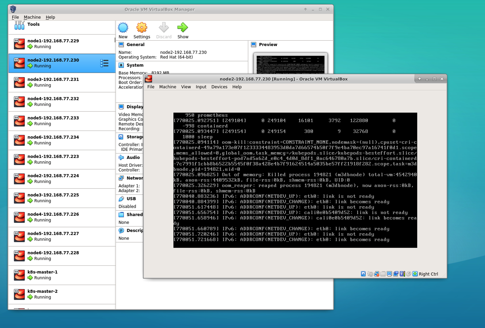
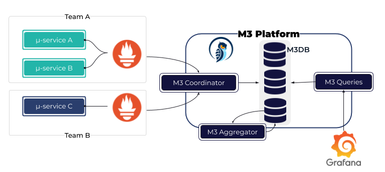
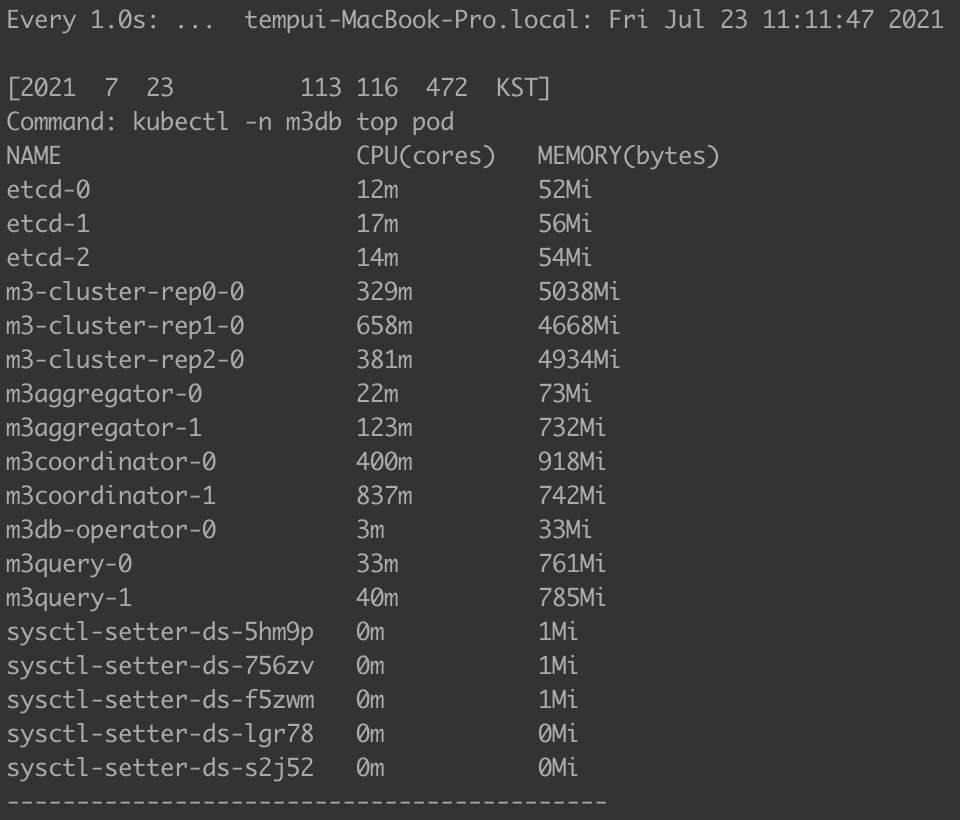
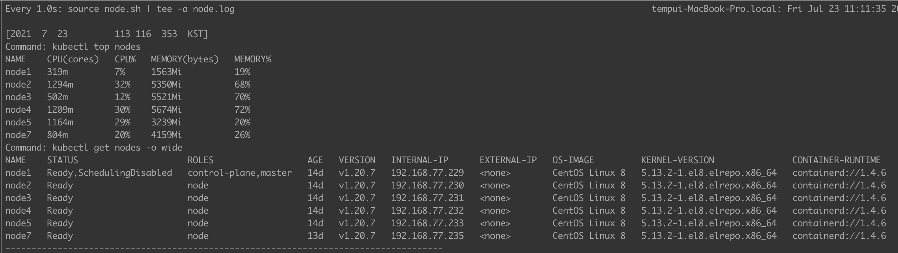

# M3DB 성능 테스트

## vm oom-kill후 eth0 link is not ready 현상 발생
- m3dbnode oom-kill 
- 원인 파악중


- m3db의 노드 리소스 점유 때문에 노드가 다운되는 현상으로 판단 하여 m3db를 독립 구성 함.

## m3db 구성



## m3db 설치 이슈
- m3db operator를 이용한 M3DB클러스트 생성시 etcd watch 에서 더이상 진행 되지 않는 현상
```sh
## externalCoordinator 를 명시하기 위해 M3DBCluster의 CR을 수정 아래와 같이 사용 하면 더이상 진행 하지 않는 현상 
  # externalCoordinator: - 활성화시 namespace가 생성 되지 않고 watch에서 멈춰 있는다.
  #   selector:
  #     app: m3coordinator
  #   serviceEndpoint: m3coordinator.m3db:7201
```

## m3db 설치 확인 사항
```sh
#!/bin/bash

# ETCD Check
kubectl -n m3db exec etcd-0 -- env ETCDCTL_API=3 etcdctl member list --write-out=table
kubectl -n m3db exec etcd-0 -- env ETCDCTL_API=3 etcdctl endpoint status --write-out=table
kubectl -n m3db exec etcd-1 -- env ETCDCTL_API=3 etcdctl endpoint status --write-out=table
kubectl -n m3db exec etcd-2 -- env ETCDCTL_API=3 etcdctl endpoint status --write-out=table

## etcd 초기화
kubectl -n m3db exec etcd-0 -- env ETCDCTL_API=3 etcdctl del --prefix "" 

# Create Namespace on M3DB Cluster (move to Operator)
# kubectl -n m3db exec m3-cluster-rep2-0 -- curl -X POST http://localhost:7201/api/v1/database/create -d '{
#   "namespaceName": "default",
#   "retentionTime": "2h"
# }' | jq .

# Check Cluster Status
kubectl -n m3db get po -l operator.m3db.io/app=m3db

kubectl -n m3db exec m3-cluster-rep2-0 -- curl -sSf localhost:9002/health
kubectl -n m3db exec m3-cluster-rep1-0 -- curl -sSf localhost:9002/health
kubectl -n m3db exec m3-cluster-rep0-0 -- curl -sSf localhost:9002/health

# Check M3DB Placement
kubectl -n m3db exec m3-cluster-rep1-0 -- curl http://localhost:7201/api/v1/services/m3db/placement | jq .

# Check M3Aggregator Placement
kubectl -n m3db exec m3-cluster-rep1-0 -- curl http://localhost:7201/api/v1/services/m3aggregator/placement | jq .

# Check M3Coordinator Placement
kubectl -n m3db exec m3-cluster-rep2-0 -- curl http://localhost:7201/api/v1/services/m3coordinator/placement | jq .

# Check M3Aggregator Topic
kubectl -n m3db exec m3-cluster-rep2-0 -- curl http://localhost:7201/api/v1/topic | jq .

# Check M3Coordinator Topic

# Check Namespace
kubectl -n m3db exec m3-cluster-rep1-0 -- curl http://localhost:7201/api/v1/services/m3db/namespace | jq .
curl http://192.168.77.233:32555/api/v1/services/m3db/namespace | jq .

# Ready Namespace
kubectl -n m3db exec m3-cluster-rep2-0 -- curl -X POST http://localhost:7201/api/v1/services/m3db/namespace/ready -d '{
  "name": "default"
}' | jq .

kubectl -n m3db exec m3-cluster-rep2-0 -- curl -X POST http://localhost:7201/api/v1/services/m3db/namespace/ready -d '{
  "name": "metrics-10s_2d"
}' | jq .

# Check M3Aggregator Metrics
curl http://192.168.77.171:32330/metrics > monitoring.aggregator

# Check M3Coordinator Metrics
curl http://192.168.77.171:32556/metrics > monitoring.coordinator

# Check M3Query Metrics
curl http://192.168.77.171:32558/metrics > monitoring.query

# Write Test Data (On Unix)
curl -X POST http://192.168.77.171:32555/api/v1/json/write -d '{
  "tags": {
    "__name__": "third_avenue",
    "city": "new_york",
    "checkout": "1"
  },
  "timestamp": '\"$(date "+%s")\"',
  "value": 3347.26
}' | jq .
curl -X POST http://192.168.77.171:32555/api/v1/json/write -d '{
  "tags": {
    "__name__": "third_avenue",
    "city": "new_york",
    "checkout": "2"
  },
  "timestamp": '\"$(date "+%s")\"',
  "value": 3347.44
}' | jq .
curl -X POST http://192.168.77.171:32555/api/v1/json/write -d '{
  "tags": {
    "__name__": "third_avenue",
    "city": "new_york",
    "checkout": "3"
  },
  "timestamp": '\"$(date "+%s")\"',
  "value": 3347.55
}' | jq .

# Read Test Data (On Unix)
curl -X "POST" -G "http://192.168.77.171:32558/api/v1/query_range" \
  -d "query=query_fetch_success" \
  -d "start=$(date "+%s" -d "10 hours ago")" \
  -d "end=$( date "+%s" -d "5 hours ago" )" \
  -d "step=30m" | jq .  

## mac
curl -X "POST" -G "http://192.168.77.233:32558/api/v1/query_range" \
  -d "query=query_fetch_success" \
  -d "start=$(date -v -4500S "+%s")" \
  -d "end=$( date +%s )" \
  -d "step=5s" | jq .

```

## Prometheus configuration
- Add to your Prometheus configuration the m3coordinator sidecar remote read/write endpoints
```yaml
  remoteWrite:
    - url: http://m3coordinator.m3db:7201/api/v1/prom/remote/write
  remoteRead:
    - url: http://m3query.m3db:7201/api/v1/prom/remote/read
      readRecent: true # To test reading even when lcoal prometheus has the data
```

- tsdb 관련 args 삭제
```yaml
## kubectl -n monitoring edit deployment prometheus-server
- "--storage.tsdb.no-lockfile"
- "--storage.tsdb.wal-compression"
- "--storage.tsdb.path=/prometheus/"
```

## Prometheus Helm Chart 변경
- m3db 사용시 tsdb 설정을 사용 안함으로 변경 함.
  - deployment에서 args: tsdb 설정 삭제
- m3db 사용시 pvc 설정을 사용 안함으로 변경 함.
- m3db 사용시 remoteWrite/remoteRead 설정 변경
```yaml
## values.yaml 샘플
  ### m3db 사용
  remoteStorage:
    enabled: true
  
    remoteWrite:
      - url: "http://192.168.77.232:32555/api/v1/prom/remote/write"

    ## https://prometheus.io/docs/prometheus/latest/configuration/configuration/#remote_read
    remoteRead:
      - url: "http://192.168.77.232:32558/api/v1/prom/remote/read"
        read_recent: true

```

## watch 명령 출력을 로깅 하기
- watch 명령에 **""** 을 사용 하여 command의 로깅을 구현 할 수 있다.
```sh
## 사용법: watch -n1 "<command> | tee -a <logfile>"
## 샘픔: vi command.sh 생성한다.
## vi node.sh

#!/bin/bash

now=$(date)
logfile="logfile"

echo "[$now]"
echo "Command: kubectl top nodes"
kubectl top nodes
echo "Command: kubectl get nodes -o wide"
kubectl get nodes -o wide
echo "------------------------------------------------------------------------------------"
echo "\n"

## watch 명령사용
watch -n1 "source command.sh | tee -a logfile"


## pod command
## vi pod.sh

#!/bin/bash

now=$(date)
logfile="logfile"

echo "[$now]"
echo "Command: kubectl -n m3db top pod"
kubectl -n m3db top pod
echo "------------------------------------------------------------------------------------"
echo "\n"
```



-----
# 참고
> [Prometheus 문제 해결을 위한 장기 저장소로 M3 활용](https://git.k3.acornsoft.io/ccambo/k3rndworks/-/blob/master/k8s/docs/%5Bkuberenetes-monitoring%5D_how_to_use_m3_as_a_longterm_storage_of_prometheus.md)
> [M3DB Operator API](https://m3db.io/docs/operator/api/)