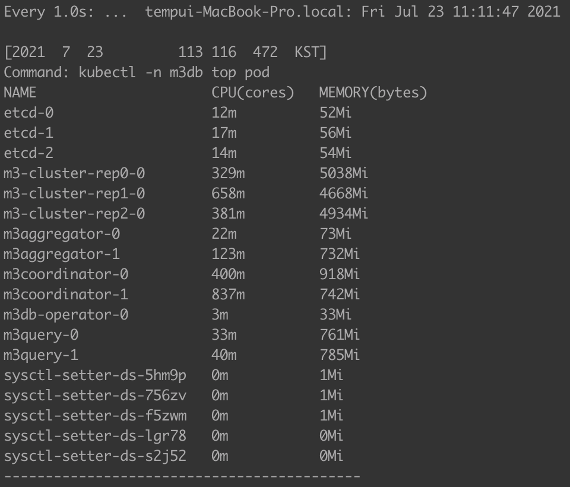
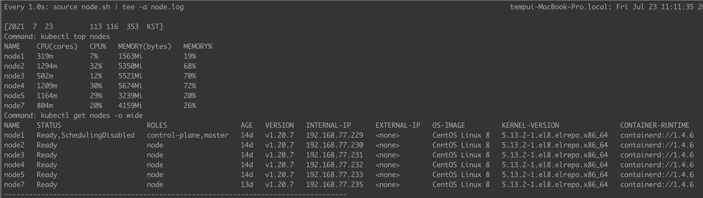
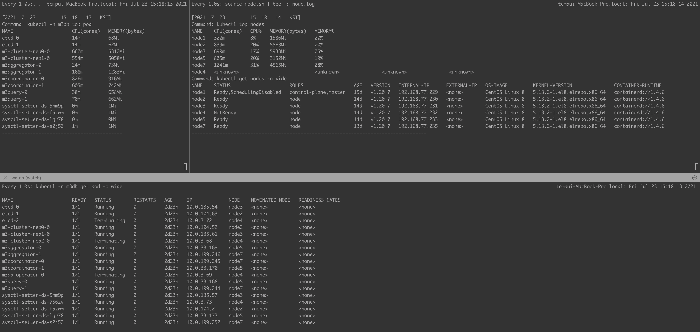
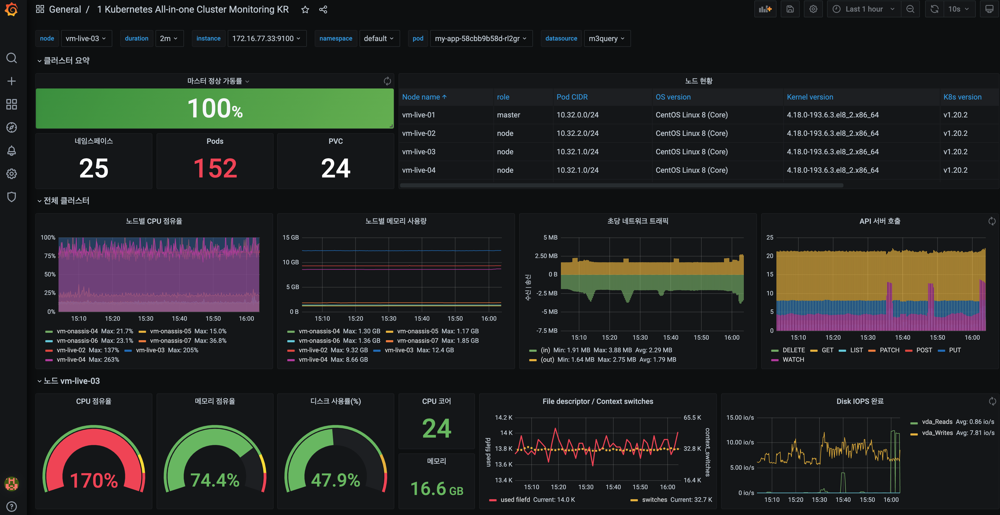

# M3DB 성능 테스트

## vm oom-kill후 eth0 link is not ready 현상 발생
- m3dbnode oom-kill 
- 원인 파악중


- m3db의 노드 리소스 점유 때문에 노드가 다운되는 현상으로 판단 하여 m3db를 독립 구성 함.
- CentOS 8.0 Kernel Upgrade를 한다.

## Linux CentOS8 커널 업데이트
elrepo 저장소를 통해 커널을 업그레이드하는 방법을 알아 볼 것이다.
  
커널을 업데이트하기 전 가장 먼저 해야 할 일은 모든 패키지를 최신 버전으로 업데이트하는 것이다.
구버전의 패키지들이 지원하지 않거나, 요소가 없으면 문제가 생기기 때문에 업데이는 필수다!


> elrepo란?
>
> Enterprise Linux 용 커뮤니티 기반 저장소이며, RHEL(RedHat Enterprise Linux) 및 이를 기반으로 꾸며진 기타 배포판들(Fedora, CentOS, Scientific)에 대한 지원을 제공하는 저장소이다.
>
> 주로 소프트웨어적인 부분 보다 커널, 파일 시스템 드라이버, 그래픽 드라이버 등을 비롯한 하드웨어와 관련된 패키지에 중점을 두고 있는 저장소다.
 

1. 아래의 명령어를 통해 패키지를 업데이트하자.
```sh
$ yum -y update
$ yum install yum-plugin-fastestmirror
```

2. 커널 버전 확인
아래의 명령어를 입력하여 운영체제 및 커널 버전을 확인한다

- 운영체제 버전 확인
```sh
$ cat /etc/redhat-release

$ cat /etc/os-release
```
- 커널 버전 확인
```sh
$ uname -msr

Linux 4.18.0-240.1.1.el8_3.x86_64 x86_64
```

3. elrepo 저장소 추가

새로운 커널을 elrepo 저장소를 통해 설치하려면 먼저 elrepo 저장소가 추가되어있어야 한다.
> GPG-KEY란?
>
> GNU Privacy Guard-KEY의 약자로 배포되고 있는 패키지가 안전한 패키지가 맞는지 확인하는 일종의 인증키다.

> elrepo 최신 버전을 확인해보자.
> http://elrepo.org/tiki/tiki-index.php
```sh
## 아래의 명령어를 입력하여 RPM-GPG-KEY를 먼저 추가한다.
$ rpm —import https://www.elrepo.org/RPM-GPG-KEY-elrepo.org

## 이제 yum 명령어를 통해 elrepo 저장소를 추가한다.
$ yum install https://www.elrepo.org/elrepo-release-8.0-2.el8.elrepo.noarch.rpm

## 이제 시스템에 elrepo 저장소가 성공적으로 등록되었는지 확인해보자.
$ yum repolist

repo id                                          repo name
LocalRepo_AppStream                              LocalRepo_AppStream
LocalRepo_BaseOS                                 LocalRepo_BaseOS
elrepo                                           ELRepo.org Community Enterprise Linux Repository - el8
```

4. 새로운 커널 설치
아래의 명령어를 입력하여 최신 버전의 새로운 커널을 설치한다.
> --enablerepo 옵션?
> 
> 기본적으로 일반적인 저장소가 활성되어있으나, 우리는 elrepo에서 최신 커널을 받아와 설치해야 하기 때문에,
> 해당 저장소를 사용한다고 옵션을 통해 명시해주어야 한다.
```sh
$ yum --enablerepo=elrepo-kernel install kernel-ml

ELRepo.org Community Enterprise Linux Kernel Repository - el8                                        687 kB/s | 2.5 MB     00:03
Dependencies resolved.
=====================================================================================================================================
 Package                           Architecture           Version                                Repository                     Size
=====================================================================================================================================
Installing:
 kernel-ml                         x86_64                 5.13.2-1.el8.elrepo                    elrepo-kernel                  66 k
Installing dependencies:
 kernel-ml-core                    x86_64                 5.13.2-1.el8.elrepo                    elrepo-kernel                  31 M
 kernel-ml-modules                 x86_64                 5.13.2-1.el8.elrepo                    elrepo-kernel                  27 M

Transaction Summary
=====================================================================================================================================
Install  3 Packages

Total download size: 58 M
Installed size: 94 M
Is this ok [y/N]: y
Downloading Packages:
(1/3): kernel-ml-5.13.2-1.el8.elrepo.x86_64.rpm                                                       68 kB/s |  66 kB     00:00
(2/3): kernel-ml-core-5.13.2-1.el8.elrepo.x86_64.rpm                                                 3.6 MB/s |  31 MB     00:08
(3/3): kernel-ml-modules-5.13.2-1.el8.elrepo.x86_64.rpm                                              2.8 MB/s |  27 MB     00:09
-------------------------------------------------------------------------------------------------------------------------------------
Total                                                                                                5.8 MB/s |  58 MB     00:09
Running transaction check
Transaction check succeeded.
Running transaction test
Transaction test succeeded.
Running transaction
  Preparing        :                                                                                                             1/1
  Installing       : kernel-ml-core-5.13.2-1.el8.elrepo.x86_64                                                                   1/3
  Running scriptlet: kernel-ml-core-5.13.2-1.el8.elrepo.x86_64                                                                   1/3
  Installing       : kernel-ml-modules-5.13.2-1.el8.elrepo.x86_64                                                                2/3
  Running scriptlet: kernel-ml-modules-5.13.2-1.el8.elrepo.x86_64                                                                2/3
  Installing       : kernel-ml-5.13.2-1.el8.elrepo.x86_64                                                                        3/3
  Running scriptlet: kernel-ml-core-5.13.2-1.el8.elrepo.x86_64                                                                   3/3
  Running scriptlet: kernel-ml-5.13.2-1.el8.elrepo.x86_64                                                                        3/3
  Verifying        : kernel-ml-5.13.2-1.el8.elrepo.x86_64                                                                        1/3
  Verifying        : kernel-ml-core-5.13.2-1.el8.elrepo.x86_64                                                                   2/3
  Verifying        : kernel-ml-modules-5.13.2-1.el8.elrepo.x86_64                                                                3/3

Installed:
  kernel-ml-5.13.2-1.el8.elrepo.x86_64   kernel-ml-core-5.13.2-1.el8.elrepo.x86_64   kernel-ml-modules-5.13.2-1.el8.elrepo.x86_64

Complete!
```

5. 재부팅을 통해 현재 커널을 최신 커널로 변경하자.
```sh
$ reboot
```

6. 커널 버전 확인
```
$ uname -smr

Linux 5.13.2-1.el8.elrepo.x86_64 x86_64
```
## m3db 구성


- 노드 구성
  - Master (cpu: 4Core, Memory: 8Gb)
  - Worker (cpu: 4Core, Memory: 8Gb) : M3DBCluster and ETCD
  - Worker (cpu: 4Core, Memory: 8Gb) : M3DBCluster and ETCD
  - Worker (cpu: 4Core, Memory: 8Gb) : M3DBCluster and ETCD
  - Worker (cpu: 4Core, Memory: 16Gb) : M3 Coordinator and M3 Query and M3 Aggregator
  - Worker (cpu: 4Core, Memory: 16Gb) : M3 Coordinator and M3 Query
  - Repository : NFS 


- 검토 해야 할 사항
위와 같은 아키텍처의 구성이 가능한지에 대해서는 좀 더 많은 검토와 제약 사항들을 확인해 봐야 한다. 또한 서비스 제공화하는 경우는 더 다양한 항목들에 대한 검토가 필요하다.

  - [ ] Multi-Cluster 식별자 제공이 가능한가?
  - [ ] Multi-Cluster 식별자는 어디에 설정이 되어야 하는가? Prometheus? Coordinator?
  - [ ] 서비스 + 클러스터 단위로 Namespace 구성을 통해 데이터 관리 필요?
  - [ ] 현재 M3 Query 와 M3 Coordinator 와의 분리/통합은?
  - [ ] 대량의 데이터일 경우의 Requirements 에 대한 검토 및 Limits 구성 검증?

## m3db 설치 이슈
- m3db operator를 이용한 M3DB클러스트 생성시 etcd watch 에서 더이상 진행 되지 않는 현상
```sh
## externalCoordinator 를 명시하기 위해 M3DBCluster의 CR을 수정 아래와 같이 사용 하면 더이상 진행 하지 않는 현상 
  # externalCoordinator: - 활성화시 namespace가 생성 되지 않고 watch에서 멈춰 있는다.
  #   selector:
  #     app: m3coordinator
  #   serviceEndpoint: m3coordinator.m3db:7201
```

## m3db 설치 확인 사항
```sh
#!/bin/bash

# ETCD Check
kubectl -n m3db exec etcd-0 -- env ETCDCTL_API=3 etcdctl member list --write-out=table
kubectl -n m3db exec etcd-0 -- env ETCDCTL_API=3 etcdctl endpoint status --write-out=table
kubectl -n m3db exec etcd-1 -- env ETCDCTL_API=3 etcdctl endpoint status --write-out=table
kubectl -n m3db exec etcd-2 -- env ETCDCTL_API=3 etcdctl endpoint status --write-out=table

## etcd 초기화
kubectl -n m3db exec etcd-0 -- env ETCDCTL_API=3 etcdctl del --prefix "" 

# Create Namespace on M3DB Cluster (move to Operator)
# kubectl -n m3db exec m3-cluster-rep2-0 -- curl -X POST http://localhost:7201/api/v1/database/create -d '{
#   "namespaceName": "default",
#   "retentionTime": "2h"
# }' | jq .

# Check Cluster Status
kubectl -n m3db get po -l operator.m3db.io/app=m3db

kubectl -n m3db exec m3-cluster-rep2-0 -- curl -sSf localhost:9002/health
kubectl -n m3db exec m3-cluster-rep1-0 -- curl -sSf localhost:9002/health
kubectl -n m3db exec m3-cluster-rep0-0 -- curl -sSf localhost:9002/health

# Check M3DB Placement
kubectl -n m3db exec m3-cluster-rep1-0 -- curl http://localhost:7201/api/v1/services/m3db/placement | jq .

# Check M3Aggregator Placement
kubectl -n m3db exec m3-cluster-rep1-0 -- curl http://localhost:7201/api/v1/services/m3aggregator/placement | jq .

# Check M3Coordinator Placement
kubectl -n m3db exec m3-cluster-rep2-0 -- curl http://localhost:7201/api/v1/services/m3coordinator/placement | jq .

# Check M3Aggregator Topic
kubectl -n m3db exec m3-cluster-rep2-0 -- curl http://localhost:7201/api/v1/topic | jq .

# Check M3Coordinator Topic

# Check Namespace
kubectl -n m3db exec m3-cluster-rep1-0 -- curl http://localhost:7201/api/v1/services/m3db/namespace | jq .
curl http://192.168.77.233:32555/api/v1/services/m3db/namespace | jq .

# Ready Namespace
kubectl -n m3db exec m3-cluster-rep2-0 -- curl -X POST http://localhost:7201/api/v1/services/m3db/namespace/ready -d '{
  "name": "default"
}' | jq .

kubectl -n m3db exec m3-cluster-rep2-0 -- curl -X POST http://localhost:7201/api/v1/services/m3db/namespace/ready -d '{
  "name": "metrics-10s_2d"
}' | jq .

# Check M3Aggregator Metrics
curl http://192.168.77.171:32330/metrics > monitoring.aggregator

# Check M3Coordinator Metrics
curl http://192.168.77.171:32556/metrics > monitoring.coordinator

# Check M3Query Metrics
curl http://192.168.77.171:32558/metrics > monitoring.query

# Write Test Data (On Unix)
curl -X POST http://192.168.77.171:32555/api/v1/json/write -d '{
  "tags": {
    "__name__": "third_avenue",
    "city": "new_york",
    "checkout": "1"
  },
  "timestamp": '\"$(date "+%s")\"',
  "value": 3347.26
}' | jq .
curl -X POST http://192.168.77.171:32555/api/v1/json/write -d '{
  "tags": {
    "__name__": "third_avenue",
    "city": "new_york",
    "checkout": "2"
  },
  "timestamp": '\"$(date "+%s")\"',
  "value": 3347.44
}' | jq .
curl -X POST http://192.168.77.171:32555/api/v1/json/write -d '{
  "tags": {
    "__name__": "third_avenue",
    "city": "new_york",
    "checkout": "3"
  },
  "timestamp": '\"$(date "+%s")\"',
  "value": 3347.55
}' | jq .

# Read Test Data (On Unix)
curl -X "POST" -G "http://192.168.77.171:32558/api/v1/query_range" \
  -d "query=query_fetch_success" \
  -d "start=$(date "+%s" -d "10 hours ago")" \
  -d "end=$( date "+%s" -d "5 hours ago" )" \
  -d "step=30m" | jq .  

## mac
curl -X "POST" -G "http://192.168.77.233:32558/api/v1/query_range" \
  -d "query=query_fetch_success" \
  -d "start=$(date -v -4500S "+%s")" \
  -d "end=$( date +%s )" \
  -d "step=5s" | jq .

```

## Prometheus configuration
- Add to your Prometheus configuration the m3coordinator sidecar remote read/write endpoints
```yaml
  remoteWrite:
    - url: http://m3coordinator.m3db:7201/api/v1/prom/remote/write
  remoteRead:
    - url: http://m3query.m3db:7201/api/v1/prom/remote/read
      readRecent: true # To test reading even when lcoal prometheus has the data
```

- tsdb 관련 args 삭제
```yaml
## kubectl -n monitoring edit deployment prometheus-server
- "--storage.tsdb.no-lockfile"
- "--storage.tsdb.wal-compression"
- "--storage.tsdb.path=/prometheus/"
```

## Prometheus Helm Chart 변경
- m3db 사용시 tsdb 설정을 사용 안함으로 변경 함.
  - deployment에서 args: tsdb 설정 삭제
- m3db 사용시 pvc 설정을 사용 안함으로 변경 함.
- m3db 사용시 remoteWrite/remoteRead 설정 변경
```yaml
## values.yaml 샘플
  ### m3db 사용
  remoteStorage:
    enabled: true
  
    remoteWrite:
      - url: "http://192.168.77.232:32555/api/v1/prom/remote/write"

    ## https://prometheus.io/docs/prometheus/latest/configuration/configuration/#remote_read
    remoteRead:
      - url: "http://192.168.77.232:32558/api/v1/prom/remote/read"
        read_recent: true

```

## watch 명령 출력을 로깅 하기
- watch 명령에 **""** 을 사용 하여 command의 로깅을 구현 할 수 있다.
```sh
## 사용법: watch -n1 "<command> | tee -a <logfile>"
## 샘픔: vi command.sh 생성한다.
## vi node.sh

#!/bin/bash

now=$(date)
logfile="logfile"

echo "[$now]"
echo "Command: kubectl top nodes"
kubectl top nodes
echo "Command: kubectl get nodes -o wide"
kubectl get nodes -o wide
echo "------------------------------------------------------------------------------------"
echo "\n"

## watch 명령사용
watch -n1 "source command.sh | tee -a logfile"


## pod command
## vi pod.sh

#!/bin/bash

now=$(date)
logfile="logfile"

echo "[$now]"
echo "Command: kubectl -n m3db top pod"
kubectl -n m3db top pod
echo "------------------------------------------------------------------------------------"
echo "\n"
```



-----

## 노드 장애 상황 재현
- etcd 노드의 kubelet을 stop 해서 장애 상황을 테스트 한다.


- metrics 수집 확인 : Grafana Dashboard 화면 / Prometheus Dashboard 화면



# 참고
> [Prometheus 문제 해결을 위한 장기 저장소로 M3 활용](https://git.k3.acornsoft.io/ccambo/k3rndworks/-/blob/master/k8s/docs/%5Bkuberenetes-monitoring%5D_how_to_use_m3_as_a_longterm_storage_of_prometheus.md)
> [M3DB Operator API](https://m3db.io/docs/operator/api/)