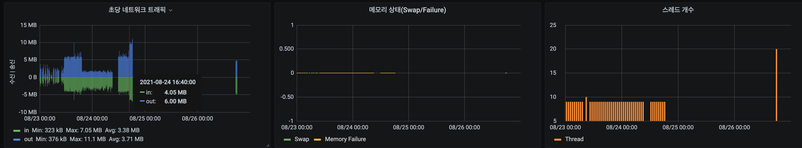

## m3-cluster crashloopbackoff 상황

cluster가 비정상 종료 되어(Virtualbox vm off) 복구 시점에서 m3-cluster 가 비정상 재시작 되는 경우 발생.

- log 내용
```sh
## etcd 연결을 못하고 계속 재시작 되는 것으로 판단 된다.
## 아래와 같이 에러 내용 없이 멈춰 있다가 재시작 된다.
## 정상 로그와 비교 했을때 다음 스텝은 etcd 연결로 판단 된다.
{"level":"info","ts":1629707644.7510695,"msg":"setting MutexProfileFraction: 0"}
{"level":"info","ts":1629707644.7511215,"msg":"setting BlockProfileRate: 0"}
{"level":"info","ts":1629707644.7512124,"msg":"setting MutexProfileFraction: 0"}
{"level":"info","ts":1629707644.7512288,"msg":"setting BlockProfileRate: 0"}
{"level":"info","ts":1629707644.7514489,"msg":"raised rlimit no file fds limit","required":true,"sysNROpenValue":3000000,"noFileMaxValue":3000000,"noFileCurrValue":3000000}
{"level":"info","ts":1629707644.7521713,"msg":"tracing disabled for m3query; set `tracing.backend` to enable"}
{"level":"info","ts":1629707645.7795236,"msg":"tracing disabled; set `tracing.backend` to enable"}

```

- Action 내용
  - etcd 접속 상태 확인. 
    - 결과: 정상 접속 확인 되었다.
  ```sh
  ## step1. m3-cluster 파드에 접속(잠시 running상태 일때) 한다.
  $ kubectl -n m3db exec -it m3-cluster-rep0-0 sh

  ## step2. configmap과 secret을 정상 mount 하는지 확인 한다.
  $ ps -ef 
  $ vi /etc/m3db/m3.yml
  $ ls /etcd-secret-tls

  ## step3. etcdctl을 설치 한다.
  ETCD_VER=v3.3.12
  wget https://storage.googleapis.com/etcd/${ETCD_VER}/etcd-${ETCD_VER}-linux-amd64.tar.gz
  tar xzvf etcd-${ETCD_VER}-linux-amd64.tar.gz
  mv etcd-${ETCD_VER}-linux-amd64/etcdctl /usr/local/bin/etcdctl
  etcdctl --version
  rm -rf etcd-${ETCD_VER}-linux-amd64/
  rm -f etcd-${ETCD_VER}-linux-amd64.tar.gz

  ## step4. etcd 조회
  ETCDCTL_API=3 etcdctl --endpoints=https://192.168.77.229:2379 --cacert=/etcd-secret-tls/ca.crt --cert=/etcd-secret-tls/etcd-client.crt --key=/etcd-secret-tls/etcd-client.key get "" --prefix --keys-only | sed '/^\s*$/d'
  ```

  - etcd key(_sd.placement/m3db/m3-cluster/m3db)를 삭제 했을때 재생성 되는지 확인 해 보았다.
    - 결과: 재생성 되지 않았다.
  ```sh
  ## step1. m3query-0 파드로 접속 한다.
  $ kubectl -n m3db exec -it m3query-0 sh

  ## step2. etcd key를 삭제 한다.
  $ ETCDCTL_API=3 etcdctl --endpoints=https://192.168.77.229:2379 --cacert=/etcd-secret-tls/ca.crt --cert=/etcd-secret-tls/etcd-client.crt --key=/etcd-secret-tls/etcd-client.key get "" --prefix --keys-only | sed '/^\s*$/d'

  $ ETCDCTL_API=3 etcdctl --endpoints=https://192.168.77.229:2379 --cacert=/etcd-secret-tls/ca.crt --cert=/etcd-secret-tls/etcd-client.crt --key=/etcd-secret-tls/etcd-client.key del _sd.placement/m3db/m3-cluster/m3db
  ```

  - m3db-operator 재설치 하여 etcd 값이 재생성 되는지 확인 해 보았다.
    - 결과: 재생성 되었다.
  ```sh
  ## step1. M3DBCluster 삭제
  $ kubectl -n m3db delete M3DBCluster m3-cluster

  ## step2. m3-operator 설치
  ## step3. M3DBCluster 설치
  ## step4. sts 수정 - secret volume mount
  ```

  - 원인 검증
    - m3db-operator가 설치 된 상태와 삭제 된 상태 모두 장애 재현(vm 재시작) 해보았으나 재현 불가  

- 해결 방안
  - m3-operator로 M3DBCluster를 재설치 한다.
  - statefulset의 pvc는 삭제 되지 않으므로 **data는 보존** 된다.
  

- 원인 분석
  - embedded etcd를 사용 하기 위해 statefulset을 수정 후 operator를 삭제 한 상태 였다.
  - m3db-operator의 역할을 분석 해 보자.
    - m3-cluster 최초 생성시에만 etcd 값을 생성 하는가?
    - statefulset을 수정 했을 경우 복구 되는가?
