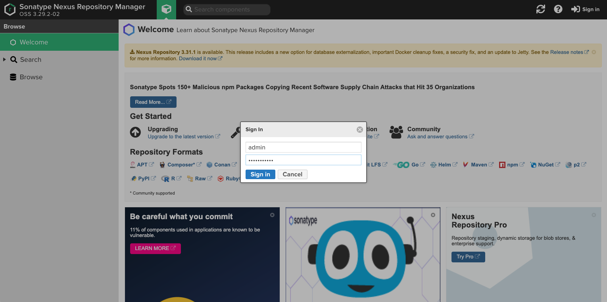
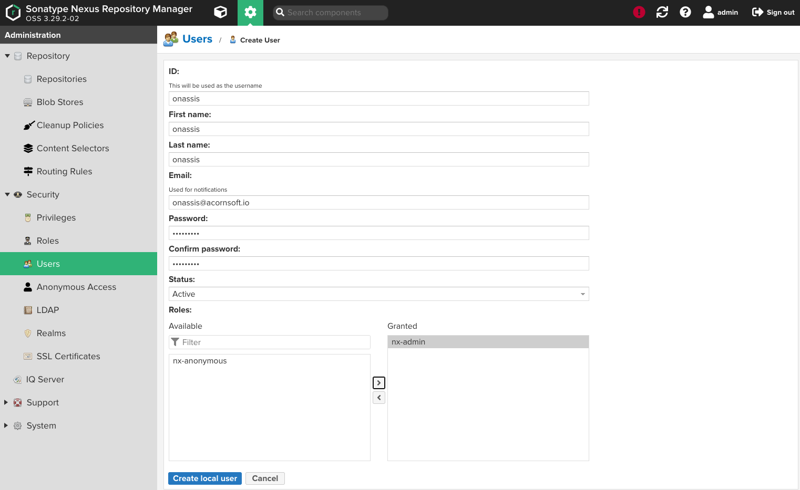
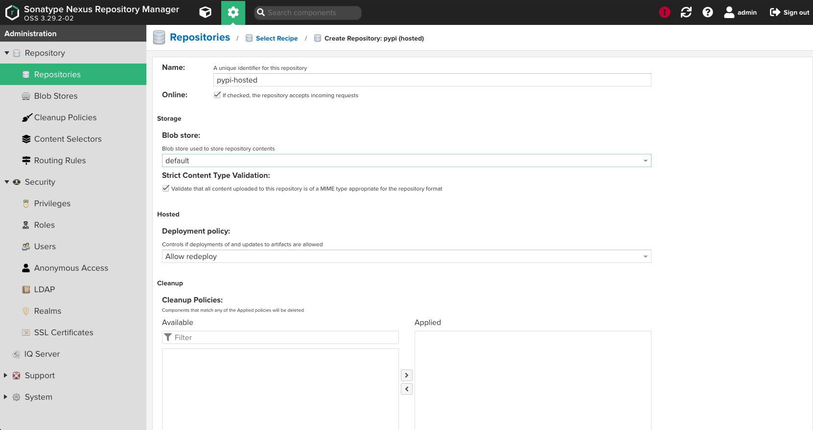
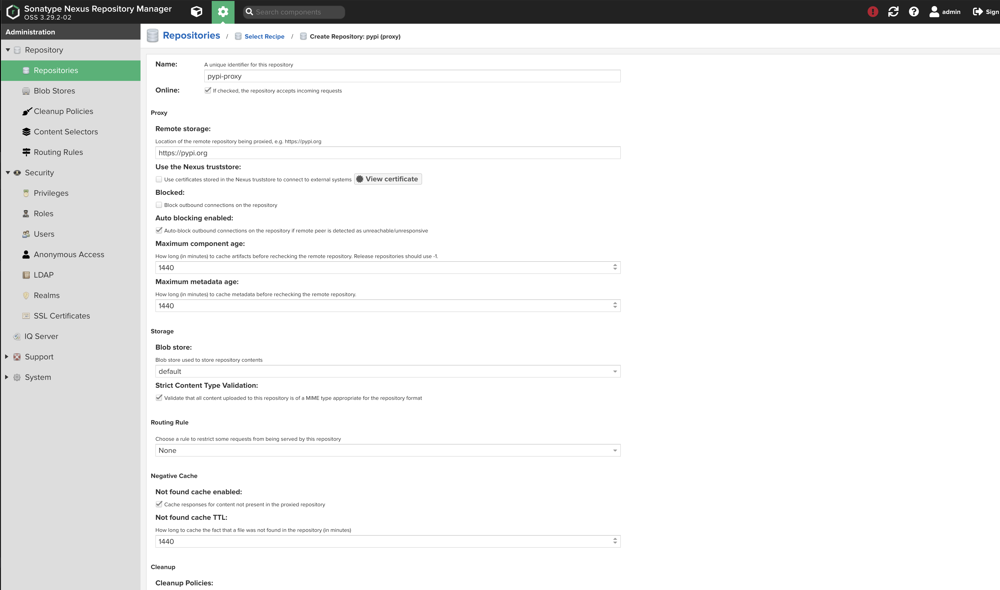
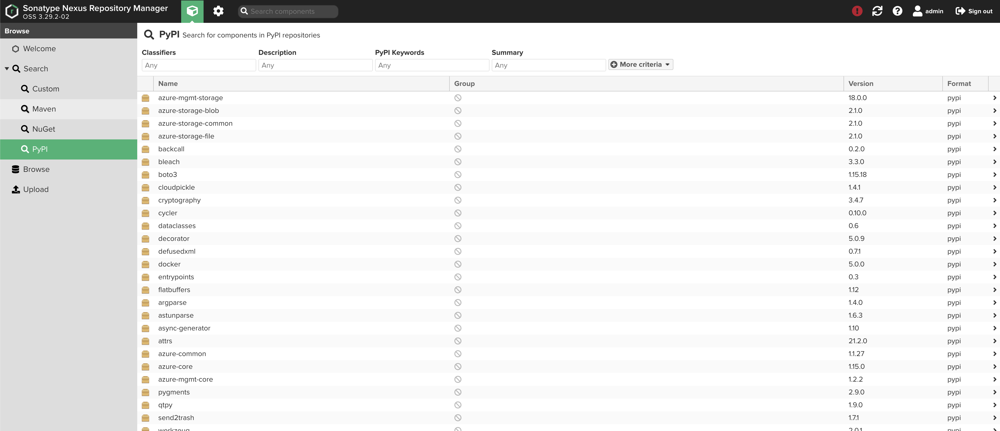

# Nexus 설치 방법

## 1. Repository 등록
> ca.crt  다운로드 URL : https://regi.k3.acornsoft.io/ca.crt
```sh
helm repo add --ca-file ./ca.crt k3lab https://192.168.77.30/chartrepo/k3lab-charts
```

## 2. nexus-values.yaml 정의
```yaml
.......................

ingress:
  enabled: true
  annotations:
    kubernetes.io/ingress.class: nginx
    nginx.ingress.kubernetes.io/proxy-body-size: "5G"
  hostPath: /
  hostRepo: nexus.k3.acornsoft.io
  tls:
    - secretName: tls-acornsoft-star
      hosts:
        - nexus.k3.acornsoft.io

.......................

```

## 3. nexus 설치
```
$ helm upgrade -i nexus k3lab/nexus-repository-manager --cleanup-on-fail -f nexus-values.yaml -n namespaces
```

## 4. nexus 접속
- url : https://nexus.k3.acornsoft.io
- id  : admin
- pwd : @c0rns0ft@@




## 5. 사용자 생성
- 위치 : Configration > Security > Users > Create local user
- 계정 정보 입력



## 6. Repository 생성
> 위치 : Configration > Repository > Repositories > Create repository

### 6-1. Hosted 방식

- pypi(hosted) repository 선택 후 구성 정보 입력



### 6-2. Proxy 방식

- pypi(proxy) repository 선택 후 구성 정보 입력



## 7. 패키지 다운로드(Pypi > Local)
- Hosted Repository 인 경우만 해당됨.
- 필요한 패키지명을 requirements.txt 생성한다.

```
$ pip download --dest packages --prefer-binary -r requirements.txt

$ cd packages

Jinja2-3.0.1-py3-none-any.whl                                 jupyter-1.0.0-py2.py3-none-any.whl
Keras_Preprocessing-1.1.2-py2.py3-none-any.whl                jupyter_client-6.1.12-py3-none-any.whl
Markdown-3.3.4-py3-none-any.whl                               jupyter_console-6.4.0-py3-none-any.whl
MarkupSafe-2.0.1-cp39-cp39-macosx_10_9_x86_64.whl             jupyter_core-4.7.1-py3-none-any.whl
Pillow-8.2.0-cp39-cp39-macosx_10_10_x86_64.whl                jupyterlab_pygments-0.1.2-py2.py3-none-any.whl
PyJWT-2.1.0-py3-none-any.whl                                  jupyterlab_widgets-1.0.0-py3-none-any.whl
PyYAML-5.4.1-cp39-cp39-macosx_10_9_x86_64.whl                 keras_nightly-2.5.0.dev2021032900-py2.py3-none-any.whl
Pygments-2.9.0-py3-none-any.whl                               kfserving-0.4.1-py3-none-any.whl
QtPy-1.9.0-py2.py3-none-any.whl                               kiwisolver-1.3.1-cp39-cp39-macosx_10_9_x86_64.whl
Send2Trash-1.7.1-py3-none-any.whl                             kubeflow_fairing-1.0.2-py3-none-any.whl
Werkzeug-2.0.1-py3-none-any.whl                               kubeflow_pytorchjob-0.1.3-py3-none-any.whl
absl_py-0.13.0-py3-none-any.whl                               kubeflow_tfjob-0.1.3-py3-none-any.whl
adal-1.2.7-py2.py3-none-any.whl                               kubernetes-10.0.1-py2.py3-none-any.whl
appnope-0.1.2-py2.py3-none-any.whl                            matplotlib-3.3.4-cp39-cp39-macosx_10_9_x86_64.whl
argon2_cffi-20.1.0-cp37-abi3-macosx_10_6_intel.whl            minio-7.0.4-py3-none-any.whl
argparse-1.4.0-py2.py3-none-any.whl                           mistune-0.8.4-py2.py3-none-any.whl
astunparse-1.6.3-py2.py3-none-any.whl                         msrest-0.6.21-py2.py3-none-any.whl
async_generator-1.10-py3-none-any.whl                         msrestazure-0.6.4-py2.py3-none-any.whl
attrs-21.2.0-py2.py3-none-any.whl                             nbclient-0.5.3-py3-none-any.whl
azure_common-1.1.27-py2.py3-none-any.whl                      nbconvert-6.0.7-py3-none-any.whl
azure_core-1.15.0-py2.py3-none-any.whl                        nbformat-5.1.3-py3-none-any.whl
azure_mgmt_core-1.2.2-py2.py3-none-any.whl                    nest_asyncio-1.5.1-py3-none-any.whl
azure_mgmt_storage-18.0.0-py2.py3-none-any.whl                notebook-6.4.0-py3-none-any.whl
azure_storage_blob-2.1.0-py2.py3-none-any.whl                 numpy-1.19.5-cp39-cp39-macosx_10_9_x86_64.whl
azure_storage_common-2.1.0-py2.py3-none-any.whl               oauth2client-4.1.3-py2.py3-none-any.whl
azure_storage_file-2.1.0-py2.py3-none-any.whl                 oauthlib-3.1.1-py2.py3-none-any.whl
backcall-0.2.0-py2.py3-none-any.whl                           opt_einsum-3.3.0-py3-none-any.whl
bleach-3.3.0-py2.py3-none-any.whl                             packaging-20.9-py2.py3-none-any.whl
boto3-1.15.18-py2.py3-none-any.whl                            pandocfilters-1.4.3.tar.gz
botocore-1.18.18-py2.py3-none-any.whl                         parso-0.8.2-py2.py3-none-any.whl
cached_property-1.5.2-py2.py3-none-any.whl                    pexpect-4.8.0-py2.py3-none-any.whl
```


## 8. 패키지 업로드(Local > Nexus)
- Hosted Repository 인 경우만 해당됨.
- 업로드에 필요한 twine 패키지 설치

```sh
$ pip install twine
```

- nexus3-pip.conf 파일 생성
```
[distutils]
index-servers =
    global

[global]
index-url = https://nexus.k3.acornsoft.io/repository/pypi-hosted/simple/
repository: https://nexus.k3.acornsoft.io/repository/pypi-hosted/
username: admin
password: @c0rns0ft@@
```

- 패키지 업로드
```sh
$ twine upload -r global --config-file nexus3-pip.conf ./packages/*

Uploading distributions to https://nexus.k3.acornsoft.io/repository/pypi-hosted/
Uploading Jinja2-3.0.1-py3-none-any.whl
100%|████████████████████████████████████████████████████████████████████████████████████████████████████████████████| 138k/138k [00:01<00:00, 114kB/s]
Uploading Keras_Preprocessing-1.1.2-py2.py3-none-any.whl
100%|██████████████████████████████████████████████████████████████████████████████████████████████████████████████| 47.9k/47.9k [00:00<00:00, 292kB/s]
Uploading Markdown-3.3.4-py3-none-any.whl
100%|████████████████████████████████████████████████████████████████████████████████████████████████████████████████| 104k/104k [00:00<00:00, 438kB/s]
```



## 9. 패키지 다운로드(Nexus > Local)
- ~/pip/pip.conf 설정
- conf 파일이 존재하지 않으면 수동으로 생성한다.
```
[distutils]
index-servers =
    global

[global]
index-url = https://nexus.k3.acornsoft.io/repository/pypi-proxy/simple/
repository: https://nexus.k3.acornsoft.io/repository/pypi-proxy/
#username: admin
#password: @c0rns0ft@@
```

- 패키지 설치
```
# 수동설치 방식(pip.conf가 설정이 안된 경우)
  $ pip install zipp -i https://nexus.k3.acornsoft.io/repository/pypi-proxy/sample
  $ pip install -r requirements.txt -i https://nexus.k3.acornsoft.io/repository/pypi-proxy/sample

# 자동설치(pip.conf가 설정된 경우)
  $ pip install zipp
  $ pip install -r requirements.txt
```
