# Openstack 관리 정책

## 오픈스택 관리 엑셀
- docs 주소: https://docs.google.com/spreadsheets/u/3/d/13osJEuB-Uc6kQ5jazO9KWaI-Bj1gfecj/edit#gid=1363506802

## 오픈스택 cli 사용법
- 오픈스택 cli를 사용하여 통합 관리를 용이 하게 한다.
```sh
# cli 설치 - mac 또는 pytyon
brew install openstackclient
pip install openstackclient

# cli 확인
openstack --version 

# openstack API를 사용하기 위해 접속 RC 파일을 다룬로드 한다.
openstack 접속(admin user) > 상단메뉴: 해당 프로젝트로 이동(onassis) > 왼쪽 메뉴: Project > API Acess 클릭 > Download OpenStack RC File 선택

# 다운로드한 RC File을 이용해서 openstack cli 접속
source onassis-openrc.sh
admin 암호 입력

# API Access 확인
openstack network list
openstack server list

```
  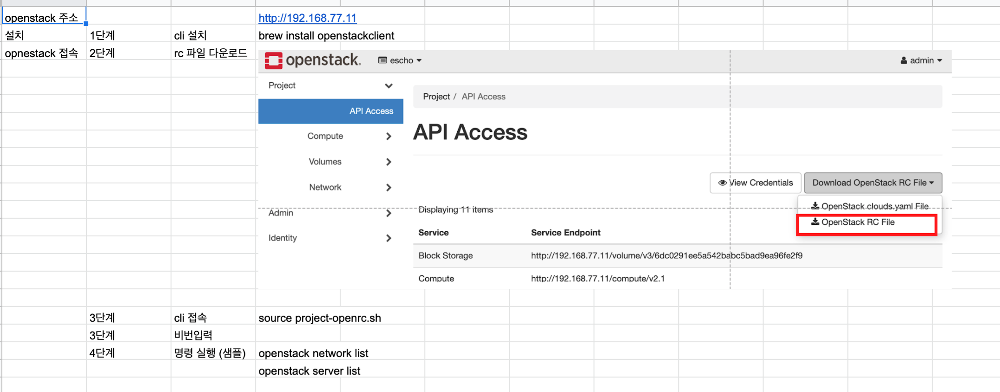

## 관리 엑셀 - iptables 사용법
- iptables 시트에서 ip 사용성을 정리 한다.
  - Project 이름
  - 네트워크 인터페이스: Floating IP
  - Description
  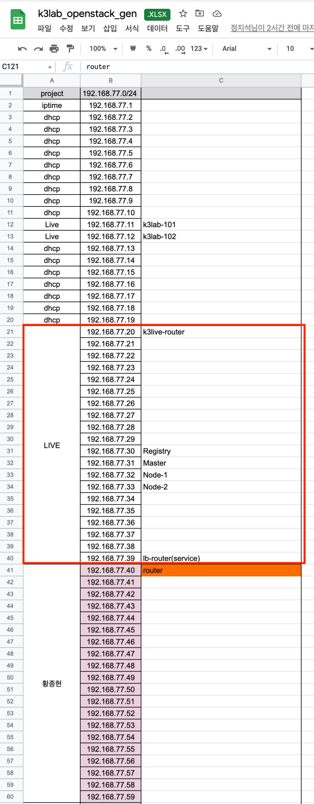

## 관리 엑셀 - 프로젝트 시트 사용법
- 프로젝트 명으로 시트를 생성 해서 명령어 관리를 한다.
- 기본정보 값
  - vol-image: os 이미지
  - vol-size: 볼륨 크기 지정
  - net-name:	네트워크 이름<프로젝트명-net>
  - subname:	서브넷 이름<프로젝트명-subnet>
  - security-group: 보안 그룹 생성 id
  - availability-zone: nova
  - project: 프로젝트명
  - flavor: flavor 이름(관리 페이지에서 확인)
  - key-name: 인증 키 이름(로그인)
  - public-net:	public
  - public-subnet:	public-subnet
- ip 주소 값
  - name: private-ip 값으로 사용된다.
  - private-ip: private ip 주소
  - float-ip: float ip 주소
- 위 항목들의 값으로 openstack 명령어를 자동 변경 한다.
  
  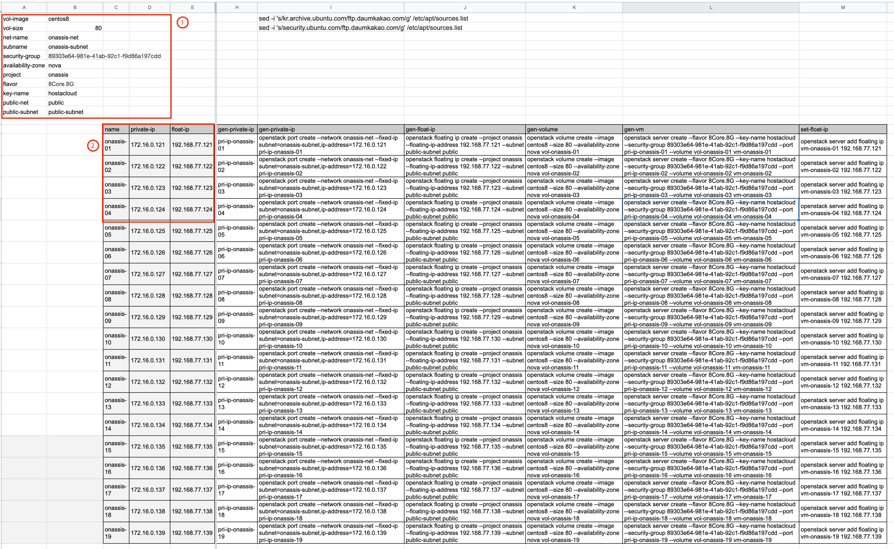

## 외부 네트워크 생성 - public
- admin 권한으로 로그인 한다.
- 좌측 메뉴 관리 > 네트워크 > 네트워크 생성
- 공급자 네트워크 유형: Flat
- 물리적인 네트워크: public (* )

## 프로젝트 생성
- admin 권한으로 로그인 한다.
- 인증 메뉴에서 사용자를 생성 한다.
  - 역할: admin으로 생성 한다.
- 인증 메뉴에서 프로젝트를 생성 한다.
  - 프로젝트 기본 정보 입력
  - 프로젝트 멤버 추가
  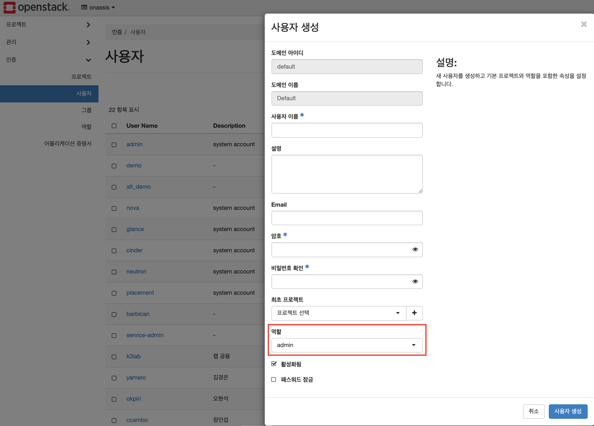
  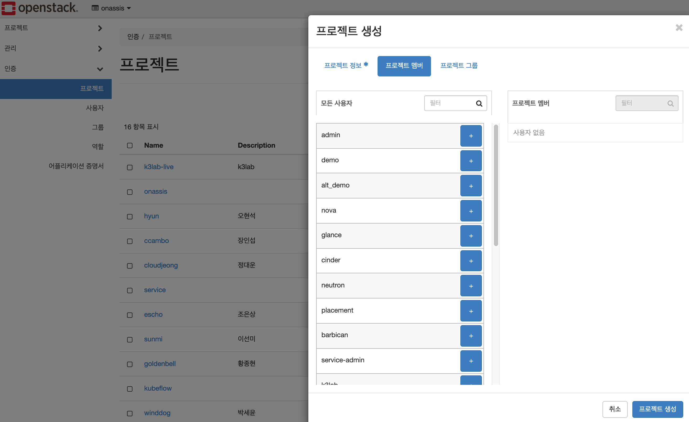

## 프로젝트 설정 - 보안 그룹
- 보안 그룹 생성: 규칙 추가(규칙 관리 클릭)
  - 규칙: 모든 ICMP / 들어옴 / CIDR: 0.0.0.0
  - 규칙: 모든 TCP / 들어옴 / CIDR: 0.0.0.0
  - 규칙: 모든 UDP / 들어옴 / CIDR: 0.0.0.0
  - 규칙: 다른 프로토콜 / 들어옴 / IP 프로토콜: 4 / CIDR: 0.0.0.0
    - 참조: [프로토콜 설명](https://realforce111.tistory.com/6)
  
<br/>

  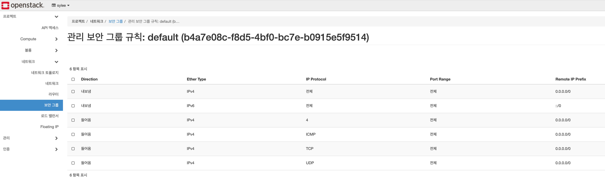
  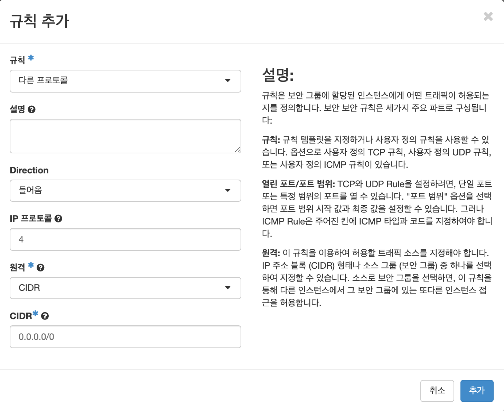

## 프로젝트 설정 - 네트워크
- 네트워크 생성
  - 네트워크 토폴리지 에서:
    - 네트워크 생성을 선택 한다.
  - 네크워크 탭 화면에서:
    - 네트워크 이름 지정 (예: <프로젝트명>-net)
  - 서브넷 탭 화면에서:
    - 서브넷 이름 지정 (예: <프로젝트명>-subnet)
    - 네트워크 주소 지정 (CIDR 형식의 주소: 192.16.0.0/16)
    - 게이트우에 IP 지겅 (default: 네트워크 주소의 첫번째 주소(192.16.0.1))
  - 서브넷 세부 정보 탭에서:
    - DNS 추가 (192.168.77.11 / 192.168.77.12 / 8.8.8.8)
  
  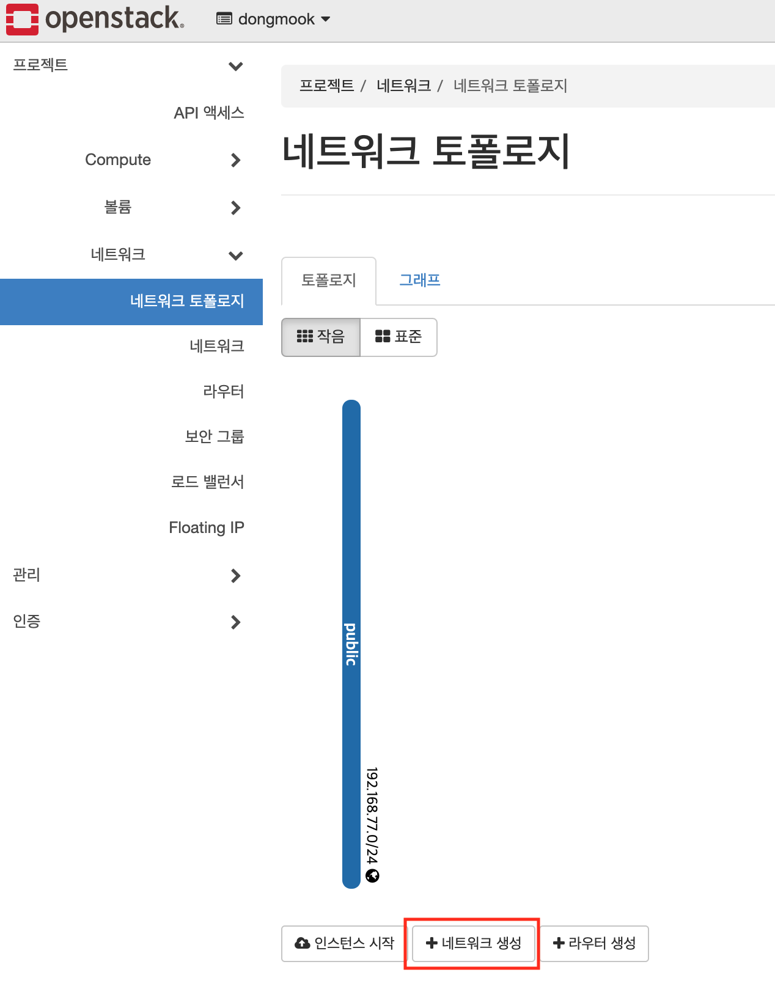
  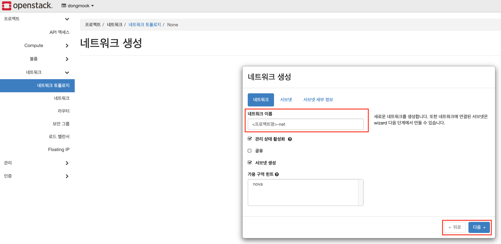
  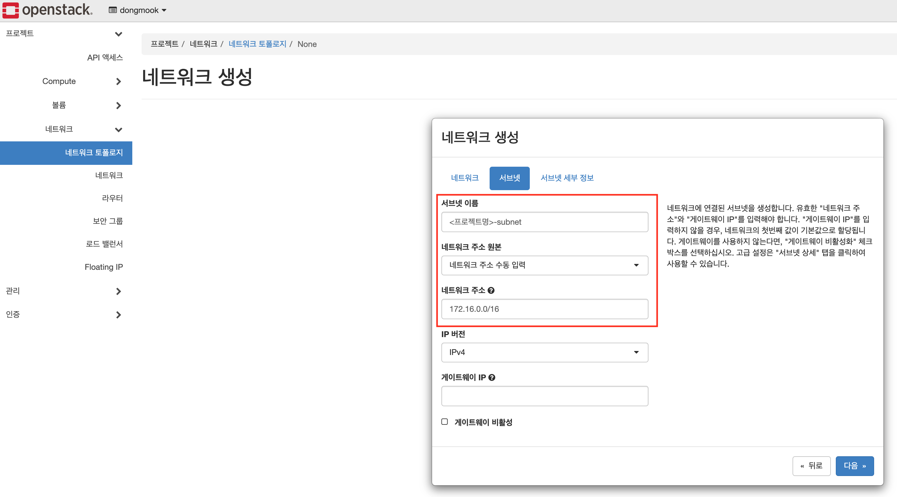
  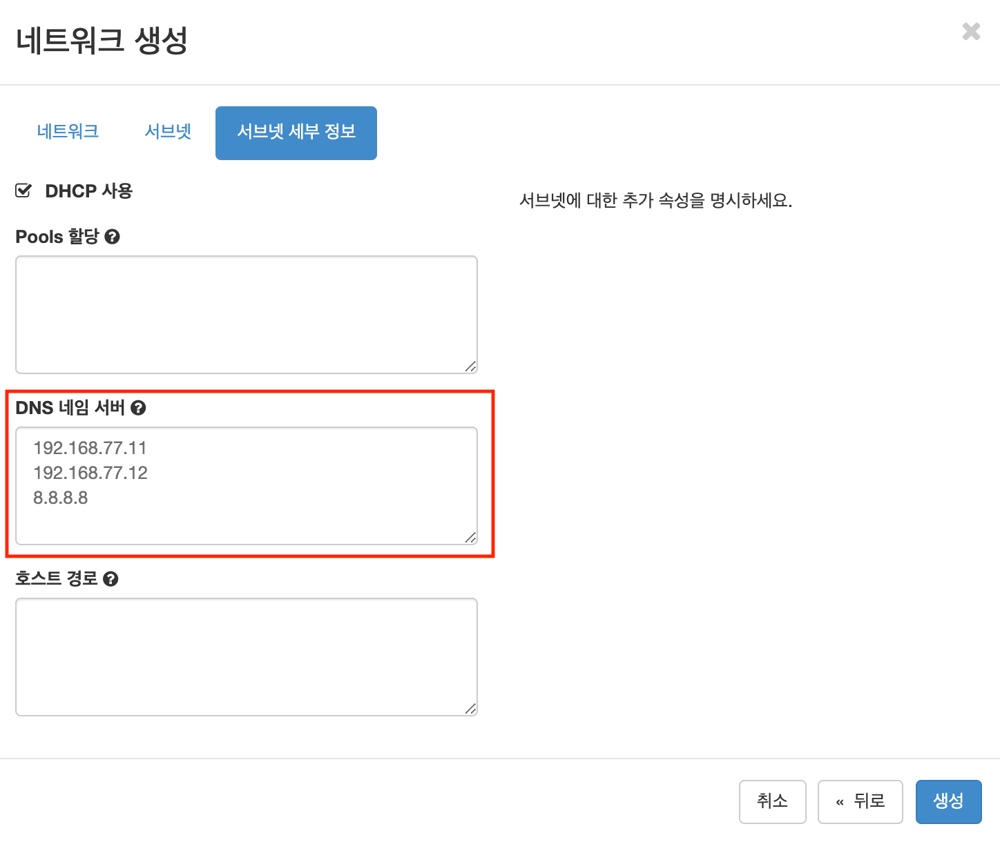

## 프로젝트 설정 - 라우터
- 라우터 생성
  - 네트워크 토폴리지 에서:
    - 라우터 생성을 선택 한다.
    - 외부 네트워크 항목에서 public을 선택 한다.
    - 임의 가용 가능한 public ip주소를 항당 받아서 cli 명령으로 라우터 주소를 변경 한다.
      ```sh
      # 라우트 주소를 변경한다.
      openstack router set --external-gateway public --fixed-ip subnet=public-subnet,ip-address=192.168.77.120 onassis-router
      ```
    - 인터패이스를 추가 한다.
  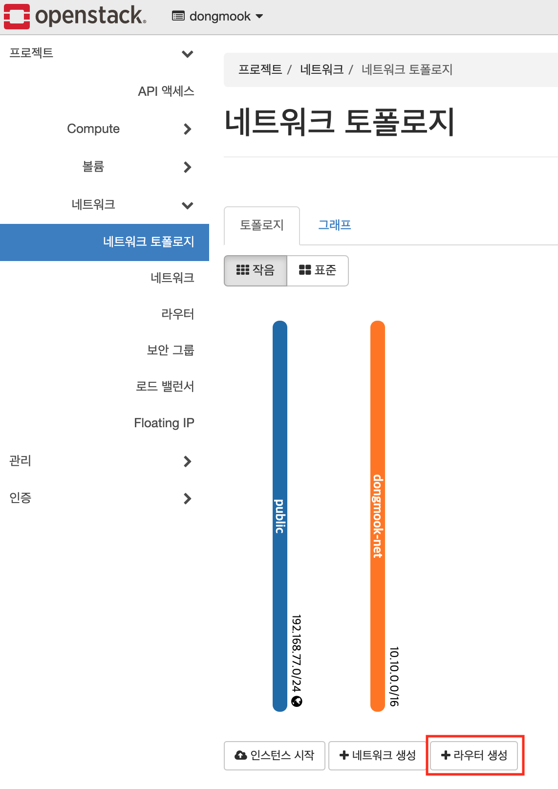
  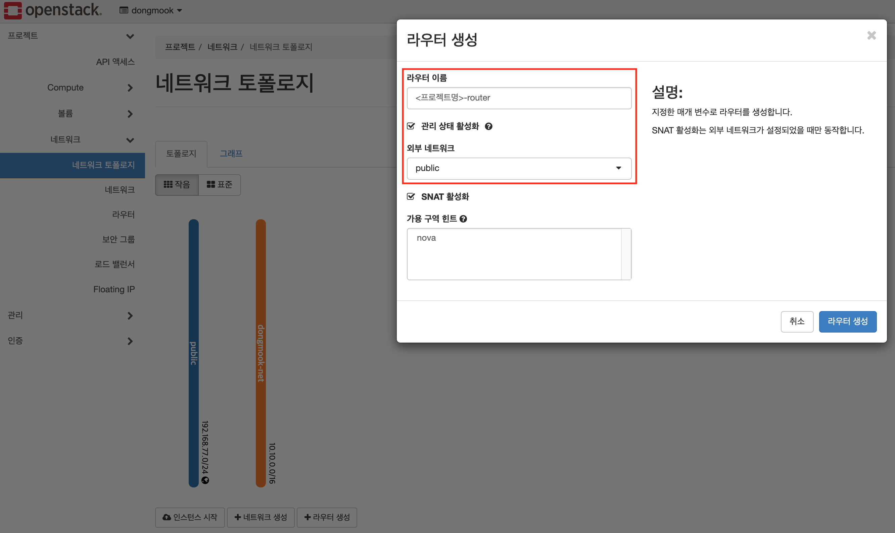
  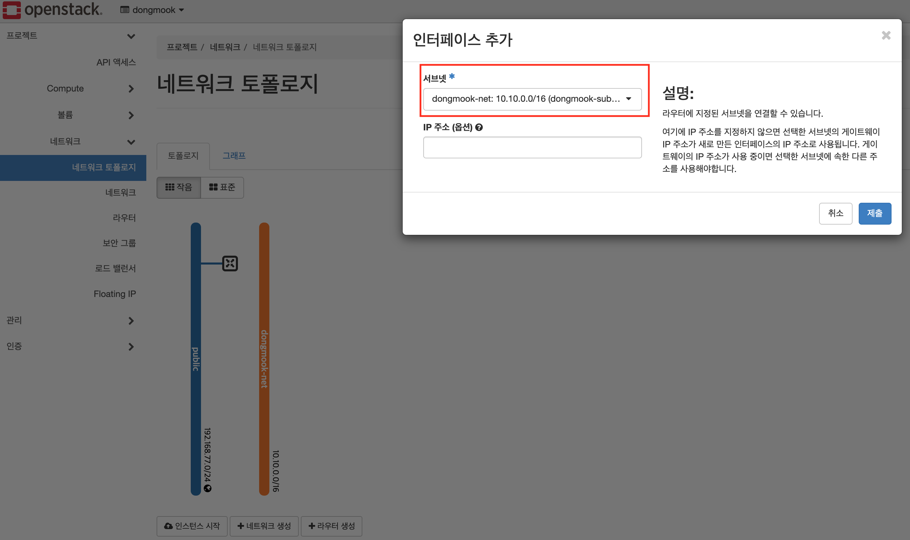
  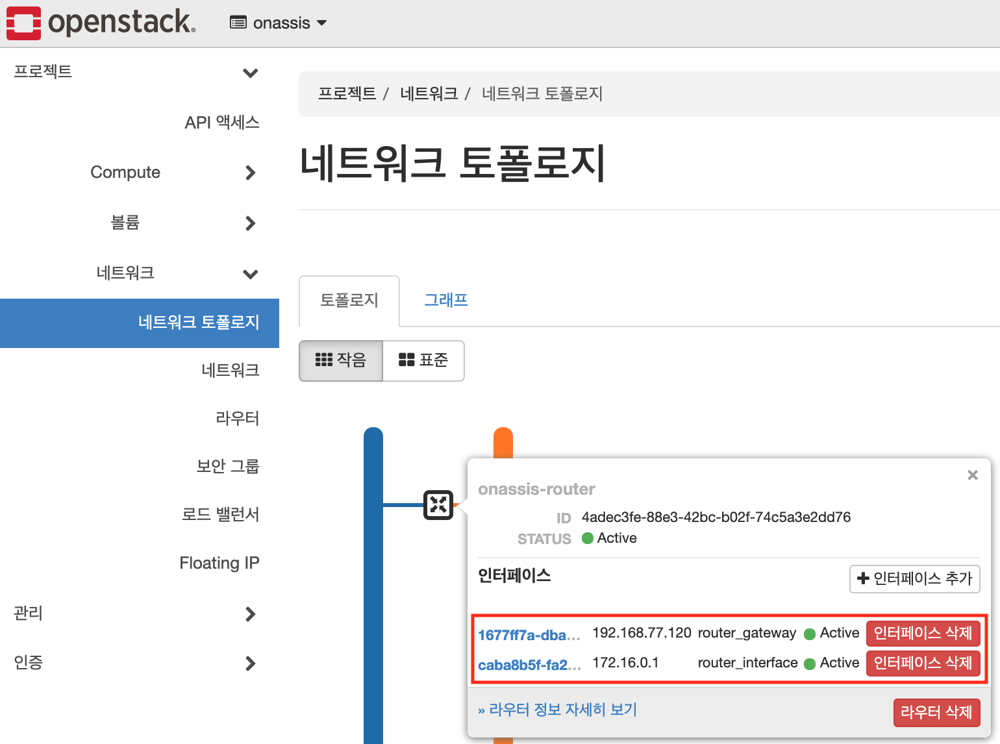

## 프로젝트 설정 - 인스턴스 생성
- 관리 엑셀의 명령어를 사용 하여 private ip를 생성 한다.
  ```sh
  ## gen-private-ip 항목의 명령어 사용
  openstack port create --network onassis-net --fixed-ip subnet=onassis-subnet,ip-address=172.16.0.121 pri-ip-onassis-01
  ```
- 관리 엑셀의 명령어를 사용 하여 float ip를 생성 한다.
  ```sh
  # gen-float-ip 항목의 명령어 사용
  openstack floating ip create --project onassis --floating-ip-address 192.168.77.121 --subnet public-subnet public 
  ```
- 관리 엑셀의 명령어를 사용 하여 volume을 생성 한다.
  ```sh
  # gen-volume 항목의 명령어 사용
  openstack volume create --image ubuntu18.04 --size 40 --availability-zone nova vol-onassis-01
  ```
- 관리 엑셀의 명령어를 사용 하여 instance를 생성 한다.
  ```sh
  # gen-vm 항목의 명령어 사용
  openstack server create --flavor 8Core.4G --key-name hostacloud --security-group 89303e64-981e-41ab-92c1-f9d86a197cdd --port pri-ip-onassis-01 --volume vol-onassis-01 vm-onassis-01
  ```
- 관리 엑셀의 명령어를 사용 하여 float ip 설정을 한다.
  ```sh
  # set-float-ip 항목의 명령어 사용
  openstack server add floating ip vm-onassis-01 192.168.77.121
  ```

> 참조 : [openstack cli 사용법 참조](#오픈스택-cli-사용법)

# 참조 
- 프로토콜 설명: https://realforce111.tistory.com/6