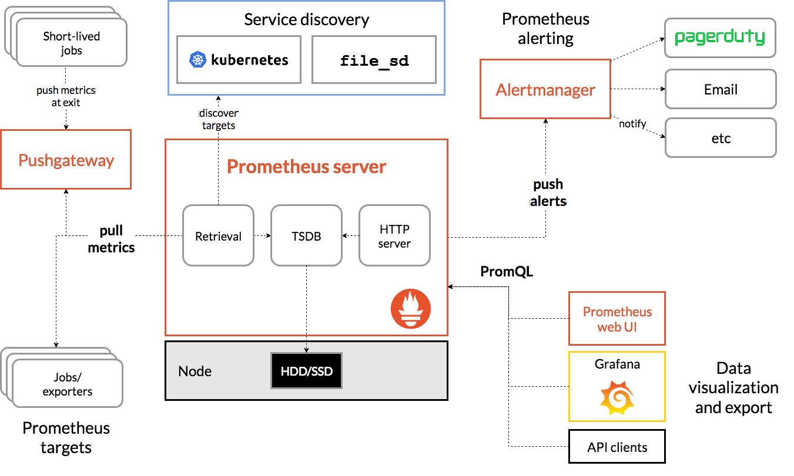

# Prometheus Getting Start

## Prometheus Architecture


## 사전준비
- Kubernetes 1.16+
- Helm 3+
- Get Repo Info
```sh
helm repo add prometheus-community https://prometheus-community.github.io/helm-charts
helm repo add kube-state-metrics https://kubernetes.github.io/kube-state-metrics
helm repo update
```

## Install Prometheus
```sh
helm upgrade prometheus -i \
  -n monitoring \
  --create-namespace \
  --cleanup-on-fail \
  --repo https://prometheus-community.github.io/helm-charts \
  prometheus \
  -f values.yaml

## local directory - mkdir charts/ -> <dependencies> 생성(kube-state-metric) : helm package <kube-state-metric>
## m3db 내용 수정 후 helm chart package 생성 함. : helm package <prometheus-diriectory>
##  <Air-gap repository>에 업로드 함.
## Private repository 사용 하기 위해서 ca.crt 필요
### prometheus local storage를 필수로 사용 한다.(https://prometheus.io/docs/prometheus/latest/storage/#on-disk-layout)
# helm upgrade prometheus -i \
#   -n monitoring \
#   --create-namespace \
#   --cleanup-on-fail \
#   --ca-file ./ca.crt \
#   --repo http://x.x.x.x/chartrepo/k3lab-charts \
#   prometheus \
#   -f values-x-x-m3db.yaml
```

## Prometheus configuration
- values 수정
  - pushgateway 설치 안한다.
  - persistentVolume 테스트시 emptyDir 사용.
  - 프로메테우스 환경설정 추가 
    - storage.tsdb.no-lockfile (db locking 해제)
    - storage.tsdb.wal-compression (WAL 압축)
  - 메트릭 수집 주기 설정 (15초)
  - server:
    - service port를 9090으로 지정한다. (kiali에서 프로메테우스 url로 사용 된다.)
```yaml
## Define serviceAccount names for components. Defaults to component's fully qualified name.
##
serviceAccounts:
  ### true -> false
  pushgateway:
    create: false
    name:
    annotations: {}

...
server:
  ## Prometheus server container name
  ##
  enabled: true

...

  persistentVolume:
    ## If true, alertmanager will create/use a Persistent Volume Claim
    ## If false, use emptyDir
    ##
    ### true -> false
    enabled: false

...

  extraFlags:
    - web.enable-lifecycle
    ## web.enable-admin-api flag controls access to the administrative HTTP API which includes functionality such as
    ## deleting time series. This is disabled by default.
    # - web.enable-admin-api
    ##
    ## storage.tsdb.no-lockfile flag controls BD locking
    ### 주석 -> 주석 해제
    - storage.tsdb.no-lockfile
    ##
    ## storage.tsdb.wal-compression flag enables compression of the write-ahead log (WAL)
    ### 주석 -> 주석 해제
    - storage.tsdb.wal-compression

  global:
    ## How frequently to scrape targets by default
    ##
    ### 1m -> 15s
    scrape_interval: 15s

...

  service:
    annotations: {}
    labels: {}
    clusterIP: ""

    ## List of IP addresses at which the Prometheus server service is available
    ## Ref: https://kubernetes.io/docs/user-guide/services/#external-ips
    ##
    externalIPs: []

    loadBalancerIP: ""
    loadBalancerSourceRanges: []
    servicePort: 9090

```

## Prometheus Metrics configmap 설정
- values의 아래 위치에 추가 한다. 
  - serverFiles: > prometheus.yml: > scrape_configs: 
```yaml
## kube-state-metrics 설정
## service 주소를 targets 주소로 지정한다.
- job_name: 'kube-state-metrics'
        static_configs:
          - targets: ['kube-state-metrics.kube-system.svc.cluster.local:8080']
```


## Prometheus AlertManager Configuration
- value 설정
  - alerting_rules.yml:
```yaml
serverFiles:

  ## Alerts configuration
  ## Ref: https://prometheus.io/docs/prometheus/latest/configuration/alerting_rules/
  alerting_rules.yml:
  # groups:
  #   - name: Instances
  #     rules:
  #       - alert: InstanceDown
  #         expr: up == 0
  #         for: 5m
  #         labels:
  #           severity: page
  #         annotations:
  #           description: '{{ $labels.instance }} of job {{ $labels.job }} has been down for more than 5 minutes.'
  #           summary: 'Instance {{ $labels.instance }} down'
  ## DEPRECATED DEFAULT VALUE, unless explicitly naming your files, please use alerting_rules.yml
  groups:
    - name: container memory alert
      rules:
      - alert: container memory usage rate is very high( > 55%)
        expr: sum(container_memory_working_set_bytes{pod!="", name=""})/ sum (kube_node_status_allocatable_memory_bytes) * 100 > 55
        for: 1m
        labels:
          severity: fatal
        annotations:
          summary: High Memory Usage on 
          identifier: ""
          description: " Memory Usage: "
    - name: container CPU alert
      rules:
      - alert: container CPU usage rate is very high( > 10%)
        expr: sum (rate (container_cpu_usage_seconds_total{pod!=""}[1m])) / sum (machine_cpu_cores) * 100 > 10
        for: 1m
        labels:
          severity: fatal
        annotations:
          summary: High Cpu Usage
  alerts: {}
```

## Dependencies 
- By default this chart installs additional, dependent charts:
  - [stable/kube-state-metrics](https://github.com/helm/charts/tree/master/stable/kube-state-metrics)


## Prometheus configmap 내용 추가  - m3coordinator  
```yaml
  prometheus.yml: |
    global:
      evaluation_interval: 1m
      scrape_interval: 15s
      scrape_timeout: 10s
    ## m3coordinator 설정
    remote_write:
      - url: http://m3coordinator.m3db:7201/api/v1/prom/remote/write
    remote_read:
      - url: http://m3query.m3db:7201/api/v1/prom/remote/read
        read_recent: true
```
## Metric 수집 설정 - for application
- service에 수집 요청을 한다.
```sh
# 메트릭 수집 요첨 설정
kubectl -n m3db edit svc m3dbnode-persistent-cluster

# annotations에 아래요 같이 프로메테우스 메트릭 수집 설정을 추가 한다.
# prometheus.io/port: 수집 포트
# prometheus.io/scrape: 수집 활성화
# prometheus.io/path: 수집 경로 (default: /metrics)
metadata:
  annotations:
    operator.m3db.io/app: m3db
    operator.m3db.io/cluster: persistent-cluster
    prometheus.io/port: "7203"
    prometheus.io/scrape: "true"
```

- m3coordinator-monitor 서비스 수집 포트 : 7203
- m3dbnode-cluster 서비스 수집 포트 : 9004
- m3aggregator 서비스 수집 포트 : 6002
- m3query-monitor 서비스 수집 포트 : 7203


---------------------
--- 아래 내용 helm chart 수정본 사용 안함
--- 이유 : prometheus에서 local storage 사용이 디폴트로 설정 되어 있다. 

## Remote Endpoints and Storage 설정 추가 - Helm Chart 수정
- ConfigMap에 remoteStorage 사용 여부 추가
```yaml
## vi helm-charts/prometheus/templates/server/cm.yaml
## 아래 내용 추가
{{- if $root.Values.server.remoteStorage.enabled }}
{{- if $root.Values.server.remoteStorage.remoteWrite }}
    remote_write:
{{ $root.Values.server.remoteStorage.remoteWrite | toYaml | indent 4 }}
{{- end }}
{{- if $root.Values.server.remoteStorage.remoteRead }}
    remote_read:
{{ $root.Values.server.remoteStorage.remoteRead | toYaml | indent 4 }}
{{- end }}
{{- end }}
```

- Deployment 수정 - storage-volume 사용여부 추가, atguments 수정
```yaml
## vi helm-charts/prometheus/templates/server/deploy.yaml
## volumeMounts - 사용 여부 추가
          volumeMounts:
            {{- if not .Values.server.remoteStorage.enabled }}
            - name: storage-volume
              mountPath: {{ .Values.server.persistentVolume.mountPath }}
              subPath: "{{ .Values.server.persistentVolume.subPath }}"
            {{- end }}

## volumes - 사용 여부 추가
      volumes:
        {{- if not .Values.server.remoteStorage.enabled }}
        - name: storage-volume
        {{- if .Values.server.persistentVolume.enabled }}
          persistentVolumeClaim:
            claimName: {{ if .Values.server.persistentVolume.existingClaim }}{{ .Values.server.persistentVolume.existingClaim }}{{- else }}{{ template "prometheus.server.fullname" . }}{{- end }}
        {{- else }}
          emptyDir:
          {{- if .Values.server.emptyDir.sizeLimit }}
            sizeLimit: {{ .Values.server.emptyDir.sizeLimit }}
          {{- else }}
            {}
          {{- end -}}
        {{- end -}}
        {{- end -}}

## atguments 수정 - tsdb 사용 여부 추가
          args:
          {{- if .Values.server.retention and not .Values.server.remoteStorage.enabled }}
            - --storage.tsdb.retention.time={{ .Values.server.retention }}
          {{- end }}
            - --config.file={{ .Values.server.configPath }}
            {{- if .Values.server.storagePath and not .Values.server.remoteStorage.enabled }}
            - --storage.tsdb.path={{ .Values.server.storagePath }}
            {{- else }}
            - --storage.tsdb.path={{ .Values.server.persistentVolume.mountPath }}
            {{- end }}
```

- Statefulset 수정 - volume 사용 여부 추가, atguments 수정
```yaml
## vi helm-charts/prometheus/templates/server/sts.yaml
## volumeMounts - 사용 여부 추가
          volumeMounts:
            {{- if not .Values.server.remoteStorage.enabled }}
            - name: storage-volume
              mountPath: {{ .Values.server.persistentVolume.mountPath }}
              subPath: "{{ .Values.server.persistentVolume.subPath }}"
            {{- end }}

## volumeClaimTemplates - 사용 여부 추가
{{- if .Values.server.persistentVolume.enabled and not .Values.server.remoteStorage.enabled }}
  volumeClaimTemplates:
    - metadata:
        name: storage-volume
        {{- if .Values.server.persistentVolume.annotations }}
        annotations:
{{ toYaml .Values.server.persistentVolume.annotations | indent 10 }}
        {{- end }}
      spec:
        accessModes:
{{ toYaml .Values.server.persistentVolume.accessModes | indent 10 }}
        resources:
          requests:
            storage: "{{ .Values.server.persistentVolume.size }}"
      {{- if .Values.server.persistentVolume.storageClass }}
      {{- if (eq "-" .Values.server.persistentVolume.storageClass) }}
        storageClassName: ""
      {{- else }}
        storageClassName: "{{ .Values.server.persistentVolume.storageClass }}"
      {{- end }}
      {{- end }}
{{- else }}
        - name: storage-volume
          emptyDir:
          {{- if .Values.server.emptyDir.sizeLimit }}
            sizeLimit: {{ .Values.server.emptyDir.sizeLimit }}
          {{- else }}
            {}
          {{- end -}}
{{- end }}

## atguments 수정 - tsdb 사용 여부 추가
          args:
          {{- if .Values.server.retention and not .Values.server.remoteStorage.enabled }}
            - --storage.tsdb.retention.time={{ .Values.server.retention }}
          {{- end }}
            - --config.file={{ .Values.server.configPath }}
            {{- if .Values.server.storagePath and not .Values.server.remoteStorage.enabled }}
            - --storage.tsdb.path={{ .Values.server.storagePath }}
            {{- else }}
            - --storage.tsdb.path={{ .Values.server.persistentVolume.mountPath }}
            {{- end }}
```

## m3db 사용 values 설정
- vi values.yaml - server: 하위 설정들을 수정 한다.
```yaml
  ## extraFlags - tsdb 설정 주석 처리
  extraFlags:
    - web.enable-lifecycle
    ## web.enable-admin-api flag controls access to the administrative HTTP API which includes functionality such as
    ## deleting time series. This is disabled by default.
    # - web.enable-admin-api
    ##
    ## storage.tsdb.no-lockfile flag controls BD locking
    ### 주석 : m3db 사용
    # - storage.tsdb.no-lockfile
    ##
    ## storage.tsdb.wal-compression flag enables compression of the write-ahead log (WAL)
    ### 주석 -> m3db 사용
    # - storage.tsdb.wal-compression

  ### m3db 사용
  remoteStorage:
    enabled: true
  
    remoteWrite:
      - url: "http://m3coordinator.m3db:7201/api/v1/prom/remote/write"

    ## https://prometheus.io/docs/prometheus/latest/configuration/configuration/#remote_read
    remoteRead:
      - url: "http://m3query.m3db:7201/api/v1/prom/remote/read"
        read_recent: true
```

## m3db 검증
- 명령어
```sh
kubectl -n m3db exec m3-cluster-rep2-0 -- curl -X "POST" -G "http://localhost:7201/api/v1/query_range" \
  -d "query=query_fetch_success" \
  -d "start=$(date "+%s" -d "10 hours ago")" \
  -d "end=$( date "+%s" -d "5 hours ago" )" \
  -d "step=30m" | jq .


  curl -X "POST" -G "http://192.168.77.33:32558/api/v1/query_range" \
  -d "query=query_fetch_success" \
  -d "start=1624501501" \
  -d "end=1624519620" \
  -d "step=30m" | jq .


curl 'http://192.168.77.34:32558/api/v1/query_range?query=abs(prometheus_http_requests_total)&start=1624507982&end=1624519290&step=15s'


kubectl -n m3db exec m3-cluster-rep2-0 -- 


kubectl -n m3db exec m3-cluster-rep2-0 -- curl -X POST http://localhost:7201/api/v1/json/write -d '{
  "tags": 
    {
      "__name__": "dongmook_test",
      "city": "new_york",
      "checkout": "1"
    },
    "timestamp": '\"$(date "+%s")\"',
    "value": 100
}' | jq .

## linux
kubectl -n m3db exec m3-cluster-rep2-0 -- curl -X "POST" -G "http://localhost:7201/api/v1/query_range" \
  -d "query=dongmook_test" \
  -d "start=$(date "+%s" -d "45 seconds ago")" \
  -d "end=$( date +%s )" \
  -d "step=5s" | jq .

## mac
kubectl -n m3db exec m3-cluster-rep2-0 -- curl -X "POST" -G "http://localhost:7201/api/v1/query_range" \
  -d "query=prometheus_http_requests_total" \
  -d "start=$(date -v -15M "+%s")" \
  -d "end=$( date +%s )" \
  -d "step=5s" | jq .

  kubectl -n m3db exec m3-cluster-rep2-0 -- curl -X "POST" -G "http://localhost:7201/api/v1/query_range" \
  -d "query=kube_pod_status_phase{origin_prometheus=~\".*\",pod=~\".*\",container =~\".*\",namespace=~\"monitoring\"}" \
  -d "start=$(date -v -15M "+%s")" \
  -d "end=$( date +%s )" \
  -d "step=5s" | jq .
```

# 참조
> [Prometheus Monitoring Community]([참조링크](https://github.com/prometheus-community/helm-charts))