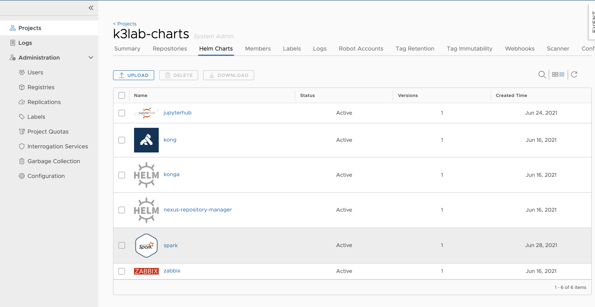
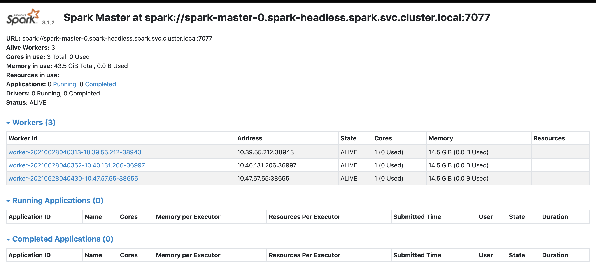

# Spark Standalone cluster installation

#1. Private Repository 등록
```bash
$ sudo curl -L -o /etc/docker/certs.d/192.168.77.30/ca.crt https://regi.k3.acornsoft.io/ca.crt
$ helm repo add --ca-file /etc/docker/certs.d/192.168.77.30/ca.crt k3lab https://192.168.77.30/chartrepo/k3lab-charts
```

# 2. spark docker image 및 chart upload
## 2.1 Bitnami spark docker image 변경
 * dockerfile - https://github.com/bitnami/bitnami-docker-spark
 * 제공되는 Spark 이미지내에 python 3.6.x 버전으로 되어 있어서 base image를 **python:3.8-slim-buster**로 하여 따로 이미지를 생성함.
 * Spark 3.1.2 임.

```bash
$ cd assets
$ git clone https://github.com/bitnami/bitnami-docker-spark
$ git clone https://github.com/aseigneurin/spark-ui-proxy.git
```

 * 3/debian-10/Dockerfile을 수정하여 docker build 함.

```bash
$ cd assets/bitnami-docker-spark/3/debian-10
$ vi Dockerfile
#FROM docker.io/bitnami/minideb:buster  // 주석처리
FROM python:3.8-slim-buster
LABEL maintainer "Bitnami <containers@bitnami.com>"

ENV HOME="/" \
    OS_ARCH="amd64" \
    OS_FLAVOUR="debian-10" \
    OS_NAME="linux" \
    PATH="/opt/bitnami/python/bin:/opt/bitnami/java/bin:/opt/bitnami/spark/bin:/opt/bitnami/spark/sbin:/opt/bitnami/common/bin:$PATH"

COPY prebuildfs /
# Install required system packages and dependencies
RUN install_packages acl ca-certificates curl gzip libbz2-1.0 libc6 libffi6 libgcc1 liblzma5 libncursesw6 libreadline7 libsqlite3-0 libssl1.1 libstdc++6 libtinfo6 procps tar zlib1g
#RUN . /opt/bitnami/scripts/libcomponent.sh && component_unpack "python" "3.6.13-6" --checksum e3be95ef0870653fe0d6a5271c4545d99493cec58f808ed41955a3170f7137f8 // 주석처리
RUN . /opt/bitnami/scripts/libcomponent.sh && component_unpack "python" "3.8.8-1"
RUN . /opt/bitnami/scripts/libcomponent.sh && component_unpack "java" "1.8.292-0" --checksum 700e2d8391934048faefb45b4c3a2af74bc7b85d4c4e0e9a24164d7256456ca2
RUN . /opt/bitnami/scripts/libcomponent.sh && component_unpack "spark" "3.1.2-0" --checksum 0a4e7acfc0b025d99e3723f80cd3a1e1a331c9b977be9a1f05bc15e5f5b01709
RUN . /opt/bitnami/scripts/libcomponent.sh && component_unpack "gosu" "1.13.0-0" --checksum fd7257c2736164d02832dbf72e2c1ed9d875bf3e32f0988520796bc503330129
RUN chmod g+rwX /opt/bitnami

COPY rootfs /
RUN /opt/bitnami/scripts/spark/postunpack.sh
ENV BITNAMI_APP_NAME="spark" \
    BITNAMI_IMAGE_VERSION="3.1.2-debian-10-r17" \
    JAVA_HOME="/opt/bitnami/java" \
    LD_LIBRARY_PATH="/opt/bitnami/python/lib/:/opt/bitnami/spark/venv/lib/python3.6/site-packages/numpy.libs/:$LD_LIBRARY_PATH" \
    LIBNSS_WRAPPER_PATH="/opt/bitnami/common/lib/libnss_wrapper.so" \
    NSS_WRAPPER_GROUP="/opt/bitnami/spark/tmp/nss_group" \
    NSS_WRAPPER_PASSWD="/opt/bitnami/spark/tmp/nss_passwd" \
    SPARK_HOME="/opt/bitnami/spark"

WORKDIR /opt/bitnami/spark
USER 1001
ENTRYPOINT [ "/opt/bitnami/scripts/spark/entrypoint.sh" ]
CMD [ "/opt/bitnami/scripts/spark/run.sh" ]
```

## 2.2 Spark image 빌드 및 registry에 push
```bash
$ docker build -t 192.168.77.30/spark/spark:3.1.2-debian-10-r17 .
$ docker push 192.168.77.30/spark/spark:3.1.2-debian-10-r17
```

 * Spark UI proxy 빌드 및 registry에 push
```bash
$ cd assets/spark-ui-proxy
$ docker build -t 192.168.77.30/spark/spark-ui-proxy:1.0 .
$ docker push 192.168.77.30/spark/spark-ui-proxy:1.0
```

## Spark chart Upload
```bash
// repository add
$ helm repo add bitnami https://charts.bitnami.com/bitnami
// repository 조회
$ helm repo ls

// spark version 별로 검색
$ helm search repo -l spark

// spark chart 5.3.3 download 후 /assets 디렉토리에 압축해제
$ helm pull --version 5.5.3 --untar -d ./assets bitnami/spark
```

 * spark chart 를 내부 harbor에 업로드 하기
```bash
$ cd assets
$ helm package spark
```



# 3. Bitnami spark chart 배포하기 (Spark Standalone cluster)
## 3.1 이제 spark docker image와 chart가 준비되었으므로 chart의 values.yaml파일을 수정한 후 실제 Spark Standalone cluster를 배포한다.

```bash
$ helm repo remove bitnami
$ helm repo update


$ cd assets/spark
$ vi values.yaml

$ helm upgrade --cleanup-on-fail -i --create-namespace -n spark spark k3lab/spark --values values.yaml

$ kubectl get pods -n spark
NAME                           READY   STATUS    RESTARTS   AGE
spark-client-578c47b86-rc5wc   1/1     Running   0          5h51m
spark-master-0                 1/1     Running   0          17h
spark-worker-0                 1/1     Running   0          17h
spark-worker-1                 1/1     Running   0          17h

$ kubectl exec -it spark-master-0 -n spark bash
I have no name!@spark-master-0:/opt/bitnami/spark$ python -V
Python 3.8.8
```

## 3.2 Spark UI을 접속하기 위해 spark-ui-proxy를 배포한다.
```bash
$ cd assets/spark-ui-proxy
$ kubectl apply -f deployment.yaml
```



## 3.3 Spark Standalone cluster에 sample application 배포 및 구성 확인
자, 이제 spark standalone cluster를 구성하였음으로 sample application을 구동시켜 보자. 아래에서 주목할 것은 deploy-mode=cluster이다.

```bash
$ kubectl exec -it spark-master-0 -n spark bash

// Pi를 구하는 java sample 구동
$ ./bin/spark-submit \
 --class org.apache.spark.examples.SparkPi \
 --master spark://spark-master-svc:7077 \
 --deploy-mode cluster \
 ./examples/jars/spark-examples_2.12-3.1.2.jar 1000
 
// Pi를 구하는 python sample 구동
$ ./bin/spark-submit \
 --master spark://spark-master-svc:7077 \
 ./examples/src/main/python/pi.py 1000 
```