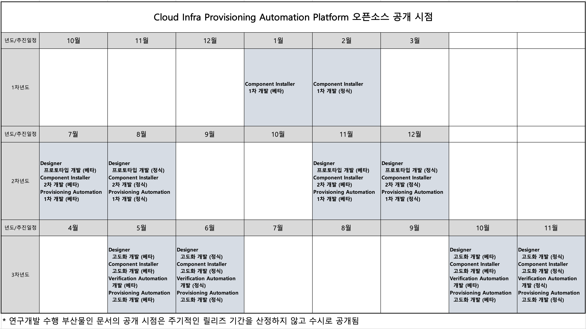

# 오픈소스화 할 4개 영역의 체계화된 공개 및 단계화 명세 필요
```
(p45 ~ p46)
# o (기술개발 결과물의 공개) 하위 항목으로 추가
# 릴리즈 시점을 표로 작성함(****이부분 확인 요망****)
```


-----
# 다수의 사이트에 동시 설치시 네트워크, 설치 상태 및 패키지 전달시 오버헤드 감소를 위한 개발 기술 내용 구체화 요망
```
(p19)
# 대규모 엣지 클라우드 병렬 구축, 스케쥴링 시스템 설계
# 추가내용(****이부분 확인 요망****)
Store 동기화 전략을 사용하여 네트워크 오버헤드 감소 및 I/O 소모 최소화 한다.
  - Rsync
    - Remote Synchronization의 약자로 로컬 또는 원격지의 데이터를 동기화(가져오기)위한 유틸리티이자 프로토콜.
    - 파일과 디렉터리를 가져올 수 있어(동기화) 백업 / 미러링 용도로 사용할 수 있다.
    - 데이터를 압축해서 이동하고 변경된 파일만 복사하기 때문에 빠르고 효율적이다. => I/O 소모 최소화
  - Openstack Glance Service
    - OpenStack 이미지 서비스인 Glance는 디스크 및 서버 이미지에 대한 저장소, 검색, 등록 및 전달 서비스를 제공한다.
    - 레지스트리 서버는 클라이언트에 이미지 메타데이터 정보를 제공하는 이미지 서비스이다. 
    - 이미지 캐시는 이미지가 요청될 때마다 이미지 서비스가 이미지 서버에서 이미지를 다시 다운로드하지 않고 로컬 호스트에서 이미지를 가져오는 데 사용한다.
```

## 참고
> [Glance 문서](https://docs.openstack.org/glance/latest/) 
> [에지 환경에서 이미지 처리](https://wiki.openstack.org/wiki/Image_handling_in_edge_environment) 


-----
# 인프라 구축과 운영이 독립적이긴 하지만, 구축은 운영을 염두에 두고 개발해야하며 이에 대한 구체적인 요구사항 수집 및 대응 방안 수립이 필요함
```
# "구축은 운영을 염두에 구고 개발 한다는" 질의에 대한 답변은 우상무님의 내용을 반영 하겠다. 
# 요구사항에 대한 수집 방안을 아래와 같이 추가 함(****이부분 확인 요망****)

(p17 ~ p18)
- 요구사항 수집 및 대응 방안
  - 요구사항 도출 
    - 요구사항 수집 : 수요처로 부터 인프라 구축에 관련된 설문지 및 인터뷰를 통해 기능, 성능, 기타 요구 사항들을 수집한다.
    - 사업 요구사항  : 브레인스토밍, 면담, 설문조사를 통해 사업방향의 기대 사항, 제약 사항 들을 취합하여 정리한다.
    - 시스템 요구사항 : 수요처의 비즈니스 모델 및 운영 방식에 따른 니즈를 파악 후 시스템의 규모를 도출한다.

  - 요구사항 합의
    - 요구사항 내부 검토 : 워크스루, 인스펙션, 기술검토를 통해 도출된 요구사항을 내부적으로 검토 한다.
    - 요구사항 검토 합의 : 내부 검토 및 기술된 내용으로 수요처의 이해관계자, 사업담당자와 검토 및 합의를 도출한다.

  - 요구사항 변경 관리
    - 요구사항 변경 수행: 요구사항에 대한 변경 사항을 공식적인 변경 관리 절차에 따라 수행한다.
    - 요구사항 추적 수행: 요구사항의 추적성 유지 및 산출물과 요구사항 간 불일치 사항 들을 주기적으로 식별 하며 필요시 보완해 나간다.
    - 요구사항 구현 확인: 분석, 설계, 구현, 시험, 이관 등 각각의 단계에서 요구사항의 구현 정보를 확인한다.

  - 산출물
    - 요구사항 정의서 : 프로젝트 구현대상을 정의한 공식적인 문서
    - 요구사항에 따른 기능 정의서 : 정의된 요구 사항을 각각의 요소에 연결하여 단계별로 산출물 추적
```

-----
# 대규모 인프라 구축 자동화를 위한 문제점 제시는 양호하나 이를 해결하기 위한 구체적인 기술 개발에 대한 설명이 부족하여 보완이 필요함
```
# 컨트롤러의 기능 설명을 추가 함(****이부분 확인 요망****)
(p20 ~ p21)
- 인프라 구축 자동화를 위한 컴포넌트 종류 및 기능 설명
 - Edge Controller : Edge Cloud내에 Edge Agent 와 실기간 데이터 처리를 위한 모듈(클러스터 프로비저닝을 위한 CR 전달)
 - Edge Agent: Central Cloud 내에 Edge Controller와 실시간 데이터 처리 및 OpenStack을 설치하기 위한 모듈(OpenStack 설치, 클러스터 프로비저닝 및 Health 체크에 관련된 상태값 전달)
 - Cluster Controller: 쿠버네티스의 빌트인 자동화 배포 기능을 사용하기 위해 인프라, 클러스터, 플랫폼 컴포넌트의 CRD를 포함 하고 있는 오퍼레이터 방식의 포드(Pod) 이며, Edge Agent를 통해 전달 받은 CR(Customer Resource)을 기준으로 멀티 Work Controller(pod) 를 생성함.
 - Work Controller: 전달 받은 CR(Customer Resource) 을 기준으로 cluster-api를 통해 OpenStack 내부에 인프라에 관련된 인스턴스(vm, network, load-balancer 등등)를 생성 하고 Component Installer로 클러스터를 구축한다.

※ 쿠버네티스 오퍼레이터는 쿠버네티스 API의 기능을 확장하여 쿠버네티스 사용자를 대신해 복잡한 애플리케이션의 인스턴스를 생성, 설정 및 관리하는 애플리케이션별 컨트롤러입니다.
```