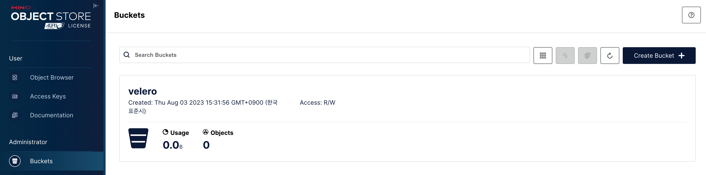
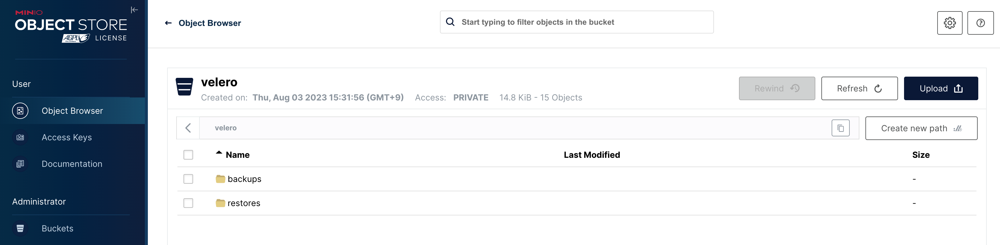

# Velero with Helm

> [참고] https://malwareanalysis.tistory.com/251

## Object Storage 생성

### Installing Minio with Helm

- velero helm chart에 dependencies로 추가한다.
```sh
## step-1. DEPENDENCIES 내용을 추가 한다.
$ vi 01.install_using_helm.sh
## dependencies
DEPENDENCIES=$(cat <<EOF
- condition: minio.enabled
  name: minio
  repository: https://charts.min.io
  version: 5.0.13
EOF
)
```

### Configuration Minio with Helm

부모 차트에서 자식 차트를 호출할 때, 부모 차트가 원하는대로 자식 차트에게 값을 주고 싶을 때가 있다. 
방법은 다음과 같다.

1. 부모의 values.yaml에 자식 차트의 이름을 선언하고, 아래에 넘겨주고 싶은 필드과 값을 선언한다.
2. 1번 작업을 하면 자식 차트의 values.yaml에 1번에서 선언한 필드가 존재하지 않아도 자식 차트의 template에서 사용할 수 있게 된다. 

```sh
## minio 옵션
# minioAPIPort: minio server port
# minioConsolePort: mino console port
# rootUser(계정)
# rootPassword(계정 비밀번호)
# replicas: 워커 갯수만큼 설정
# memory: pod 메모리
# service type: NodePort
# consoleService type: NodePort

## step-1. minio 설치 여부 결정
--set minio.enabled=true

## step-2. minio using Persistent Volume Claims
--set minio.persistence.storageClass="nfs-csi"
--set minio.persistence.size="100Gi"

## step-3. Set default rootUser
--set minio.rootUser="edgecraft"
--set minio.rootPassword="edgecraft"

## step-4. minio 옵션 설정
--set minio.replicas=2
--set minio.resources.requests.memory="1Gi"
--set minio.service.type="NodePort"
--set minio.service.port="32000" 
--set minio.consoleService.type="NodePort"
--set minio.consoleService.port="32001"
--set minio.minioAPIPort="32000"
--set minio.minioConsolePort="32001"

## step-4. 설치 후 만들려는 버킷을 지정한다
--set minio.buckets[0].name=velero,buckets[0].policy=none,buckets[0].purge=false
```

## Installing with Helm

### Add Helm repository and Download charts
```sh
## step-1. Add chart repository
$ 
$ helm repo add vmware-tanzu https://vmware-tanzu.github.io/helm-charts
$ helm repo update
$ helm search repo vmware-tanzu

# download charts
## Usage:
##  helm pull [chart URL | repo/chartname] [...] [flags]
$ helm pull ${RELEASE_NAME}/${CHART_NAME} --untar -d ./assets --version ${VERSION}
```

### Installataion

```sh
## step-1. install using helm
### Usage:
###   helm upgrade [RELEASE] [CHART] [flags]
# helm upgrade harbor kore/harbor \
cloud=$(cat <<EOF
|
      [default]
      aws_access_key_id = admin
      aws_secret_access_key = Pass0000@
EOF
)

helm upgrade ${CHART_NAME} ${CHART_DIR} \
    --install \
    --reset-values \
    --atomic \
    --no-hooks \
    --create-namespace \
    --kubeconfig ${KUBECONFIG} \
    --namespace ${NAMESPACE} \
    --values ${CHART_VALUES} \
    --version ${VERSION} \
    --set minio.enabled=true \
    --set minio.persistence.storageClass="nfs-csi" \
    --set minio.persistence.size="100Gi" \
    --set minio.rootUser="edgecraft" \
    --set minio.rootPassword="edgecraft" \
    --set minio.replicas=2 \
    --set minio.resources.requests.memory="4Gi" \
    --set minio.service.type="NodePort" \
    --set minio.service.port="32000" \
    --set minio.consoleService.type="NodePort" \
    --set minio.consoleService.port="32001" \
    --set minio.minioAPIPort="32000" \
    --set minio.minioConsolePort="32001" \
    --set minio.buckets[0].name=velero,minio.buckets[0].policy=none,minio.buckets[0].purge=false \
    --set initContainers[0].name="velero-plugin-for-aws",initContainers[0].image="velero/velero-plugin-for-aws:v1.7.0" \
    --set initContainers[0].imagePullPolicy="IfNotPresent" \
    --set initContainers[0].volumeMounts[0].mountPath="/target",initContainers[0].volumeMounts[0].name="plugins" \
    --set-string credentials.secretContents.cloud="$cloud" \
    --set snapshotsEnabled=false
```

### Upgrade the configuration
> Option 1) CLI commands: helm --set, --set-string, --set-file Flags 사용
> Option 2) YAML file: helm values.yaml 내용 수정

- initContainers: aws 플러그인을 설치하는 컨테이너
- congiruation: provider 설정
- credentials: provider 계정/비밀번호
- snapshotEnabled: 테스트 목적이여서 비활성화 했습니다.
- deployNodeAgent: nodeAgent 설치 daemonset
- nodeAgent: nodeAgent 설정
  - podVolumePath 설정은 kubelet rootDir 패스 pods

```sh
## step-1. configuration
$ vi values-edgecraft.yaml
##
## Configuration settings that directly affect the Velero deployment YAML.
##

# Annotations to add to the Velero deployment's. Optional.
#
# If you are using reloader use the following annotation with your VELERO_SECRET_NAME
annotations:
  annotation: velero
# secret.reloader.stakater.com/reload: "<VELERO_SECRET_NAME>"

# Labels to add to the Velero deployment's. Optional.
labels:
  label: velero

# Annotations to add to the Velero deployment's pod template. Optional.
#
# If using kube2iam or kiam, use the following annotation with your AWS_ACCOUNT_ID
# and VELERO_ROLE_NAME filled in:
podAnnotations:
  pod-annotation: velero

# Additional pod labels for Velero deployment's template. Optional
podLabels:
  pod-label: velero

# Resource requests/limits to specify for the Velero deployment.
resources:
  requests:
    cpu: 100m
    memory: 128Mi
  limits:
    cpu: 100m
    memory: 128Mi

# The kubectl upgrade/cleanup job
kubectl:
  # Annotations to kubectl job
  annotations:
    annotation: kubectl
  # Labels to kubectl job
  labels:
    label: kubectl
  # Resources to kubectl job
  resources:
    requests:
      cpu: 100m
      memory: 128Mi
    limits:
      cpu: 100m
      memory: 128Mi

# This job upgrades the CRDs.
upgradeCRDs: true

# This job is meant primarily for cleaning up CRDs on CI systems.
# Using this on production systems, especially those that have multiple releases of Velero, will be destructive.
cleanUpCRDs: true

configuration:
  # Parameters for the BackupStorageLocation(s). Configure multiple by adding other element(s) to the backupStorageLocation slice.
  # See https://velero.io/docs/v1.6/api-types/backupstoragelocation/
  backupStorageLocation:
    # name is the name of the backup storage location where backups should be stored. If a name is not provided,
    # a backup storage location will be created with the name "default". Optional.
  - name: edgecraft
    # provider is the name for the backup storage location provider.
    provider: aws
    # bucket is the name of the bucket to store backups in. Required.
    bucket: velero
    caCert:
    prefix:
    default: true
    validationFrequency:
    accessMode: ReadWrite
    credential:
      name: test-credential
      key: test-key
    config:
      region: minio
      s3ForcePathStyle: true
      s3Url: <MinIO URL>
      publicUrl: <MinIO URL>
# Information about the Kubernetes service account Velero uses.
serviceAccount:
  server:
    create: true
    name: velero
    annotations:
    labels:

# Whether to create backupstoragelocation crd, if false => do not create a default backup location
backupsEnabled: true
# Whether to create volumesnapshotlocation crd, if false => disable snapshot feature
snapshotsEnabled: true


# Details of the container image to use in the Velero deployment & daemonset (if
# enabling node-agent). Required.
# Whether to deploy the node-agent daemonset.
deployNodeAgent: true

nodeAgent:
  ## kubelet rootDir path
  podVolumePath: /data/kubelet/pods
  privileged: false
  # Pod priority class name to use for the node-agent daemonset. Optional.
  priorityClassName: ""
  # Resource requests/limits to specify for the node-agent daemonset deployment. Optional.
  # https://velero.io/docs/v1.6/customize-installation/#customize-resource-requests-and-limits
  resources:
    requests:
      cpu: 500m
      memory: 512Mi
    limits:
      cpu: 1000m
      memory: 1024Mi

  # Annotations to set for the node-agent daemonset. Optional.
  annotations:
    annotation: node-agent

  # labels to set for the node-agent daemonset. Optional.
  labels:
    label: node-agent

##
## End of additional Velero resource settings.
##

```

## 백업/복원 예제

### Minio에서 velero가 사용한 bucket을 생성



### velero 클라이언트 설치

helm으로 설치한 거는 velero서버이고 서버에게 작업내용을 전달할 클라이언트를 별도로 설치해야합니다. 설치방법은 github 릴리즈페이지에서 압축파일을 다운로드 받고 압축을 해제하면 끝입니다.

```sh
## step-1. velero 클라이언트 설치
$ wget https://github.com/vmware-tanzu/velero/releases/download/v1.11.1/velero-v1.11.1-linux-amd64.tar.gz
$ tar -zxvf velero-v1.11.1-linux-amd64.tar.gz
```

### 백업 예제

velero 클라이언트에서 명령어를 입력하여 velero 컨트롤러에게 백업을 요청합니다. helm에서 설정한 storage 이름과 backup 데이터 이름을 설정합니다.

```sh
## step-1. example nginx 배포
$ kubectl apply -f examples/nginx-app/with-pv.yaml
$ kubectl -n nginx-example get all
NAME                                    READY   STATUS    RESTARTS   AGE
pod/nginx-deployment-5df669cf7c-t2bws   2/2     Running   0          18s

NAME               TYPE       CLUSTER-IP    EXTERNAL-IP   PORT(S)        AGE
service/my-nginx   NodePort   10.96.14.82   <none>        80:30024/TCP   17s

NAME                               READY   UP-TO-DATE   AVAILABLE   AGE
deployment.apps/nginx-deployment   1/1     1            1           17s

NAME                                          DESIRED   CURRENT   READY   AGE
replicaset.apps/nginx-deployment-5df669cf7c   1         1         1       18s

## step-2. velero 클라이언트에서 명령어를 입력하여 velero 컨트롤러에게 백업을 요청합니다
### namespace: velero는 default
$ ./velero backup create nginx-backup \
--namespace velero \
--include-namespaces nginx-example \
--exclude-namespaces kube-system,velero \
--storage-location edgecraft \
--wait

### 백업 확인
$ ./velero backup get --namespace velero
NAME           STATUS      ERRORS   WARNINGS   CREATED                         EXPIRES   STORAGE LOCATION   SELECTOR
nginx-backup   Completed   0        0          2023-08-07 12:52:58 +0900 KST   29d       edgecraft          <none>

## step-3 velero 클라이언트에서 명령어를 입력하여 velero 컨트롤러에게 복원을 요청합니다
$ ./velero restore create --namespace velero --from-backup nginx-backup

### 복원 확인
$ ./velero restore get --namespace velero
AME                          BACKUP         STATUS      STARTED                         COMPLETED                       ERRORS   WARNINGS   CREATED                         SELECTOR
nginx-backup-20230807130952   nginx-backup   Completed   2023-08-07 13:09:52 +0900 KST   2023-08-07 13:09:54 +0900 KST   0        1          2023-08-07 13:09:52 +0900 KST   <none>
```



## Cluster 백업/복원 Architecture

Cluster 백업은 네임스페이스 단위의 어플리케이션을 전제로 한다. ( velero 및 kube-system 네임스페이스는 제외 - 충돌위험 )
복원시 타겟 클러스터가 준비되어 있어야 한다.

### 백업 단계

- 1. 백업 네임스페이스 선택 (k8s 시스템 네임스페이스 제외, velero 네임스페이스 제외)
- 2. storage-location 선택. (minio object storage)
- 3. 스켈줄링 지정 (선택사항)

### 복원 단계

- 1. 타겟 클러스터 생성
- 2. 타겟 클러스터에 velero 설치
- 3. 백업리스트에서 해당 클러스터 선택 후 복원