# Zabbix 설치 방법

## 1. Repository 등록
> ca.crt  다운로드 URL : https://regi.k3.acornsoft.io/ca.crt
```sh
helm repo add --ca-file ./ca.crt k3lab https://192.168.77.30/chartrepo/k3lab-charts
```

## 2. zabbix-values.yaml 정의
```yaml
# Default values for zabbix.
# This is a YAML-formatted file.
# Declare variables to be passed into your templates.

# **Zabbix server** configurations
zabbixServer:
...........

  service:
    # -- Type of service in Kubernetes cluster
    type: NodePort
    # -- Port of service in Kubernetes cluster
    port: 10051

  # -- cachesize -> 장비 수량에 비례
  ZBX_CACHESIZE: 5G

...........

# Ingress configurations
ingress:
  # -- Enables Ingress
  enabled: true
  # -- Ingress annotations
  annotations: {}
  # -- Ingress hosts
  hosts:
    - host: zbx.k3.acornsoft.io
      paths: [/]
  # -- Ingress TLS configuration
  tls:
    - secretName: tls-acornsoft-star
      hosts:
        - zbx.k3.acornsoft.io

...........

```

## 3. zabbix Server 설치
```sh
$ helm upgrade -i zabbix k3lab/zabbix --cleanup-on-fail -f zabbix-values.yaml -n namespaces
```

## 4. zabbix Agent 설치
```sh
$ yum install zabbix-agent

============================================================
 Package                   Architecture           Version           Repository           Size
============================================================
Installing:
 zabbix-agent               x86_64               5.0.1-1.el8         zabbix              454 k

Transaction Summary
============================================================
```

## 5. zabbix Agent 설정
```sh
$ vi /etc/zabbix/zabbix_agentd.conf

Server=192.168.232.128                             [Zabbix Server의 IP 또는 호스트 이름/ server -> cient]
ServerActive=127.0.0.1                             [Zabbix Server IP, PORT / client -> server]
Hostname=127.0.0.1                                 [Agent 설치 서버의 IP 또는 호스트 이름]

```

## 6. zabbix Agent 서비스 구동
```sh
$ systemctl enable zabbix-agent                          [부팅 시 자동 활성화]

$ systemctl start zabbix-agent                           [서비스 구동]

$ systemctl status zabbix-agent                          [서비스 상태 확인]

```

## 7. Zabbix 접속
- URL : https://zbx.k3.acornsoft.io/index.php
- ID : Admin
- PWD : @c0~

## 8. UserGroups, Users 생성
- 위치 : Administration > User groups > Create user group
- 그룹정보 입력
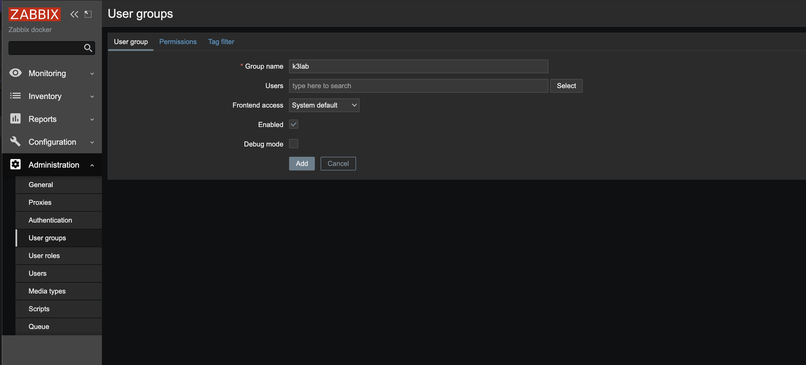

- 위치 : Administration > Users > Create user
- User 탭에서 로그인 사용자 정보 등록
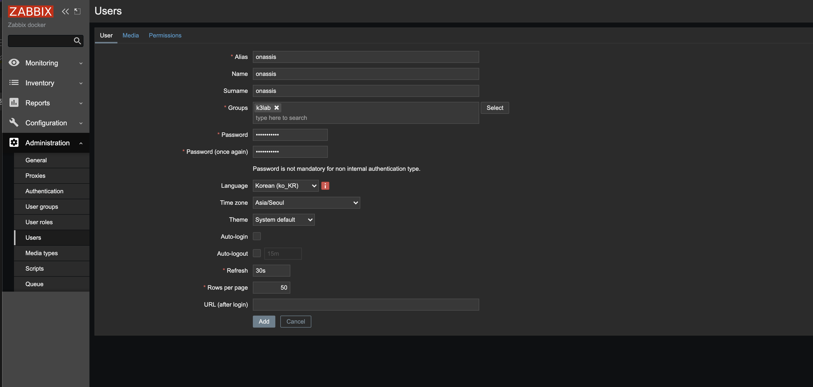

- Permissions 탭에서 Role 추가(Super Admin role)
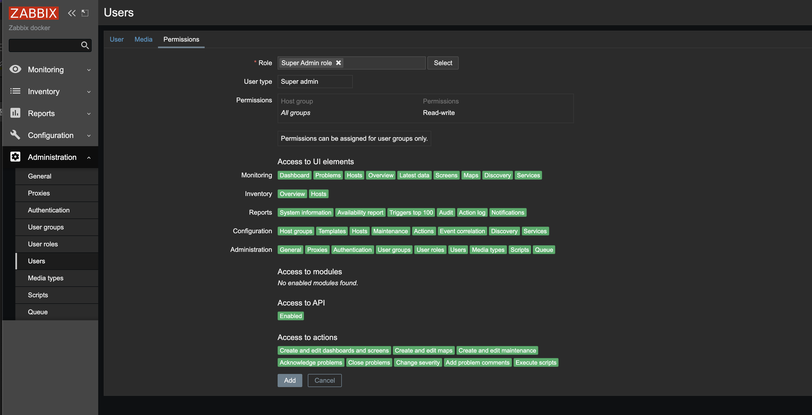

## 9. HostGroups, Hosts 생성
- 위치 : Configuration > Host groups > Create host group
- 그룹정보 입력
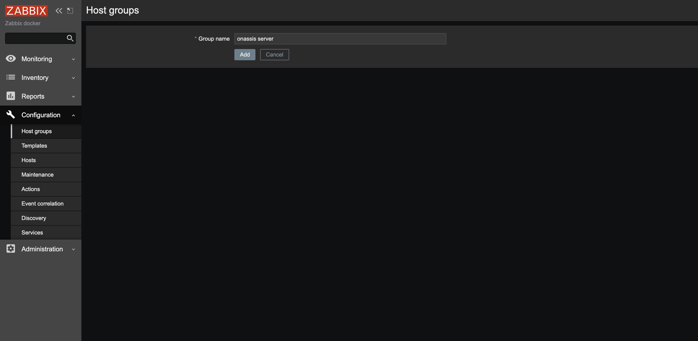

- 위치 : Configuration > Hosts > Create host
- Host 탭에서 host 정보 등록
- Client로 사용될 모든 장비의 host 정보를 각각 등록 시킨다
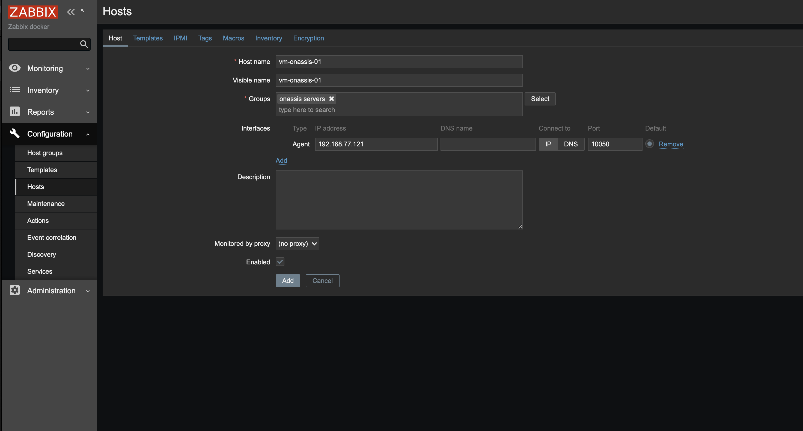

- Templages 탭에서 Link new templates 선택
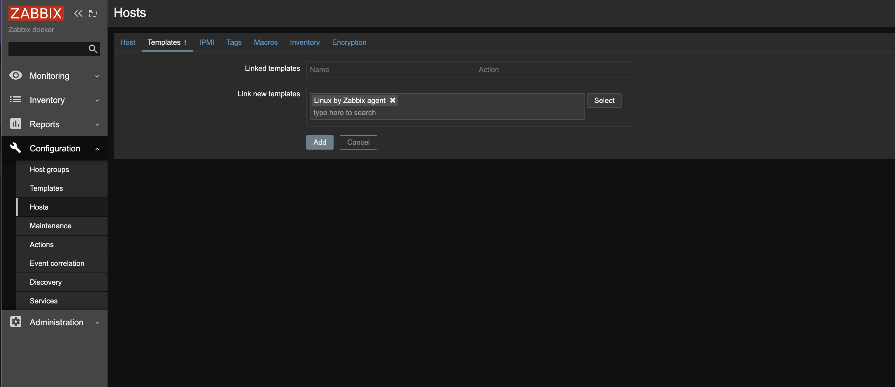

## 10. Screens 생성

### 10-1. CPU usage screen 생성
- 위치: Monitoring > Screens > Create screen
- Cpu usage에 사용될 기본 정보를 입력
- Columms, Rows 는 화면에 노출할 장비의 대수에 비례함.

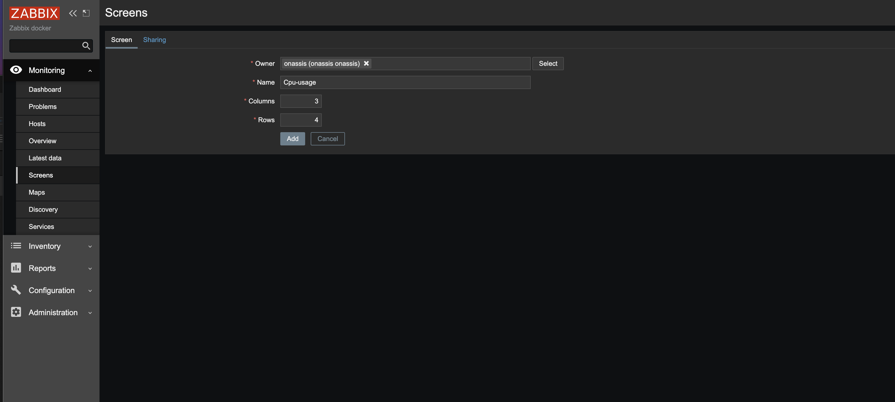

- 위치: Monitoring > Screens > Cpu-usage 클릭 > edit screen
- change 버튼 클릭 후 "Graph" 필드에 select 클릭을 통해 Host 정보 및 Cpu usage 그래프를 선택한다.
- 장비 대수만큼 반복 등록함

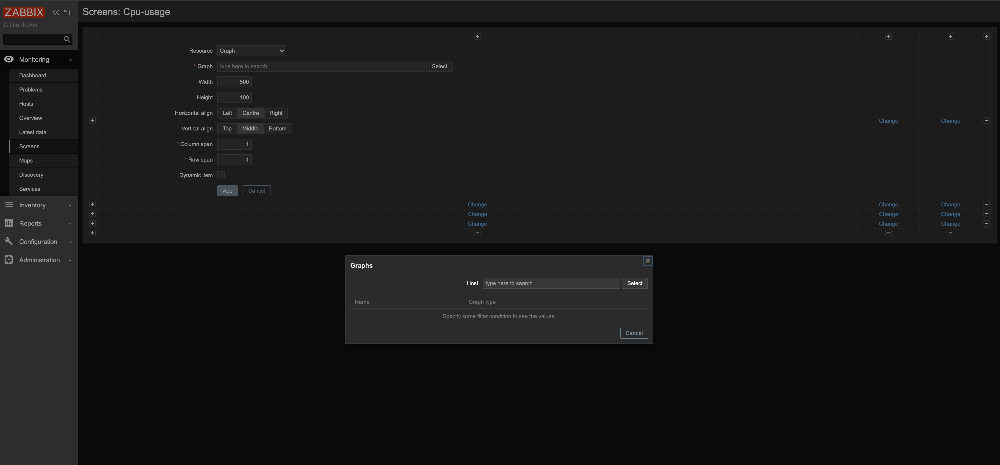

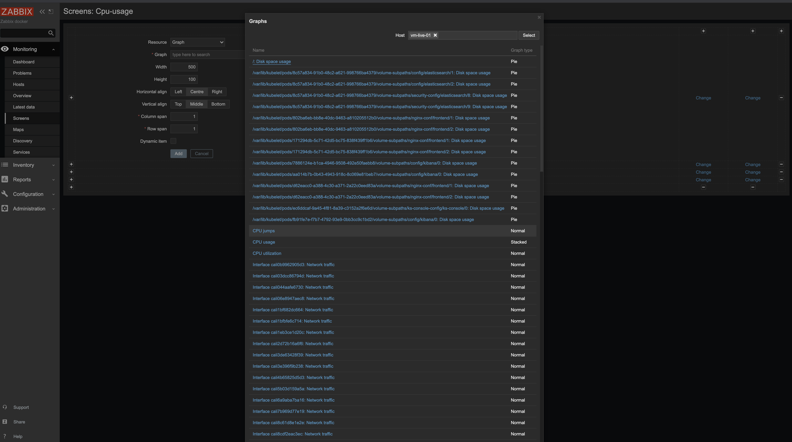

### 10-2. Disk space usage
- 위치: Monitoring > Screens > Create screen
- Disk space usage에 사용될 기본 정보를 입력
- Columms, Rows 는 화면에 노출할 장비의 대수에 비례함.

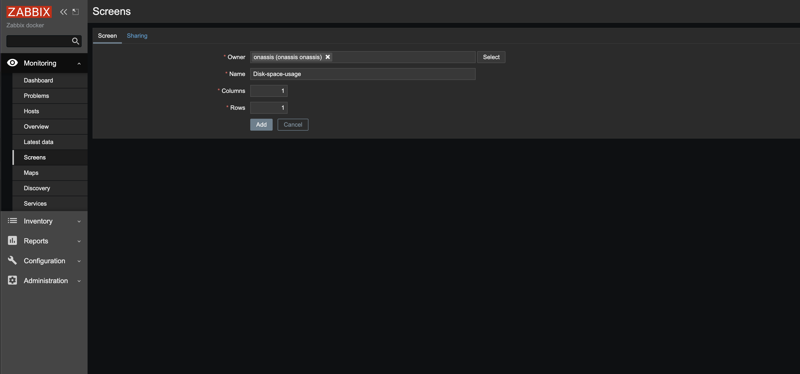

- 위치: Monitoring > Screens > Disk-space-usage 클릭 > edit screen
- change 버튼 클릭 후 "Graph" 필드에 select 클릭을 통해 Host 정보 및 Disk space usage 그래프를 선택한다.
- 장비 대수만큼 반복 등록함


### 10-3. Memory usage
- 위치: Monitoring > Screens > Create screen
- Memory usage에 사용될 기본 정보를 입력
- Columms, Rows 는 화면에 노출할 장비의 대수에 비례함.

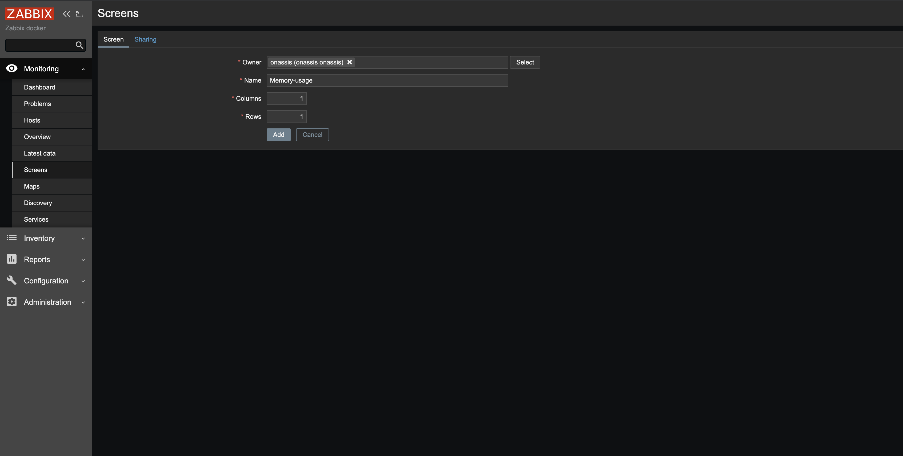

- 위치: Monitoring > Screens > Memory-usage 클릭 > edit screen
- change 버튼 클릭 후 "Graph" 필드에 select 클릭을 통해 Host 정보 및 Memory usage 그래프를 선택한다.
- 장비 대수만큼 반복 등록함


### 10-4. Network traffic
- 위치: Monitoring > Screens > Create screen
- Network traffic 에 사용될 기본 정보를 입력
- Columms, Rows 는 화면에 노출할 장비의 대수에 비례함.


- 위치: Monitoring > Screens > Network-traffic 클릭 > edit screen
- change 버튼 클릭 후 "Graph" 필드에 select 클릭을 통해 Host 정보 및 Network traffic(interface) 그래프를 선택한다.
- 네트웍 인터페이스는 장비 마다 다를 수 있으므로 해당 장비에 들어가서 확인 후 등록함.(ifconfig 명령)
- 장비 대수만큼 반복 등록함


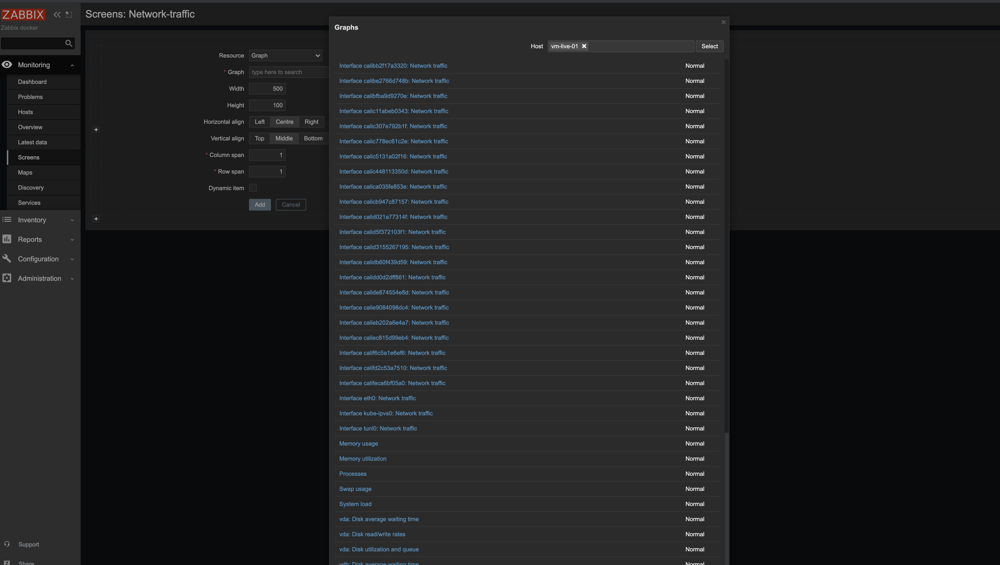